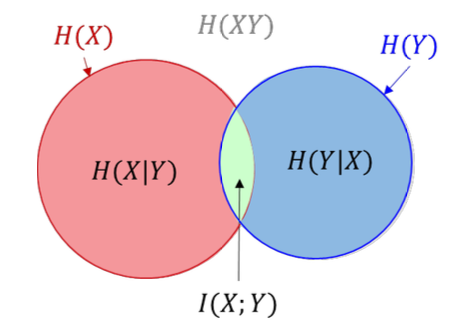

## Table of contents

Wednesday, January 1, 2025
## Mathematic Model of the Source

*The process of the source sending the "message" could be modeled as a random variable*:
- The output of the source cannot be determined with certainty beforehand. For example, we cannot predict the exact outcome of the event before it occurs, making it inherently stochastic.
- We can use a probabilistic framework to describe the likelihood of different possible outcomes by treating the source as a random variable.

Below is a revision of the mathematical models of random variables based on the essence of the source.
### Memoryless Source

**Single-symbol discrete**:
$$
\begin{bmatrix}
X \\ P
\end{bmatrix} =
\begin{bmatrix}
x_1 & x_2 & \dots & x_n \\
p(x_1) & p(x_2) & \dots & p(x_n)
\end{bmatrix}
$$

**Multiple-symbol discrete**: Model the source as $X^N = (\alpha_{i})_{i \in [\![1, n^N]\!]}$ where $\alpha_i = (x_1 x_2 \dots x_N)$ and $x_i \in \{ x_1, \dots, x_n \}$
$$
\begin{bmatrix}
X^N \\ P
\end{bmatrix} =
\begin{bmatrix}
\alpha_1 & \alpha_2 & \dots & \alpha_n \\
p(\alpha_1) & p(\alpha_2) & \dots & p(\alpha_n)
\end{bmatrix}
$$
> Note that $p(\alpha_{i}) = p(x_{i_{1}}x_{i_{2}} \dots x_{i_{N}})= \prod_{k=1}^N p(x_{i_{k}})$ if the source is memoryless.

**Single-symbol continuous**:
$$
\begin{bmatrix}
X \\ P
\end{bmatrix} =
\begin{bmatrix}
\mathbb{R} \\ 
p_{X}(x)
\end{bmatrix}
$$

### Source with Memory

**Multiple-symbol discrete**: using the conditional probability, for a $m$-order Markovian source,
$$
\begin{bmatrix}
X \\ P
\end{bmatrix} = \begin{bmatrix}
x_{1} \ x_{2} \ \dots x_{n} \\
p(x_{i}|x_{i-1}x_{i-2}\dots x_{i-m})
\end{bmatrix}
$$

> Note that the $p$ is a probability matrix with dimension $n^m \times n$.

## Information of a Random Event: its Mathematic Model

### (Un)-Certainty of an Event: Probability of Happening

**(Un)-certainty** of an event: Describes the possibility of such event actually happens in the view of the receiver.

Here, *the term uncertainty measures the observer's lack of confidence or predictability regarding its occurrence.*

> The term "uncertainty" doesn't imply the certainty that the event will not happen; it refers to the observer's inability to confidently predict the outcome or assign high certainty to either possibility.

Uncertainty is highest not just when probabilities are low but when they are neither high nor low (close to 0.5).

Uncertainty also reflects the extent of surprise of the observer when the event happens.

### Self-Information: Mathematic Modeling of Uncertainty

**Self-information** about a specific event is a mathematical interpretation of "uncertainty." The self-information of a random event $X = x_i$ is:
$$
I(x_i) = - \log p(x_i)
$$
Properties of self-information:
- *Is non-negative.* For every event $X = x_i$, $I(x_i) \geq 0$.
- *Is monotone decreasing.* If $p(X = x_i) > p(X= x_2)$ then $I(x_1) < I(x_2)$
- *Certainty*: If the event has probability 1, the event will certainly happen; thus, the self-information is 0 bit. 
- *Extreme surprise*: If the event has a probability very close to 0, we feel exceedingly astonished if the event happens. Its self-information is infinity.

### Self-Information of Various Types of Sources

**Single source, multiple symbols**: Source sending a sequence of $N$ symbols, where each symbol appears $m_{i}$ times.
$$
I = - \sum_{x_i \in X} m_i \log p(x_i) \quad \text{where} \quad \sum_{x_i \in X} m_i = N
$$

**Multiple sources**:
- **Joint self-information**: Information of the event that the symbols appear simultaneously: $I(x_{i}y_{j}) = -\log p(x_{i }y_{j})$
- **Condition self-information**: Information of the event that the symbol appears under certain condition: $I(x_{i}|y_{j}) = - \log p(x_{i}|y_{j})$

> Consider modeling each case as a random event.

### Self-Information in the case of s-independent events

When $X$ and $Y$ are s-independent, $$I(x_{i}y_{j}) = I(x_{i})+ I(y_{j})$$
## Mutual Information: Relation in Two Random Events

### Mutual Information: Acquire Information about one Random Event from Another Random Event

In the communication end, we want to deduce what is the original message $X$ is after obtaining the received message $Y$. In other words, we want to acquire information about $X$ when observing $Y$.

This is described as the *shared information* between the two random variables, and is defined as **mutual information**.

Interpretation of mutual information:
- Source sent $x_i$ and Receiver correspondingly received $y_j$.
- We know in the beforehand the probability model of sending $x_i$.
- We want to deduce what the source really send after observing the received $y_j$.
- The information received (i.e. uncertainty reduced) in this process = uncertainty pre-known about $x_{i}$ - uncertainty still exists after receiving $y_j$.

Thus, denote the mutual information (i.e. the amount of uncertainty reduced) between $x_{i}$ and $y_j$ is $I(x_{i};y_{j})$, it could be calculated as: 
$$
I(x_{i};y_{j}) = I(x_{i}) - I(x_{i}|y_{j}) =  \log \frac{p(x_{i}|y_{j})}{p(x_{i})} = \log \frac{p(x_{i}y_{j})}{p(x_{i})p(y_{j})}
$$

### Properties of Mutual Information

## Information Entropy of Single-Symbol Discrete Memoryless Sources

### Information Entropy: The Average Amount of Information Contained in Each Symbol of a Sequence

Revision: Information of a sequence of $N$ symbols:
$$
I = -\sum_{i=1}^n m_{i} \log p(x_{i})
$$

When $N$ is very large, it is difficult to count $m_i$, thus we use the *average amount of information per symbol (of the message)*: 
$$
\bar{I} = - \sum_{i=1}^n \frac{m_{i}}{N} \log p(x_{i}) \approx - \sum_{i=1}^n p(x_{i})\log p(x_{i})
$$

Observe from the formula, it is also the *expectation of the self-information*:
$$
\bar{I} = \mathbb{E}[I(X = x_{i})]
$$

**Information Entropy** of a discrete source (described as a random variable), denoted as $H(X)$, is:
- The average amount of information per symbol of a sequence after the source sends the message.
- Expectation of the self-information (of the message sent by the source).
- _Measure of the average uncertainty of the memoryless source._
$$
H(X) = \mathbb{E}[I(X=x_{i})] = -\sum_{i=1}^n p(x_{i}) \log p(x_{i})
$$

> Note that $p(x_{i}) \log p(x_{i}) = 0$ if $p(x_{i}) = 0$.

### Joint Entropy and Condition Entropy: Between Different Sources

> For every random variable, we define mathematically the entropy as the expectation of the information of each event.

Suppose that $X$ send a sequence which is a subset of $\{{x_{1}, x_{2}, \dots, x_{n}}\}$ and $Y$ received a sequence which is a subset of $\{y_{1}, y_{2}, \dots, y_{m}\}$.

The **joint entropy** $H(XY)$ could be defined as:
$$
H(XY) = \mathbb{E}_{X, Y}[I(x_{i} y_{j})] = - \sum_{i=1}^n \sum_{j=1}^m p(x_{i}y_{j}) \log p(x_{i}y_{j})
$$

Similarly, the **condition entropy** could be defined as:
$$
H(Y|X) = \mathbb{E}_{X, Y}[I(y_{j}|x_{i})] = \sum_{i=1}^n p(x_{i}) H(Y | X = x_{i}) = - \sum_{i=1}^n \sum_{j=1}^m p(x_{i}y_{j}) \log p(y_{j}|x_{i})
$$
### Properties of the Entropy Function

1. *Non-negativity*.
2. *Symmetry*. Only how the probabilities is distributed really matters to the entropy of the random variable. We don't care which event $x_{i}$ that the probability $p_{i}$ corresponds to.
3. *Extensibility*. Symbols with very low probabilities have little contribution to the entropy of the source. (Hint: $\lim_{ \epsilon \to 0 } \epsilon \log \epsilon = 0$)
4. *Additivity*. $H(X Y) = H(X) + H(Y | X)$ (Imagine $H$ as $\log p$), when $Y$ and $X$ are s-independent, $H(XY) = H(X) + H(Y)$.
5. *Increasing*. If divide one single symbol into several symbols, the overall entropy will increase.
6. *Upper convexity*, shape like $\cap$.
7. *Extremum property*: $$H(p_{1}, p_{2}, \dots, p_{n}) \leq H\left( \frac{1}{n}, \frac{1}{n}, \dots, \frac{1}{n} \right)$$

**Maximum discrete entropy theorem**: For a discrete memoryless source $X$ whose sample space contains $n$ symbols, the entropy arrives at its maximum when all of the occurrence of the symbols is identical, i.e.
$$
H(X) \leq H_{\max} = H\left( \frac{1}{n}, \frac{1}{n}, \dots, \frac{1}{n} \right) = \log n
$$

> Note: Equal distribution signifies maximum randomness. We cannot gain any prior knowledge from the event.

### Loss Entropy and Noise Entropy: Their Practical Meanings

**Loss entropy** is $H(X|Y)$ since it is the information "lost", i.e. uncertainty left about the message of the source (sent to other destinations) during transmission.

> Notice the word "after". This signifies the deduction is divided into two steps in sequence: (1) We first observe the random variable $Y$ (2) We then want to deduce $X$ based on the fact we received $Y$.

**Noise Entropy** is $H(Y|X)$ since it is the uncertainty "added" to the observed message due to noise (which is invariant from the message of the source).

> Similarly, (1) We know we sent random variable $X$ (2) We want to figure out what $Y$ would be under the condition we sent $X$.

Therefore, the information provided by the event that simultaneously $X = x_i$ and $Y= y_j$ is:
$$
H(XY) = H(X) + H(Y|X) = H(Y) + H(X|Y)
$$
> Note: $H(XY) = H(X) + H(Y)$ if $X$ and $Y$ are s-independent.

### Relationship Between Different Kind of Entropies

