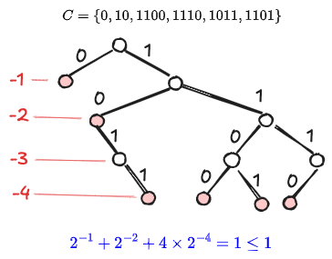
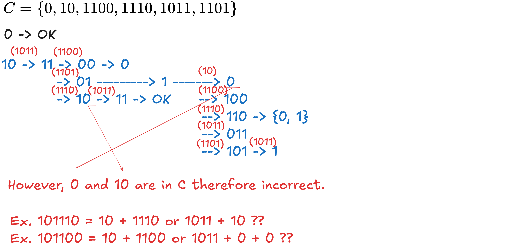
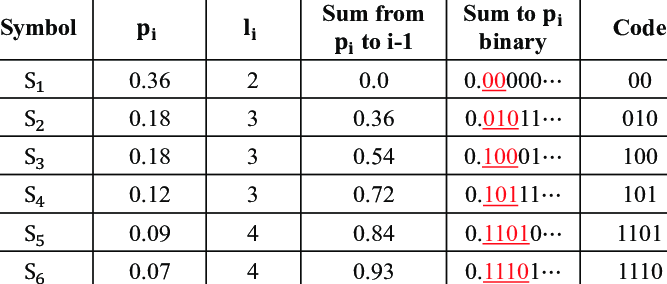
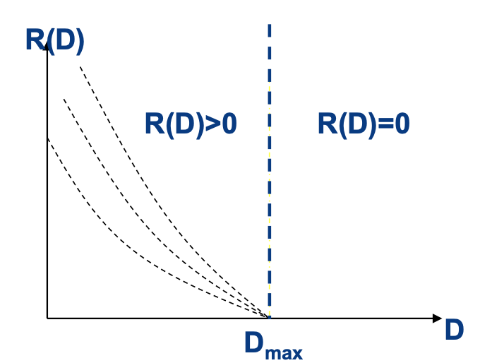

## Table of contents

Why do we need to encode source symbols?
- Reduce redundancy in code (to enhance transmission efficiency)
- Balances compression with acceptable information loss (effective)
- In some cases, ensure the correctness of the code.
## Encoder

### Definition of the Source Encoder

The purpose of the **source encoder** is to transform a kind of symbol sequence into another type of symbol sequence (named **code sequence**):
- The sequence generated by the source is $X^N = (X_{1} \dots X_{N})$
- Any $X_i$ is the random variable having probability distribution $\begin{bmatrix}\dots & x_{i} & \dots \\ \dots& p_{i} & \dots\end{bmatrix}$. 
- Each symbol in the code sequence is an element of the set $\{ x_{1}, x_{2}, \dots,x_{q}\}$ where the size of the set is $q$.
- _The encoder transforms the symbol sequence into a code sequence:_ $X^N \to C^L = (C_{1}\dots C_{L})$
- For each $X_{i}$ it is encoded into $X_{i}'$ which contains multiple code symbols: $X_{i}\to X_{i}' = (C_{j}C_{j+1} \dots)$
- Each of the symbols of the code sequence $C_{j}$ is an element of the set $\{ b_{1}, b_{2}\dots, b_{r}\}$, where the size of the set is $r$. We refer it to as **$r$-ary encoding**.

> Notations:The possible values that $x_i$ could be is the set $\{ a_{1}, \dots, a_{q}\}$
$$
\begin{bmatrix}
X^N = (X_{1}\dots X_{N}) \\
X_{i} \in \{x_{1}, \dots, x_{q}\} \\
\text{Possibilities: } q^N
\end{bmatrix} \to
\begin{bmatrix}
C^L = (C_{1}\dots C_{L}) \\
C_{i} \in \{b_{1}, \dots, b_{r}\} \\
\text{Possibilities: } r^L
\end{bmatrix} 
$$

> *Example*: transform decimal numbers to binary numbers, 16 -> 10000. $X_i \in \{ 0, \dots, 9\}$, $C_{i} \in \{0, 1\}$, $X^N =(X_{1}=1, X_{2}=6)$ , $C^L = (C_{1}=1, C_{2}= \dots = C_{5}=0)$, possibilities $q^N = 81$ and $r^L =2^5 =32$.

> *Example*: transform alphabets into digits, AB -> 12.

## Unique Decodable Code

### A Certain Encoding is Lossless under the Condition: Uniquely Decodable Code

To achieve lossless source coding, two conditions must be satisfied:
1. Each source symbol must be uniquely mapped to a sequence of code symbols.
2. The inverse mapping of the codeword must also correspond uniquely to the source symbol.

The property of this one-to-one mapping requires the encoding to have the following characteristics (if it exists):
1. First, the *codewords* produced after encoding must be unambiguous, meaning a single codeword cannot simultaneously correspond to two different source symbols. We call this a **non-singular code**.
2. More importantly, *any finite-length sequence of codewords* must also be unambiguous during decoding. This is the key to determining whether an encoding is lossless, and we call this a **uniquely decodable code**. A uniquely decodable code is always non-singular.
3. For cases where the lengths of codewords output for different source symbols are inconsistent, the encoding must satisfy the condition of *instantaneity*: no codeword can be a prefix of another codeword.

Based on the above definitions, the following conclusions can be drawn:
- **If an encoding is lossless, it must be uniquely decodable.**
- **Instantaneous codes are always uniquely decodable.** However, non-instantaneous codes are not necessarily not uniquely decodable, and this requires further evaluation using the prefix-suffix method.

### Methods for Determining Whether an Encoding is Lossless Source Coding

**Fixed-Length Code Judgement**: For fixed-length codes, as long as they are non-singular, they are guaranteed to be uniquely decodable. The following steps describe how to evaluate variable-length codes.

**Necessary Condition for Uniquely Decodable Codes: Kraft's Inequality**: For any uniquely decodable code set $C = \{ W_1, W_2, \dots, W_q \}$, with code symbols $\{ b_1, b_2, \dots, b_m \}$, and corresponding code lengths $k_1, k_2, \dots, k_q$, the **Kraft's inequality** must hold:

$$
\sum_{i=1}^q m^{-k_i} \leq 1
$$

**Prefix-Suffix Method for Determining Whether a Non-Instantaneous Code is Uniquely Decodable**: First, variable-length codes must satisfy Kraft's inequality. On this basis, use the prefix-suffix method to determine whether the code is uniquely decodable.

Algorithm: Start with the shortest codeword and determine if it is a prefix of any other codeword. For all possible suffixes that follow, enumerate them iteratively until termination. Examine whether this set includes any codeword. If any codeword is found within this set, the encoding is not uniquely decodable.

Example:

## Lossless Encoding

Below are essential evaluation metrics on lossless encoding:
- **Compression ratio** focuses on space saved during encoding.
- **Average code length** evaluates coding compactness (tied to entropy).
- **Coding information rate** bridges source entropy and encoded sequence efficiency.
- **Coding efficiency** compares actual performance to the theoretical Shannon limit.
### Evaluation Metric: Compress Ratio

**Compress Ratio**: Evaluate in what extent the data is compressed.
$$
P_{r} = \frac{L_{B} - L_{D}}{L_{B}} \times 100 \%
$$
where $L_B$ is the length of the original source sequence, and $L_D$ is the length of the encoded sequence.
### Evaluation Metric: Average Code Length

**Average code length**: Evaluate the average encoded symbol length per source symbol.
- Lossless encoding, each $x_i$ corresponds $c_i$ with same distribution probability.
- Thus, the code length is the mathematical expectation of the new code length.

Note the length of each code symbol $l_i = l(x_i')$ where $x_i'$ is the encoded code symbol of the source symbol $x_i$. 

Case of single-symbol:
$$
\bar{L} = \mathbb{E}_{X}[l_{i}] =  \sum_{x_{i}} l(x_{i}') p(x_{i})
$$

Case of multiple-symbol: (Here, $\alpha_{i} = (x_{i_{1}}x_{i_{2}}\dots x_{iN})$)
$$
\overline{L_{N}} = \mathbb{E}_{X^N}[l(\alpha_{i})] = \sum_{\alpha_{i}} l(x_{i}') p (\alpha_{i})
$$

Thus, we have **average code length per symbol of a (source) sequence**:
$$
\bar{L} = \frac{\overline{L_{N}}}{N}
$$

- $\overline{L_N}$ denotes the average length of an $N$-long source sequence.
- $\bar{L}$ represents the average code length per source symbol.

> Note: Caution to the meanings of the symbols. $\overline{L_{N}}$ is the average length of each possibility of the sequence whose length is $N$ (i.e. per $N$-long sequence). On the contrary, $H_{N}(X)$ is the average entropy per symbol, whose value is close to $H(X)$.
### Evaluation Metric: Coding Information Rate

**Coding information rate**: Evaluate the average information _of the source_ included in each _code_ symbol
> Note: Avg SOURCE Information per CODE symbol

Case of single-symbol:
$$
R = \frac{H(X)}{\bar{L}}
$$

Recap: The entropy, i.e. expectation of information of a sequence is $H(X^N)$ and the average symbol entropy of a memoryless source is $H_{N}(X)$.

Case of multiple-symbol: it is simultaneously ...
- (i) the entropy of the (source) sequence divided by the length of the encoded sequence.
- (ii) the avg entropy per symbol of the (source) sequence divided by the avg length of each symbol of the encoded sequence.
$$
R = \frac{H(X^N)}{\overline{L_{N}}} = \frac{H_{N}(X)}{\bar{L}}
$$
### Evaluation Metric: Coding Efficiency and Channel Redundancy

> Note: To calculate the efficiency, we need to compare the entropy with the maximum transmitted information rate, achieved when sending equal-distributed encoded sequence.

**Capacity of the channel (maximum information rate) necessary to transmit a single source symbol**: Evaluate the maximum transmitted information  _by the encoded codeword_  of each *source* symbol
- We want to evaluate the maximum transmission capacity of the channel
- In this case, the probability distribution of the _code symbol_ should be equivalent (_Maximum discrete theorem_)
- Under this condition, observing the useful information transmitted per _source_ symbol can evaluate its efficiency.

> Note: Max CODE Information per SOURCE symbol.

> Note: The term "Necessary" here means the minimum requirement of the transmission capacity of the channel (i.e. maximum information rate)

The maximum transmission rate that could be reached when the code symbols are equal-distributed:
$$
R_{\max} = \frac{\max_{p(b_{i})} H(C^L)}{N} = \frac{\overline{L_{N} }}{N} \log r = \bar{L} \log r
$$

The **coding efficiency** is comparing the actual encoded information rate to the theoretical maximum transmission rate:
$$
\eta = \frac{H_{N}(X)}{R_{\max}} = \frac{H_{N}(X)}{\bar{L}\log r} = \frac{H(X^N)}{\overline{L_{N}} \log r}
$$

**Channel redundancy** refers to the extent to which a channel's capacity is **not fully utilized** to transmit useful information.
$$
\gamma = 1 - \eta
$$

### Lossless Source Coding Theorem (Fixed-length): Enhance Coding Efficiency Under Lossless Condition

The transmission of symbols or sequences goes through these steps: Source -> Encode -> Channel -> Decode -> Destination.

The necessary conditions in this process:
(1) The maximum information rate of _sending a source symbol_ should be larger than the average entropy per symbol.
(2) The decoding error probability should be very low.
(3) Enhance coding efficiency.

From (1), for any $\epsilon> 0$ and $\delta >0$, if 
$$
\frac{\overline{L_{N}}}{N} \log m \geq H_{N}(X) + \epsilon
$$
Then exists a sufficient large $N$ that satisfies the condition that the decoding error rate is smaller than $\delta$.

Our optimization goal is to:
$$
\arg \min_{\bar{L}} p\left( |\frac{\overline{L_{N}}}{N} \log r - H_{N}(X) | \geq \epsilon \right) \quad \text{s.t.} \quad  R_{\max}  = \frac{\overline{L_{N}}}{N} \log r\geq H_{N}(X)
$$

If it's fixed-length coding, then $\overline{L_{N}} = L_{N}$. (1) requires: 
$$
H_{N}(X) \leq R_{\max} = \frac{L_{N}}{N} \log r
$$

Suppose that $R_{\max} \geq H_{N}(X) + \epsilon$, therefore the coding efficiency is:
$$
\eta = \frac{H_{N}(X)}{H_{N}(X) + \epsilon}, \; \epsilon>0
$$

According to Chebyshev's theorem, if we want the error probability to be below $\delta>0$ (which should be a very small value) and the coding efficiency to be high than a certain value (which we could then deduce the value of $\epsilon$), the length of the source sequence should satisfy:
$$
N \geq \frac{\sigma^2(X)}{\epsilon^2\delta} \quad \text{where} \quad \sigma^2(X) = \mathbb{E}_{X}[(I(x_{i}) - H(X))^2], \; \epsilon= \frac{H_{N}(X) (1- \eta)}{\eta}
$$

Conclusion: 
- If $\delta$ is very small, then the length should be very large.
- In practical, $N$ should be very large, which is impossible to implement in reality. 
- Coding efficiency is not high enough.

### Lossless Source Coding Theorem (Variable-length), Shannon First Theorem

The average code length should meet the inequality:

Single-symbol source:
$$
\frac{H_{N}(X)}{\log r} \leq \bar{L} < \frac{H_{N}(X)}{\log r}+1
$$

where the variable-length coding is $r$-ary.
Multiple-symbol source:
$$
\frac{H_{N}(X)}{\log r} \leq \bar{L} < \frac{H_{N}(X)}{\log r}+\epsilon
$$
where $\epsilon >0$.

- The theorem points out that it is possible to achieve coding when the average code length is lower than the upper bound.
- When the average code length is higher than the upper bound, the unique decodable code still exists.

### Shannon Coding: Lossless Source Coding Method 1

1. Arrange by the probability $p(x_{1})\geq p(x_{2})\geq \dots \geq p(x_{n})$
2. Determine the corresponding code length which should satisfy $- \log p(x_{i})\leq l_{i}< \log p(x_{i})+1$
3. Calculate the cumulative possibility until the symbol: $$P_{i} = \sum_{k=1}^{i-1} p(x_{k})$$
4. Transform $P_i$ into binary number and then use the first $l_{i}$ bit.

### Huffman Coding: Lossless Source Coding Method 2

Example:

## Limited Loss Source Coding: Effective Encoding

The goal is to compress the information of the source symbols or sequences under constraints that the loss shouldn't be too significant:
$$
\min I(X;Y) \quad \text{s.t.} \quad \overline{D} \leq  D
$$
where $\overline{D}$ is the average distortion of the information and $D$ is the allowable distortion.

### Evaluation Metric: Distortion

Suppose that the input of the encode is $x_i$ and its corresponding output is $y_j$, there are two possibilities:
- $x_{i}=y_{j}$: No loss.
- $x_{i} \ne y_{j}$: There is loss.

Therefore, a simple distortion function (which is the **Hamming function**) of a single symbol is defined as:
$$
d(x_{i}, y_{j}) = \begin{cases}
0 \quad  y_{j} = y^* =  x_{i} \\
1 \quad y_{j}\ne y^* = x_{i}
\end{cases}
$$
Here $y^*$ denotes the expected correct output.

> There are many other types of distortion functions.

The **distortion matrix** is 
$$
D = (d(x_{i},y_{j}))_{i,j}
$$

The **average distortion** (i.e. expectation or statistical average) of the distortion function is:
$$
\overline{D} = \mathbb{E}_{X, Y}[d(x_{i},y_{j})] = \sum_{i}\sum_{j} p(x_{i}y_{j}) d(x_{i},y_{j})
$$

Suppose that the length of the sequence is $N$. Therefore, for any $(i, j)$, the distortion function is the sum of the distortion of each symbol in the sequence:
$$
d_{N}(\alpha_{i},\beta_{j}) = \sum_{k=1}^N d(x_{i k}, y_{j k}) \quad \text{where} \quad \alpha_{i}= (x_{i 1}x_{i 2} \dots x_{i N})
$$

The **average distortion** is:
$$
\overline{D_{N}} = \sum_{i=1}^{n^N}\sum_{j=1}^{m^N} p(\alpha_{i}\beta_{j}) d_{N}(\alpha_{i}, \beta_{j})
$$

and the **average distortion per symbol** is:
$$
\overline{D} = \frac{\overline{D_{N}}}{N}
$$
### Information Rate-Distortion Function 

We restate our goal here:
$$
\min I(X;Y) \quad \text{s.t.} \quad \overline{D} \leq  D
$$

Imagine the encoder as a channel transform $X$ into $Y$, thus we're finding the probability transition matrix that minimize the amount of information transmitted (i.e. the mutual information):

$$
p(y_{j}|x_{i}) =\arg\min_{P} I(X;Y) \quad \text{s.t.} \quad \overline{D} \leq  D
$$

We define $R(D)$ the **information rate-distortion function** which is the minimum rate should be sent by the source under the fidelity criterion. 

$$
R(D) = \min_{p\in P_{D}} I(X; Y) \quad \text{where} \quad P_{D} = \{p(y_{j}|x_{i}), \; \overline{D} \leq D\}
$$

$R(D)$ monotone decreases with the degree of the distortion (allowed) and falls to zero when $D$ reaches a value:

### Calculate the Maximum Distortion Rate
We denote
$$
D_{\max} = \max_{R(D) \ne 0} D  = \min_{R(D) = 0 } D
$$

According to the graph, we need to find $D_{\max}$. Since $X$ and $Y$ are s-independent when $R(D) = 0$,  $I(x_{i}; y_{j}) = 0$, therefore $D_{\max}$ is reached under certain probability distribution of $p(y)$:
$$
D_{\max} = \min_{p(y)} D = \min_{p(y)} \sum_{i=1}^n \sum_{j=1}^m p(x_{i})p(y_{j}) d(x_{i}, y_{j}) = \min_{p(y)} \sum_{j=1}^m p(y_{j})\sum_{i=1}^M p(x_{i})d(x_{i},y_{j})
$$

By solving the equation:
$$
\quad y_{k} = \arg\min_{y_{j}}  \sum_{i=1}^M p(x_{i})d(x_{i},y_{j})
$$
The minimum of $D_{\max}$ could be achieved when the probability distribution of $y$ is: 

$$
p(y_{j}) = \delta_{j,k} = \begin{cases}
1 \quad \text{if} \; j = k \\
0 \quad \text{if} \; j \ne k
\end{cases}
$$

### Limited Loss Source Coding Theorem, Shannon Third Theorem

The **Shannon Third Theorem** states the existence of a coding method to minimize information transmission under the fidelity criterion.

The question is, when is it (im)-possible, under fidelity criterion $D$ to code a message having information rate $R$ sent by the source?

The answer is that: for _any_ $D \geq 0$ and $\epsilon>0$, when the transmission rate 
$$
R > R(D) = \min I(X; Y)
$$
where $R(D)$ is the information rate-distortion function, there exists a method to make the distortion rate less then $D$.

