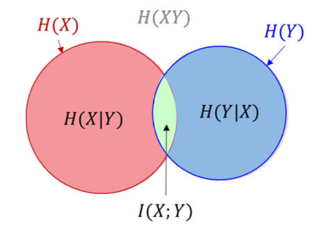

## Table of contents

Thursday, January 2, 2025
## Mutual Information and Average Mutual Information

### Definition of the Mutual Information

**Mutual information**: Information obtained (or "delivered") through the transmission of the symbol.
- Source send $X = x_i$, Destination received $Y = y_j$.
- The receiver wants to deduce $X = ?$ based on the served message symbol $y_j$. Ideally, $x_{i}= y_{j}$.
- Information obtained = Uncertainty reduced.
- Amount of uncertainty reduced: Prior uncertainty about $X = x_i$ - Uncertainty about $X = x_i$ left after receiving $Y =y_j$

The mutual information of symbol $x_i$ and $y_j$:
$$
I(x_{i};y_{j}) = I(x_{i})-  I(x_{i}|y_{j}) = \log \frac{p(x_{i}|y_{j})}{p(x_{i})}
$$

### Properties of the Mutual Information

*Ideal case: Precise transmission*: 
- 100% confidence in symbol mapping
- $p(x_{i}| y_{j}) = 1$. 
- Thus $I(x_{i};y_{j})=I(x_{i})$.

*Common case*:
- $p(x_{i}|y_{j}) < 1$.
- Thus $I(x_{i};y_{j}) < I(x_{i})$.
- Receive partial information about $x_i$.

*Case when the quality of the channel is very bad*:
- Uncertainty even increases after transmission (due to noise, interrupts , ...)
- $I(x_{i}|y_{j})> I(x_{i})$.
- Thus $I(x_{i};y_{j})<0$.
- No valuable information gained about $x_i$.

Relationship of mutual information and other self information:
$$
I(x_{i};y_{j}) = I(x_{i})- I(x_{i}|y_{j}) =  I(y_{j})-I(y_{j}|x_{i})  = I(x_{i}) + I(y_{j}) - I(x_{i}y_{j})
$$

### Average Mutual Information

**Average Mutual Information**: Quantify the amount of the information passing through the channel.
- Evaluate the average amount of information delivered from src to dst.
- Mathematical expectation of overall mutual information between symbols of two sources.
- Depend on the transmission probability matrix.

> Note: Average of what? Mutual information of each possible symbol pair.

The average mutual information between $X$ and $Y$:
$$
I(X;Y) = \mathbb{E}_{X, Y}[I(x_{i};y_{j})] = \sum_{x_{i}} \sum_{y_{j}} p(x_{i}y_{j}) I(x_{i};y_{j}) = \sum_{x_{i}}\sum_{y_{j}} p(x_{i}y_{j}) \log \frac{p(x_{i}|y_{j})}{p(x_{i})}
$$

> Other formulas are similar.

### Mutual Information and Entropy

## Channel

### Mathematical Model of a Discrete Channel

A channel consists of three parts:
- Source, sends $X$
- Destination, receives $Y$
- Transition matrix between $X$ and $Y$: $[p(Y|X)]_{X, Y}$

Channel could be modeled as $\{ X, p(Y|X), Y \}$.

### Special Types of Channel

A channel is **lossless** when the loss entropy $H(X|Y)$ is zero. (All information of the source is transmitted to the source)

A channel is **noiseless** when the noise entropy $H(Y|X)$ is zero. (The destination is only receiving message coming from the unique source)

Ideal situation: A channel is simultaneously lossless and noiseless.
### Channel Capacity

**Channel capacity**: measures the maximum amount of information could be transmitted from the source to the destination.
- Maximum of the transmission rate.
- Transmission rate quantified by the average delivered information per time.
- Which is the _average mutual information_ divided by time.

Thus, 
$$
C = \max_{p(x)} I(X;Y)
$$

> To calculate the channel's capacity, is to find the maximum of the mutual information between the source and the destination. The case of maxima usually appears based on the maximum discrete entropy theorem.
