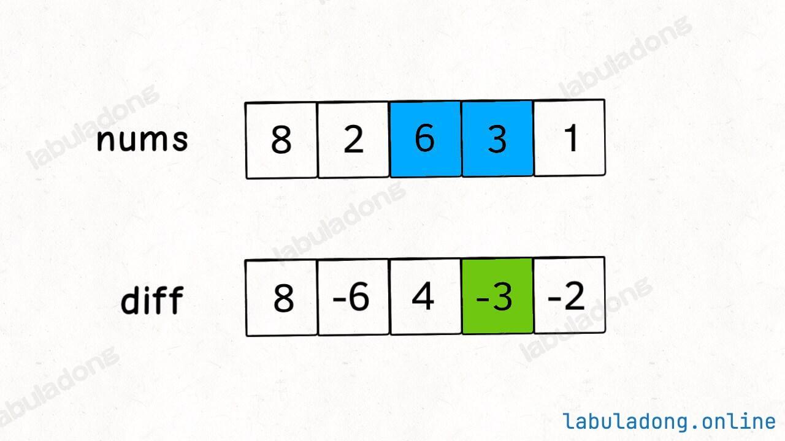
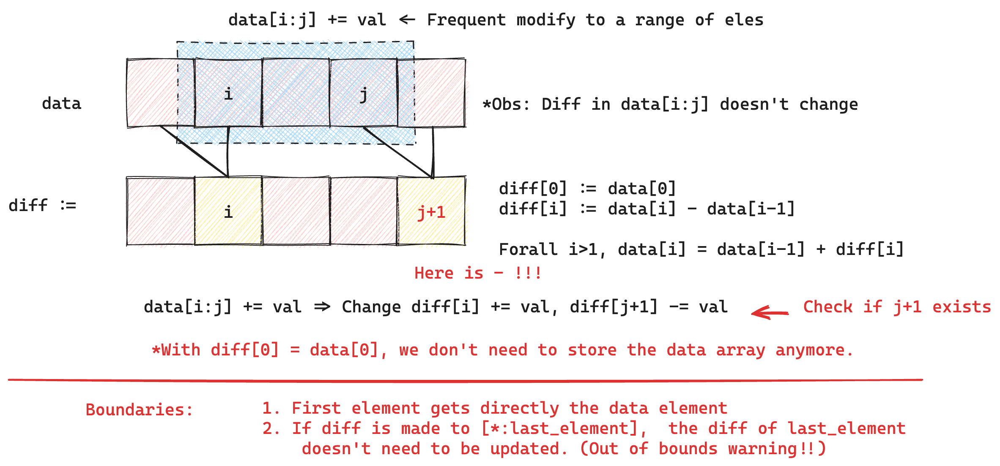

**Array techniques series**.
1. [Algo Basics: Prefix Sum Array 前缀和](posts/algo-basics-prefix-sum/index.md)
2. [Algo Basics: Difference Array 差分数组](posts/algo-basics-difference-array/index.md)

在某些情况下，我们需要**频繁对原始数组的某个区间的元素进行同样数量的增减**，并且我们希望最终获得数组中各元素的值。

如果使用暴力方法，复杂度是 $O(n)$，但是如果我们只记录元素之间的差（差分），那我们只需要对于元素前后的差分值进行修改即可，复杂度可以优化到 $O(1)$.


差分数组的示意图。diff 中的每个元素都由对应位置的数据减去上个位置的数据得到。这样如果我们需要对一个区域的元素进行统一操作，只用修改 diff 数组中的区域边界上的元素即可

核心思路



**Example [LeetCode 1109](https://leetcode.cn/problems/corporate-flight-bookings/description/)**.

```cpp
class Solution {  
public:  
    vector<int> corpFlightBookings(vector<vector<int>>& bookings, int n) {  
        BookingsData bookings_data = BookingsData(n);  
        bookings_data.insert(bookings);  
        return bookings_data.getData();  
    }  
  
private:  
    class BookingsData {  
    private:  
        vector<int> diff;  
    public:  
        BookingsData(int n)  
            : diff(n) {}  
  
        void insert(vector<vector<int>>& bookings) {  
            for (auto& booking: bookings) {  
                insert_once(booking);  
            }  
        }  
  
        void insert_once(vector<int>& booking) {  
            int start = booking[0];  
            int end = booking[1];  
            int num = booking[2];  
  
            if (start-1 == 0) diff[0] += num;  
            else diff[start-1] += num; // correspond to input  
            if (end != diff.size()) diff[end] -= num; // correspond to input  
        }  
  
        vector<int> getData() {  
            vector<int> data(diff.size());  
            data[0] = diff[0];  
            for (int i=1; i<diff.size(); i++) {  
                data[i] = data[i-1] + diff[i];  
            }  
  
            return data;  
        }  
    };  
};
```

注意边界条件，特别是 end 情况

**Example ([Leetcode 1094](https://leetcode.cn/problems/car-pooling/description/))**.

```cpp
class Solution {  
public:  
    bool carPooling(vector<vector<int>>& trips, int capacity) {  
        NumPassengersArr num_passengers_arr = NumPassengersArr();  
        num_passengers_arr.update(trips);  
        return num_passengers_arr.isInCapacity(capacity);  
    }  
private:  
    class NumPassengersArr {  
    private:  
        static constexpr int MAX_TRIP_LENGTH = 1000;  
        vector<int> diff;  
    public:  
        NumPassengersArr()  
            : diff(MAX_TRIP_LENGTH + 1) {}  
  
        void update_one_trip(vector<int>& trip) {  
            int numPassengers = trip[0];  
            int from_pos = trip[1];  
            int to_pos = trip[2];  
  
            diff[from_pos] += numPassengers;  
            if (to_pos != MAX_TRIP_LENGTH) {  
                diff[to_pos] -= numPassengers;  
                // Note: Passangers get off at to_pos  
                // Therefore, a trip corresponds to                // [from_pos, to_pos)                // Here is to_pos, not to_pos+1            }  
        }  
  
        void update(vector<vector<int>>& trips) {  
            for (auto& trip: trips) {  
                update_one_trip(trip);  
            }  
        }  
  
        bool isInCapacity(int capacity) {  
            int num_passengers = 0;  
            for (int i=0; i<=MAX_TRIP_LENGTH; i++) {  
                num_passengers += diff[i];  
                if (num_passengers > capacity) return false;  
            }  
            return true;  
        }  
    };  
};
```

注意区间。这里乘客在 `to_pos` 就下车了，因此一段旅程实际有效的区间是 `[from_pos, to_pos)`

以及注意测试用例，这里测试用例提到是从 0 开始的

## Conclusion

差分数组和前缀和思路相似，前者适用于对数组中进行统一操作的情景，后者适用于数组中元素永远不变的情况。