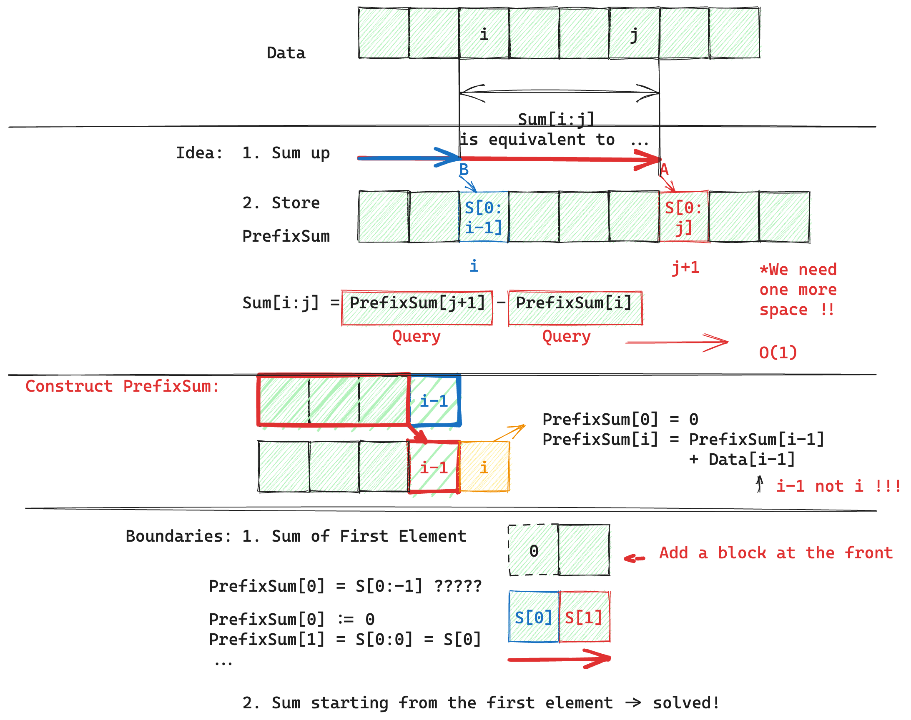
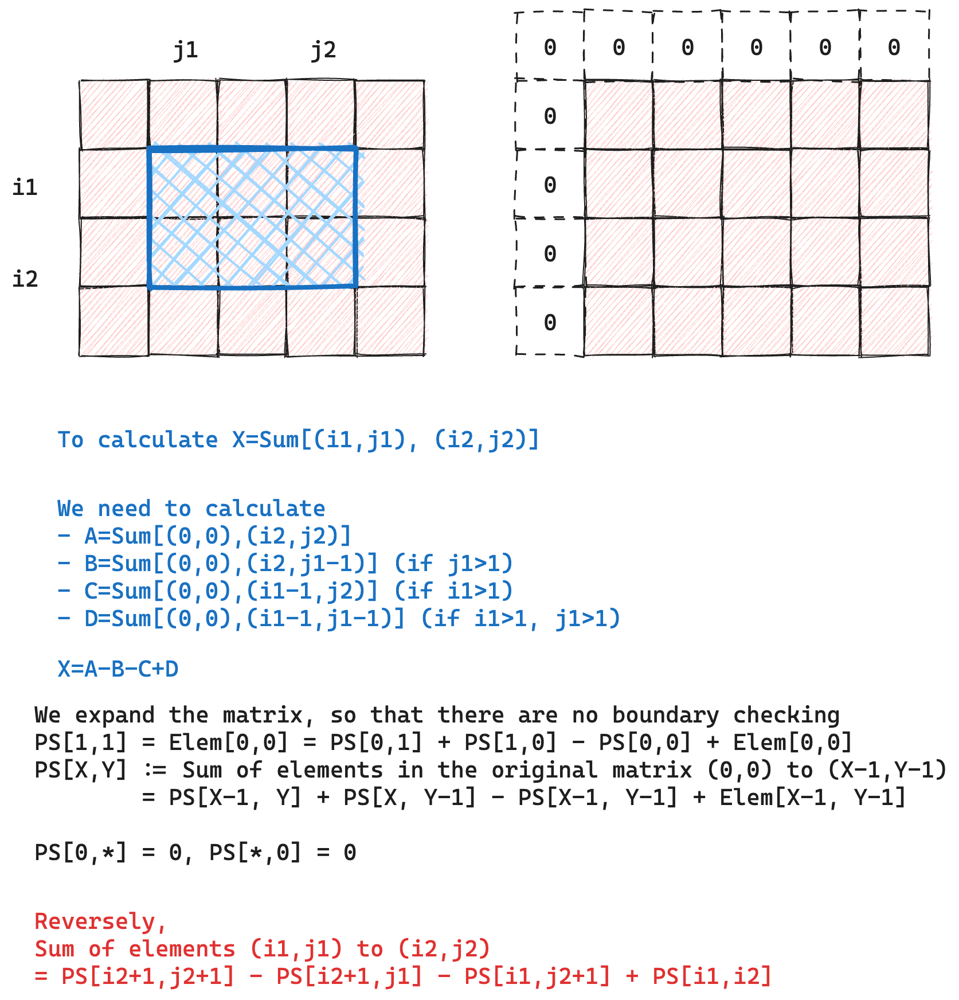

## Example: 1D

给定一个整数数组，希望计算数组中索引 `left` 和 `right` 之间元素总和。

For an array, computing the sum between indices $i$ and $j$ requires visiting $j - i + 1$ elements in the naive approach. This can be optimized by precomputing prefix sums, reducing each range-sum query to two constant-time lookups.





**Purposed implementation**. Leetcode 303：一维数组区间和

原题：https://leetcode.cn/problems/range-sum-query-immutable/description/

```cpp
class NumArray {  
private:  
    vector<int> data;  
    vector<int> prefix_sum;  
public:  
    NumArray(vector<int>& nums)  
        : data(nums)  
        , prefix_sum(nums.size() + 1){  
        // prefix_sum[0] = 0;, auto. satisfied  
        for (int i = 1; i <= nums.size(); i++) {  
            prefix_sum[i] = prefix_sum[i-1] + data[i-1];  
        }  
    }  
  
    int sumRange(int left, int right) {  
        return prefix_sum[right + 1] - prefix_sum[left];  
    }  
};
```

其实可以不用存储 `data` 变量，直接使用 `prefix_sum` 即可。

注意在初始化 `prefix_sum` 时使用的技巧：先使用值初始化确定容器内元素个数，然后再计算传值。将 `prefix_sum` 理解为一个 `vector<int>`，括号内为构造函数的参数

## Example: 2D

给定一个二维矩阵，希望计算左上角直到右下角所描述的子矩阵的元素总和。

依然采用前缀和的思路，每个子矩阵可以通过以下计算得到：




**Purposed implementation**. Leetcode 304：二维矩阵区域和

```cpp
class NumMatrix {  
private:  
    vector<vector<int>> prefix_sum;  
public:  
    NumMatrix(vector<vector<int>>& matrix)  
        : prefix_sum(matrix.size()+1,  
            vector<int>(matrix[0].size()+1, 0)){  
        // prefix_sum[0, *] = 0;  
        // prefix_sum[*, 0] = 0;        for (int i=1; i<=matrix.size(); i++) {  
            for (int j=1; j<=matrix[0].size(); j++) {  
                prefix_sum[i][j] = prefix_sum[i-1][j]  
                    + prefix_sum[i][j-1] - prefix_sum[i-1][j-1]  
                    + matrix[i-1][j-1];  
            }  
        }  
    }  
  
    int sumRegion(int row1, int col1, int row2, int col2) {  
        return prefix_sum[row2+1][col2+1] - prefix_sum[row2+1][col1]  
            - prefix_sum[row1][col2+1] + prefix_sum[row1][col1];  
          
    }  
};
```

难点依然在于二维矩阵的初始化上。
- 首先将 `prefix_sum` 理解为一个 `vector<int>`，括号内为构造函数的参数
- 外层：依然采用值初始化，元素数量为输入矩阵的行数，但这次需要指定内层初始化的值（还是一个 `vector<int>` 变量：`prefix_sum(matrix.size()+1, ...)`
- 内层：每个内层的默认初始化也是采用值初始化，元素数量为输入矩阵每一行内元素个数，默认每个值初始化为 0 即可，`prefix_sum(..., vector<int>(matrix[0].size()+1, 0))`

## Conclusion

前缀和是一种典型的空间换时间的思路，可以把 $O(n)$ 复杂度的计算减少到 $O(1)$.

使用前缀和的主要思考步骤：
- **定义**：原 data 的前缀和如何定义。例如一维数组里面定义为第一个元素开始直到目标元素的和，二维数组里定义为 (0,0) 元素直到目标元素的子矩阵和
- **存储和递推**：我如何存储这些得到的前缀和，一般来说需要 Padding，以及通过递推得到每个值，对应表达式 $E_{1}$. 检查边界情况是否有问题
- **查询表达式**：我每个元素如何通过原 data 的前缀和得到，计算出表达式 $E_{2}$。

前缀和局限：
- 原数组的元素不能发生改变。不然需要重新计算前缀和，和暴力求解方法没有太大差别
- 前缀和技巧只使用于满足可减性/容斥性的聚合操作。容斥性即通过有限次运算消除重叠贡献，并恢复子空间结果。反例：$\max$ 函数存在 $E_{1}$ 但是不能够构造 $E_{2}$ 表达式