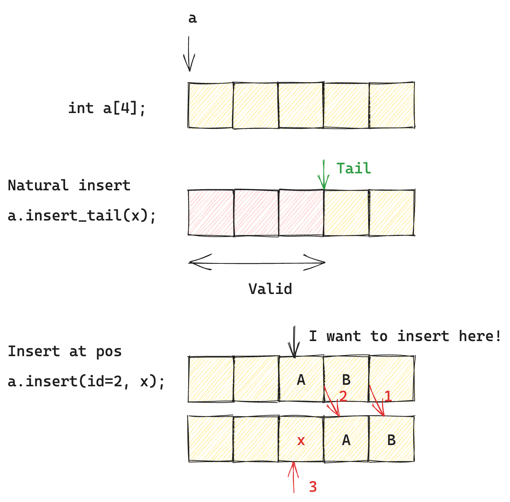

## 数组

数组是一段连续的内存空间，其中每个元素大小固定、类型一致。

连续内存使得数组能够通过“起始地址 + 下标偏移”实现 O(1) 的随机访问。

## 静态数组

静态数组，所谓静态，就是在创建时就确定了容量，其可存储的元素个数在生命周期内保持不变。这意味着数组的使用者必须在分配时对数据规模作出一个预估，记为 $M$。


如果在运行过程中实际需要存储的元素数量超过 $M$，原有数组将无法直接容纳新的数据。

### 实现

假设静态数组名为 `StaticArray`，需要知道自己的 capacity（预估容量），以及 size（实际存放的元素个数）

CRUD 操作：
- 创建 
	- c. 根据预估容量进行创建：`StaticArray(int capacity)`：分配一段连续空间即可
- 插入元素
	- I1. “自然”插入：每个元素插入在已存储的最后一个元素（index=size）的后段
	- I2. 在 pos 位置插入：指针抵达位置，并且将从所在位置直到 index=size 的所有元素都向后移一位
- 删除元素
	- d1. “自然”删除：删除最尾部的元素
	- d2. 在 pos 位置删除。与对应插入操作很相似，这次是从所在位置直到 tail 每个元素向前移动一位；更新 tail 位置
- 读取元素
	- r. 直接根据 pos 访问
- 更新元素.
	- u. 直接访问 pos 元素并进行更新



## 动态数组

一种直接但代价高昂的解决方式是：当满足一定条件（例如原空间已经无法存放新的元素）时，重新分配一块更大的连续内存，并将原数组中的所有元素整体迁移过去。**动态数组**就是实现这一思想的抽象。

在分配空间时，动态数组一次性分配一大块内存，而不是每次插入时都进行扩容操作，使得扩容开销得以被摊销。

因此需要实现：
1. 弹性扩缩容。一个简单的逻辑是：当元素个数达到底层静态数组的容量上限时，扩容为 2 倍；缩减到 1/4 时，缩容为 1/2
2. 索引越界检查
3. 删除元素谨防内存泄漏

## C++: `std::vector<T>` APIs

### 初始化
1. 字面量初始，直接传值
2. 通过拷贝别的 vector，或者是别的 vector 的一部份
3. 通过指定大小，也可以指定每个元素初始化值大小

```cpp
// (1) 字面量初始，用于测试/常量数据
vector<int> v1 = {1, 2, 3, 4};

// (2-1) 拷贝已有 vector
// 意味着内容完全拷贝，且大小一致
vector<int> v2(v1);

// (2-2) 拷贝已有 vector 的一部份（通过迭代器）
vector<int> v3(v1.begin(), v1.end());

// (3-1) 初始化指定大小 `size` 的容器
size_t size = 5; vector<int> v4(size);

// (3-2) 初始化指定大小 `size` 并且将每个元素初始化为 `elem` 的值
// 类似 zero-like, ones-like
int val = 1; vector<int> v5(size, val);

// (4) 默认构造
vector<int> v;
```


