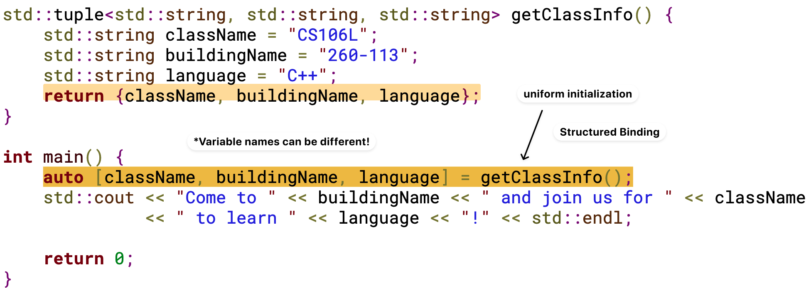
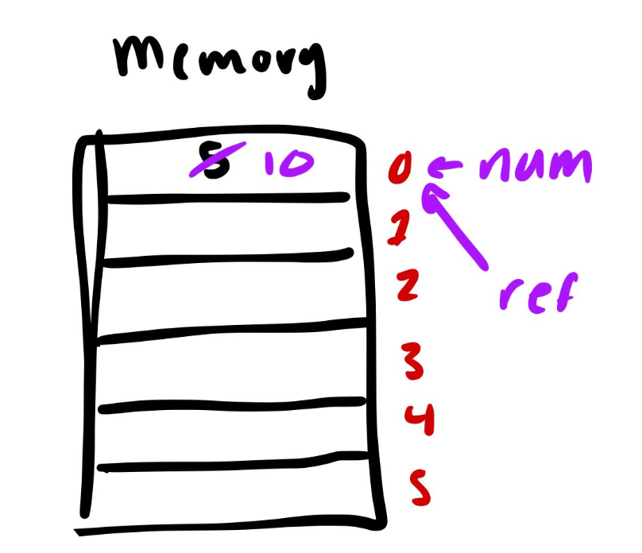

C++ Basics Series.
- [C++ Basics (1): Types, Structs and Objects](posts/c-basics-1-types-structs-and-objects/index.md)
- [C++ Basics (2): Streams](posts/c-basics-2-streams/index.md)
- [C++ Basics (3): STL Containers, Iterators and Pointers](posts/c-basics-3-stl-containers/index.md)
- [C++ Basics (4): Classes](posts/c-basics-4-classes/index.md)
- [C++ Basics (5): Template Classes and Template Functions](posts/c-basics-5-template-classes-and-template-functions/index.md)
- [C++ Basics (6): Functions and Lambdas](posts/c-basics-6-functions/index.md)

在很多情况下（例如函数需要返回多个结果时），我们希望将多个相关的值**组合为一个整体进行返回**。C++ 提供了多种方式来对多个值进行建模与打包，例如使用 struct、std::pair 和 std::tuple 将多个值组合成一个类型。在调用端，可以通过 **structured binding** 对这些聚合类型进行高效而清晰的解包，从而方便地获取各个返回值。

本文还简单介绍了几种初始化方法，以及推荐使用 **uniform initialization** `{}` 以禁止缩窄转换。

## Types and Structs

*Keywords*.
- Struct
- Type alias
- Auto type inference

### Struct

+ build data together into a new, single object, thus
+ enable user to return multiple values simultaneously.

```cpp
struct StanfordID {
    string name;
    string sunet;
    int idNumber;
};

StanfordID id;
id.name = "Jacob";
id.sunet = "jtrb";
id.idNumber = 6504417;

// -------------------
// Can now be returned 
StanfordID issueNewID() {
    StanfordID id {"Jacob", "ad", 23};
    return id;
}

StanfordID new_id = issueNewID();
```

### `std::pair`

`std::pair` is a general purpose struct with two fields.

```cpp
std::pair<int, double> example {2, 3.14};
int first_num = example.first; // .first
double second_num =example.second; // .second

std::cout << example.first << std::endl;
```

### `std::tuple`

`std::tuple` is a general purpose struct with multiple fields.

```cpp
std::tuple<int, std::string, double> {2, "ad", 80.8};
```


### Type alias and type inference

_Type alias_. `using` creates cd types alias and `auto` infers the type of a variable.

```cpp
using Roots = std::pair<double, double>; // alias
using Solution = std::pair<bool, Roots>;
```

_Automatic Type Inference_. `auto` infers the type of a variable

```cpp
std::map<std::string, std::vector<std::pair<int, std::unordered_map<char, double>>>> complexType;

auto it complexType.begin(); // auto = std::map<std::string, std::vector<std::pair<int, std::unordered_map<char, double>>>>::iterator
```

## Initialization and Reference

### Initialization

Methods of initialization.

+ **Direct initialization**: `()`
	```cpp
	int numOne(12.0); // Direct initialization : doesn't care if 12.0 is a int or not
	```
+ **Uniform initialization** (recommended!) : Care about types: `{}`
	```cpp
	int numTwo{12.0}; // Uniform initialization : DOES care, raise error
	```

### Structured binding

**Structured Binding**.
- A useful way to initialize some variables from data structures with fixed sizes at compile time
- Ability to access multiple values returned by a function
- _But_! Can only use on objects where the _size_ is _known at compile time_.


Example (Structured Binding).

> [!note] 如何使用 Structured binding？
> - 在函数定义时，通常使用 struct 或 std::tuple<...> 作为返回类型，将多个值打包为一个整体；在函数体内，可以在 return 语句中直接使用 {...} 进行 uniform initialization。 
> - 在调用函数的时候，直接 `auto= [a, b, c] = f();` 进行返回参数解包为多个变量，同时避免拷贝开销

This is identical to use `std::get<i>`:

```cpp
auto classInfo = getClassInfo();
std::string className = std::get<0>(classInfo);
std::string buildingName = std::get<1>(classInfo);
std::string language = std::get<2>(classInfo);
```


### References

A *reference* is an _alias_ to an already-existing thing.

```cpp
int num = 5;
int& ref = num; // Reference
```

Example (Changing the value of the reference). The code `ref = 10;` will also change the value of `num`, the "referenced" value.


### Pass by reference

_Passing in a variable by reference_: Take in the _actual_ piece of memory, don't make a copy!

```cpp
// This function takes the actual piece of `nums` instead of modifing the COPY of `nums`
void shift(std::vector<std::pair<int, int>> &nums) {
    for (auto &num : nums) { // Common Bug
        std::swap(num.first, num.second);
    }
}

int main() {
    std::vector<std::pair<int, int>> nums {{2, 3}, {4, 5}};
    shift(nums);
    std::cout << nums[0].first << " " << nums[0].second << std::endl;
}
```

Common bug. With `auto`, structured bindings copy the element; add `&` to bind by reference.

```cpp
// `auto` structured bindings copy;
// `auto&` binds by reference.
for (auto& [num1, num2] : nums) { ... }
```

### L-values and R-values and reference


*L-value*
- has stable _identifiable location_ in memory, and 
- you can use it to modify the value stored at the location.

*R-value* is something that's _"manufactured on the spot"_. It is temporary.

Example (R-value).
- The return value of a function (which is not a reference): `f()`
- Literal values `42`

Only L-values can be passed by reference.

### Const and reference

Can't declare a non-const reference to a const variable

```cpp
std::vector<int> vec{1, 2, 3};
const std::vector<int> const_vec{1, 2, 3};
const std::vector<int> &const_ref{vec};

// incorrect
std::vector<int> &invalid_ref{const_vec};
```
