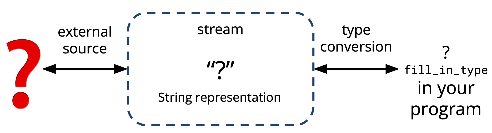
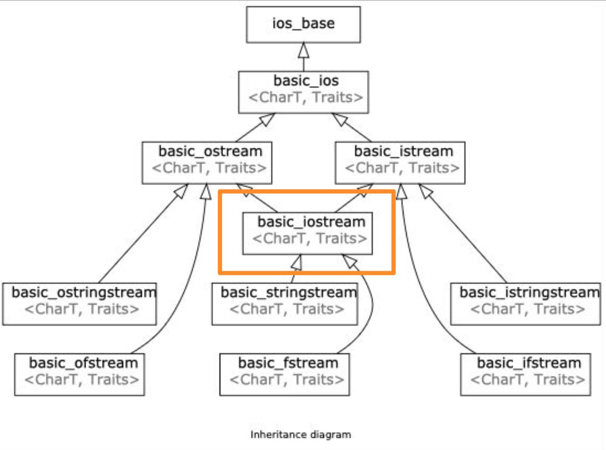
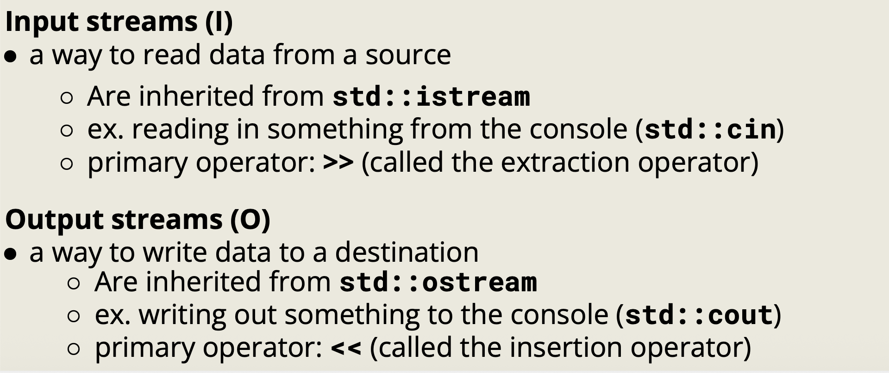
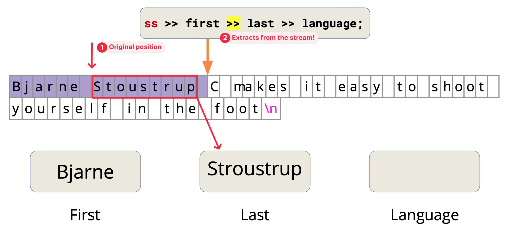
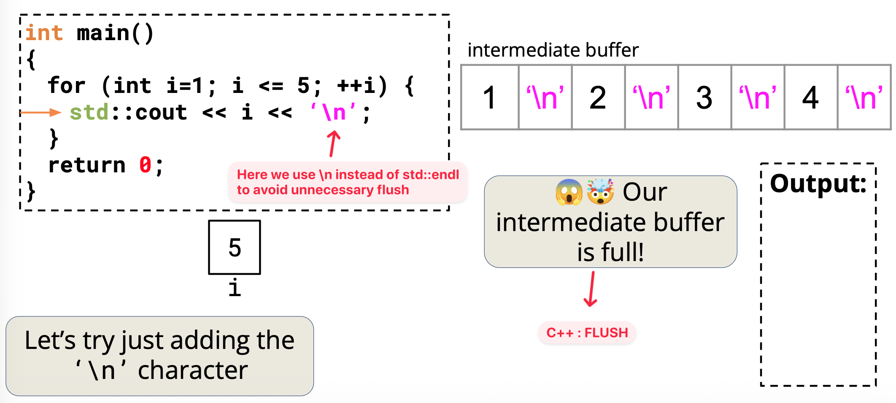
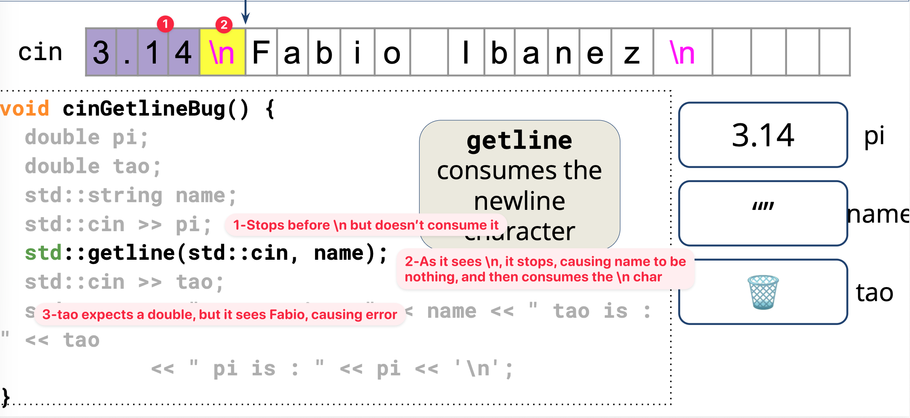

A general input/output abstraction for C++.


Illustration of C++ streams.

Types of streams.

Stream inheritance diagram

##  I/O stream 


Input streams and output streams

Example (Extraction). See the next section.

## Stringstream

`std::stringstream` treat strings as streams, and are useful for use-cases that deal with _mixing data types_. 

It is _both an input stream and an output stream_.

```cpp
#include <sstream>

std::string initial_quote = "Bjarne Stroustrup C makes it easy to shoot yourself in the foot";

// Create a stringstream
std::stringstream ss;
ss << initial_quote; // Insert the quote

// Define the data destinations
std::string first, last, language, extracted_quote;
```

*Extraction*.
- `>>` operator reads until _the next whitespace_.
  - Skips the leading whitespace 
  - The terminated whitespace _is left in the stream_.



Illustration of sstream extraction.

Example (Continuous extraction).
  ```cpp
std::vector<std::string> strvec;
std::string tempstr;

while (ss >> tempstr) {
  strvec.push_back(tempstr);
}
  ```
- `getline` operator reads _multiple words_ from the stream until the `delim` character (by default `\n`).
  - The `delim` char is _consumed_ but not stored
  - Usually used to read the entire text

The `getline()` API:

```cpp
istream& getline(istream& is, string& str, char delim)
```

Note (`>>` and `std::getline`):
- The `>>` operator skips leading whitespace, but stops reading at the next
  whitespace character without consuming it.
- Therefore, chaining extractions like `ss >> a >> b >> c` works correctly,
  since each `>>` skips the leftover whitespace.
- However, if we first use `ss >> a` and then call `std::getline(ss, d)`,
  `getline` will often read an empty string. This happens because the newline
  character left in the stream by `>>` is immediately consumed by `getline`.

Solution. Use `std::ws` to consume all whitspaces including `\n`.
```cpp
// Extrations
ss >> first >> last >> language;
ss >> std::ws; // Add this line to consume the ' '
std::getline(ss, extracted_quote);
```


## Output stream

A way to write data to a destination/external source
- ex. writing out something to the console (std::cout)
- use the `<<` operator to send to the output stream

### Flush

`std::cout` stream is line-buffered.

Contents in buffer not shown on external source until an explicit flush occurs!


Illustration of stream flushing

Flushing occurs if 
- the stream's buffer needs to be synchronized with its destination, e.g. the intermediate buffer is full
- or flushing is explicitly requested, such as calling `std::flush` or `std::endl`

Flushing is an expensive operation.

Tip.
Use `\n` instead of `std::endl` to avoid unnecessary flushing.

### Output file stream


Output file streams have a type: `std::ofstream`. A way to write data to a file!

Use the `<<` insertion operator to send to the file.

Common APIs.
- `open()`
- `close()`
- `is_open()`

```cpp
#include <fstream>
std::ofstream ofs("hello-world.txt"); // (1-1) Initialization
if (ofs.is_open()) { // (2) is_open ?
  ofs << "Hello world!" << '\n';
}
ofs.close(); // (3) close
ofs << "this will not get written";

ofs.open("hello-world.txt"); // (1-2) Open
ofs << "this will get written";
```

Flags. The default way of `<<` is to truncate all the things. Use `std::ios::app` to append to the back.

```cpp
ofs.open("text.txt"); // by default, std::ios::out, truncate
ofs.open("text.txt", std::ios:app); // append
```

## Input stream

`std::cin` is buffered. Think of it as a place where a user can store some data and then read from it.

`std::cin` buffer stops at a whitespace (` `, `\n` or `\t`) and `getline` stops at the `delim` character (by default `\n`).


std::cin vs std::getline.

`std::cin()` leaves the newline in the buffer, while `getline()` get rid of (or consumes) it.

Best practice.
- Don't use `getline()` and `std::cin()` together.
- Separate the process of getting input and the process of extracting the contents.

Example.
```cpp
// Continuously receiving input
while(true) {
    std::string userinputLine;

    // 1. Get a complete line
    if (!std::getline(std::cin, userinputLine)) {
        break;
    }

    // 2. Pass it to a stringstream to process it
    std::istringstream iss(userinputLine);

    int x;
    iss >> x;
    // 3. Failure or EOF detection
    if (iss.fail() || !iss.eof()) {
        std::cout << "Invalid input\n";
    } else {
        std::cout << "You entered: " << x << '\n';
    }
}
```