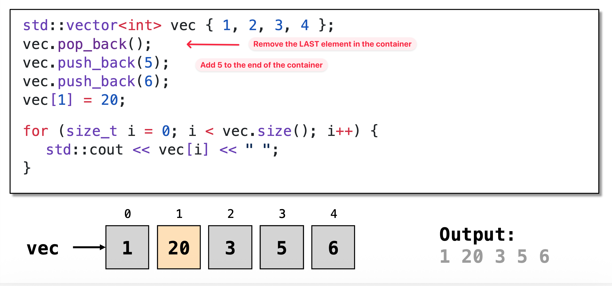
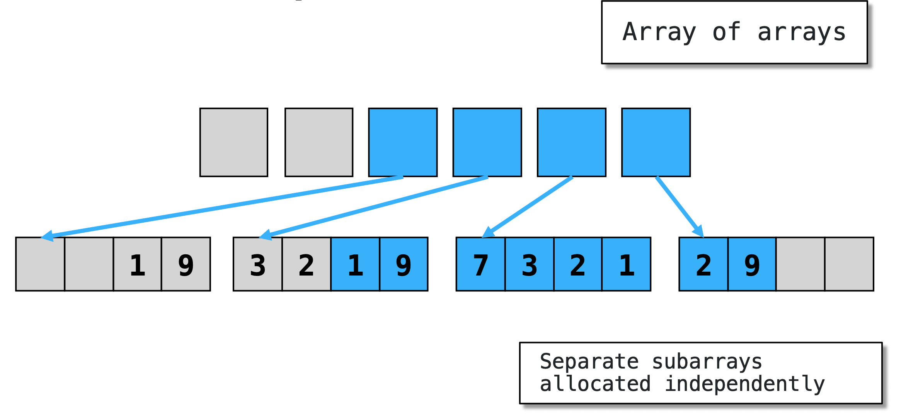
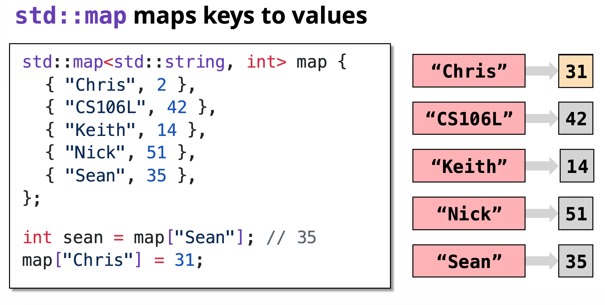
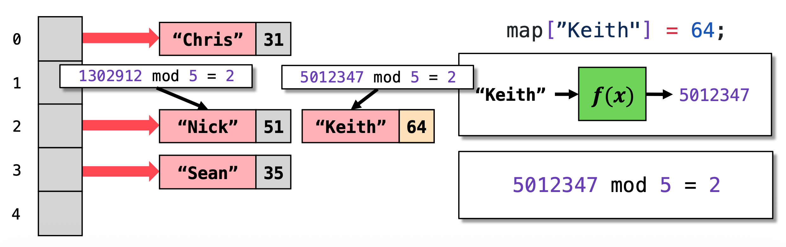
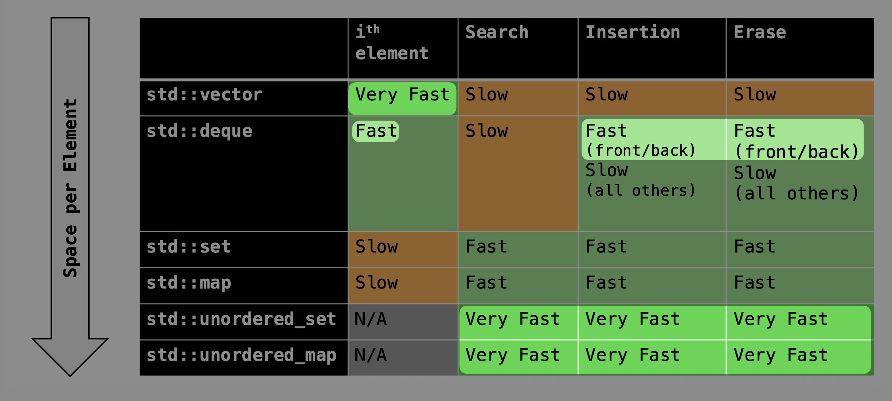
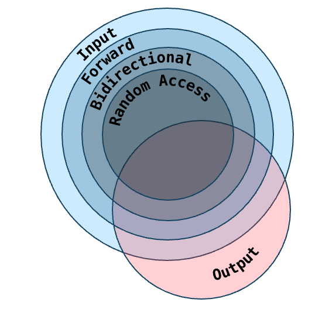

C++ Basics Series.
- [C++ Basics (1): Types, Structs and Objects](posts/c-basics-1-types-structs-and-objects/index.md)
- [C++ Basics (2): Streams](posts/c-basics-2-streams/index.md)
- [C++ Basics (3): STL Containers, Iterators and Pointers](posts/c-basics-3-stl-containers/index.md)
- [C++ Basics (4): Classes](posts/c-basics-4-classes/index.md)
- [C++ Basics (5): Template Classes and Template Functions](posts/c-basics-5-template-classes-and-template-functions/index.md)
- [C++ Basics (6): Functions and Lambdas](posts/c-basics-6-functions/index.md)
## Containers
### Sequence containers

#### `std::vector`

`std::vector<T>`.
- Contiguous memory
- $O(1)$ random memory access 
- Insertion/removal is efficient at the end of the container



#### `std::deque`

`std::deque<T>`: *Double-ended queue*. Allows efficient insertion/removal at either end

Note. The memory is no longer contiguous.


#### APIs
Access: `[i], .at(i), .front(), .back()`

Modify (Insert/Delete): 
  - `.push_back(x)`, `.pop_back()`, `.emplace_back(x)`
  - Only deque: `.push_front(x)`, `.pop_front()`, `.emplace_front(x)`
Insert (Slow):
  - `v.insert(v.begin() + 2, x)`
  - `v.erase(v.begin() + 2, x)` -> Iterator

#### Others

Others: `std::array<T, N>` (Example: `<std::string, 5>`) More efficienct than `std::vector` since it's memory size is known at compile time thus can be stack allocated.

### Associative containers

#### `std::map`

`std::map` illustration

`std::map<K, V>` stores a collection of `std::pair<const K, V>`. `K` should be const.

```cpp
std::map<std::string, int> map {{"Alice", 1}, {"Bob", 2}};

for (auto kv:map) {
    std::string key = kv.first;
    int value = kv.second;
}

for (const auto &[key, value] : map) {
    // ...
}
```

`std::map<K, V>` is implemented as a BST (technically a _red-black tree_), therefore requires `K` to have an operator<#sidenote[`K`, not `V`.].

APIs:
- Insert: `m[k]=v`, `m.insert({k, v})`, `m.emplace(k, v)`
- Search: `if m.contains(k)`
- Check empty: `if (m.empty())`

#### `std::set`

`std::set<K>`
- is an amoral `std::map`, which is also a BST
- is an `std::map` without values
- also requires `K` to have an operator<

#### Unordered map and Unordered set

Unordered map and unordered set is implemented as a Hashmap.


`std:unordered_map` illustration

`std::unordered_map<K, V>` and `std::unordered_set<K>` 
- do not require `K` to have `operator<`
- require `K` to be _hashable_


#### APIs

Access: `m[k]`

Modify (Append/Delete):
- `m.insert({k, v})`, `m[k] = v`
- `s.insert(k)`
- `m.erase(k)` or `s.erase(k)`

Check if `k` in the map/set:
- `if (m.contains(k))` or `if (s.contains(k))`

Check if `m` or `s` is empty:
- `if (m.empty())` or `if (s.empty())`

### Summary of data structures




## Iterators

To iterate elements in a certain container, e.g. `std::deque`, `std::map`, `std::set`,  the standard usage is:

```cpp
for (const auto& elem : container) { ... }
```


C++ iterators are like a "claw" in a claw machine.

The claw can:
- Grab a toy
- Move forward
- Check if we're done

To move the claw, we need to know:
- Where to start
- Where to stop


C++ iterator example

### Basic Interfaces

Container interfaces:
- `c.begin()` : Iterator to the first element
- `c.end()`: Iterator to _one_ element _after the end_ of the container

Iterator interfaces:
- `auto it = c.begin()`
- `it++`
- Dereference: `auto &elem = *it`, and moreover `auto &x = it->member`
- Forward pass `++it` (Better than `it++`)

Note (Difference between `++it` and `it++`).
- Prefix `++it`: Increments the iterator and returns a reference to the same object
- Postfix `it++`: Increments it and returns a _copy_ of the old value
- Better to use postfix than prefix

### Iterator Types
All iterators support the basic operations.

However, some provide even more:
- Move backwards: `--it;`
- Modify: `*it = elem;`
- Randn. access: `it += n;`
- Compare positions: `it1 < it2`

Types of iterators:
- **Input iterators**. Allow us to read elements: `auto elem = *it;`
- **Output iterators**. Allow us to write elements: `*it = elem;`
- **Forward iterators**: Allows us to make multiple passes. If `it1 == it2`, then `++it1 == ++it2` (Counterexample: streams, when forwarding, consumes the elments in the container)
- **Bidirectional iterations**: Allow us to move both forward and backward. `auto& elem = *(--it);`
- **Random access iterators**: Allow us to quickly skip forward and backward. `auto & second = *(it + 2);`

### Summary of STL iterator types



## Pointers

An iterator points to a container element, a pointer points to any object

Example.
- `int*` means `px` is a pointer to an `int`
- `&` is the address of the operator (in this case, `x`)
```c++
int x = 106;
int* px = &x;
```