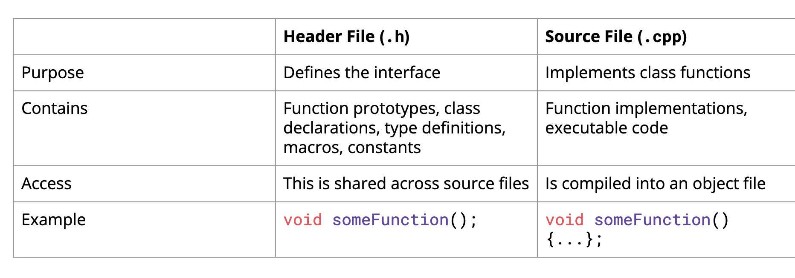
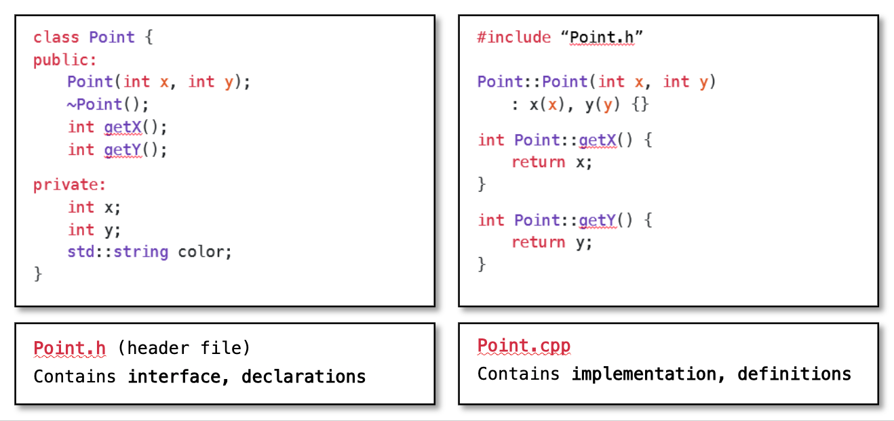
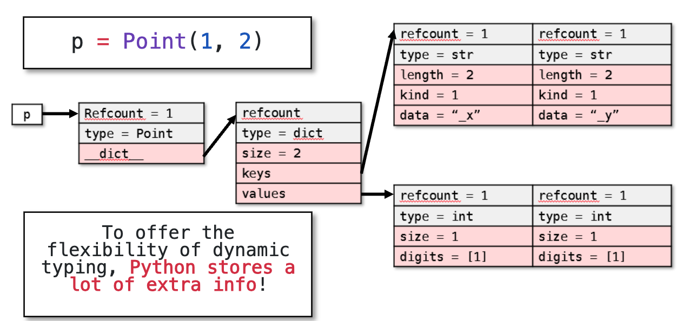
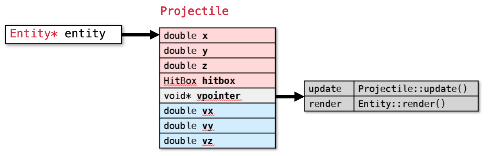
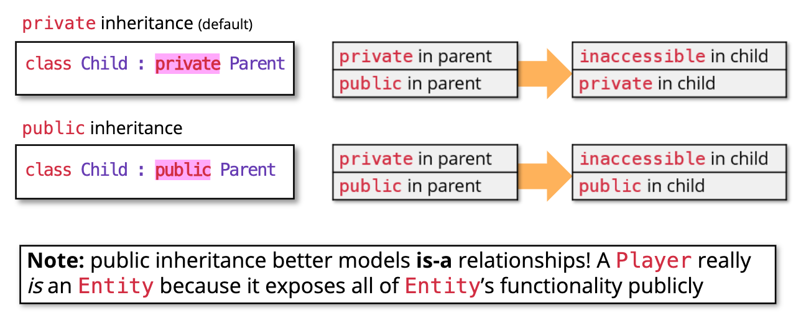
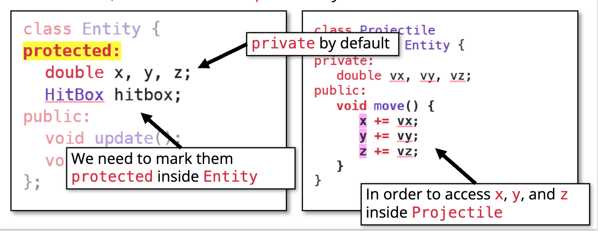
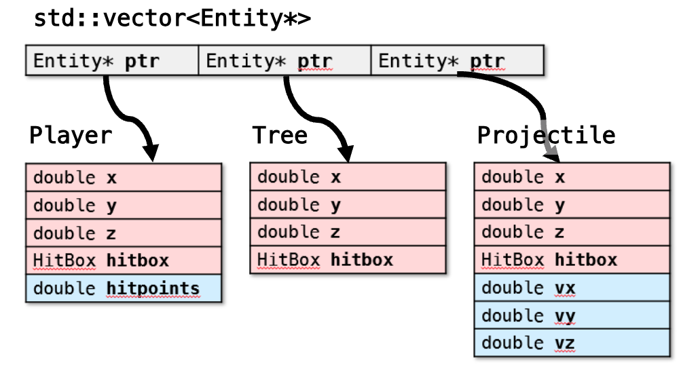

**Classes** containing
- a sequence of objects of various types
- a set of functions for manipulating these projects
- AND a set of restrictions on the access of these objects and function

## Implementation




Class implementation example: `Point` class
## Basic design

- Constructor
- Destructor
- Public interfaces
- Public methods

### Constructor

The syntax for the constructor is just the name of the class.

```c++
// .h
class StanfordID {
private:
	std::string name;
	std::string sunet;
	int idNumber;
public:
	// constructor for our StudentID
	StanfordID(std::string name, std::string sunet, int idNumber);
	}
	
// .cpp
// Use namespaces to specify the class
StanfordID::StanfordID(std::string name, std::string sunet, int idNumber) {
	this->name = name;
	this->sunet = sunet;
	if ( idNumber > 0 ) this->idNumber = idNumber;
}
```

**Default constructor**: Constructor without parameters. For example,

```c++
// default constructor
StanfordID::StanfordID() {
	name = “John Appleseed”;
	sunet = “jappleseed”;
	idNumber = 00000001;
}
```

**List initialization**. Use `: XX{XX}, ...` before `{};`

```c++
StanfordID::StanfordID(std::string name, std::string sunet, int idNumber):
name{name}, sunet{sunet}, idNumber{idNumber} {};
```

Constructors can be overloaded.

### Destructor

Pay attention to the dynamically allocated memory. Avoid memory leakage

```c++
StanfordID::~StanfordID() {
	// free/deallocate any data here
	delete [] my_array;
}
```

## Memory layout: Python vs C++

To offer the flexibility of dynamic typing, Python stores a lot of extra info.
On the contrary, C++ just stores the data in the object (in this case, only the values of `int x` and `int y`)



## This

Python `self` in C++: `this`, the pointer to the current class

```cpp
int Point::getX() { return x; }
// is equivalent to
int Point::getX() { return this->x; } // Returns this instance x
```

`this` is passed as a parameter to class function behind the scenes.

```cpp
int Point::setX(int x) { x = x; } // incorrect, this->x is shadowed
int Point::setX(int x) { this->x = x; } // correct, the real Point instance
```


## Const method

"Dear compiler, I promise not to modify this object inside of this method".

Method declared as `const`: This method does not modify the object pointed to by this

```cpp
class Vector {
public:
    size_t size() const; // won't change the Vector instance
}
```
## Inheritance


### Usage: is-a relationships

For example, `class Weapon: Entity { /* ... */ }` defines "a Weapon is an Entity" relationship.

Benefits.
- *Polymorphism*: Different objects may need the _same interface_
- *Extensibility*: Extend a class by creating a new subclass with _specific (different) properties_

### Virtual function

Virtual function declared in base class:
```cpp
class Shape {
public:
    virtual double area() const = 0; // pure virtual, MUST BE implemented in the subclass 
}
class Rectangle : public Shape {
public:
    // ...
    double area() const { return _width * _height; } 
}
```

Usage. For dynamic attributes. See [Part2: Virtual function](#Part2%20Virtual%20function).

Behind the scenes:
- Adding `virtual` to a function adds some metadat to each object
- Specifically, adds a pointer `vpointer` to a table (called a `vtable`), that says, for each `virtual` method, which function should be called for that object.



### Pure virtual functions

A class with one or more pure virtual functions is an *abstract* class, therefore can't be instantiated.

Only override all of the pure functions makes the class concrete.

```cpp
class Shape {
public:
	virtual double volume() = 0;
}
```

A virtual function provides a default behavior that may be overridden, while a pure virtual function defines a required interface that must be implemented by derived classes.
### Access modifiers: public, protected and private

By default, classes are inherited privately unless declared as protected or public.



Example.

Example

### Danger: Object slicing + dynamic dispatch

Case.
- `Entity` is a class that provides the coordinates `x, y, z` and default methods to update and render them
- `Player`, `Projectile` inherits from `Entity` and overrides the `update` and `render` functions.
- Moreover, `Player` have extra `hitpoints` attribute and Projectile have `vx, vy, vz` extra attributes

The below code will not work.
```cpp
std::vector<Entity> entities { Player(), Projectile() };
while(true) { 
	for (auto& entity: entities) {
		entity.update(); entity.render();
	}
}
```

#### Part1: Use pointers

Because the objects are stored *by value* in `std::vector<Entity>`, the derived parts of Player and Projectile are sliced off.

As a result, the container holds pure Entity objects, and dynamic dispatch never happens.

Solution. Use pointers. In this case, use
```c++
Player player;
Projectile projectile;
std::vector<Entity*> entities {
    &player,
    &projectile
};
```


Pointers remain the details of the subclass.

#### Part2: Virtual function

Without virtual, the function call is **statically dispatched** based on the static type (`Entity*`), so overridden methods in derived classes are ignored. Is it `Entity.update()` or `Player.update()`?

Using `Entity*` makes us forget which type of the object actually is. What we want is **dynamic dispatch**, depending on the runtime type of the object, a different method should be called.


Solution. 
1. Mark the `Entity.update()` and `Entity.render()` as  `virtual` to enables dynamic dispatch
2. Mark `override` in subclasses. (for readability)

```c++
class Entity {
public:
	virtual void update() {}
	virtual void render() {}
}

class Projectile : public Entity {
public:
	void update() override {};
}
```

## Composition

**Composition** defines a has-a relationship

```c++
class Car {
	Engine* engine;
	SteeringWheel* wheel;
	Brakes* brakes;
}
```

