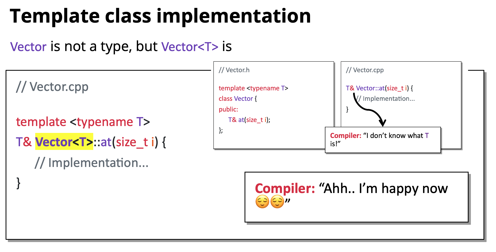
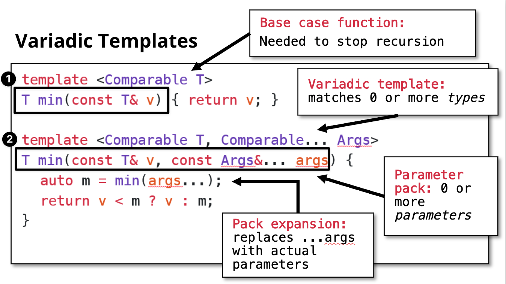

A blueprint for creating classes with generic types.

Goal: Eliminate code redundancy.

## Template class

Example.

```cpp
// Template Declaration: Takes in the name of a type T
template <typename T>
class Vector {
public:
	T& at(size_t index);
}

// T gets replaced when Vector is instantiated
Vector<int> intVec;
Vector<std::string> strVec;

struct MyCustomStruct {};
Vector<MyCustomStruct> structVec;
```


*Template Declaration*: Takes in the name of a type `T`, which gets replaced when the class is *instantiated*

*Template Instantiation*: Auto-on-demand generation of code for a specific type

### Implementation

Must copy `template <...>` syntax in `.cpp` file. The template class is `TemplateClass<T>` not `TemplateClass`.



For template classes, the `.h` file includes the `.cpp` file at the bottom of the line. (For non-template classes, it is the `.cpp` file includes the `.h` file at the head of the line)

```cpp
// Vector.h

// ... Template Vector Type
#include "Vector.cpp"

// Vector.cpp
template <typename T>
T& Vector<T>::at(size_t i) { /* ... */ }
```

### Template class and const

Objects that marked as `const` can only make use of the `const` interface, which are the functions that are `const` in an object.
```c++
template <class T>
class Vector {
public:
	size_t size() const;
	bool empty() const;
	
	T& at(size_t index); // #1
	T& at(size_t index) const; // #2: Don't write this!
	const T& at(size_t index) const; #3
}

void printVec(const Vector<int>& v) { 
	for (size_t i = 0; i < v.size(); i++) { /* ... */ }
}
```

Problem (#1). No corresponding function `size()` for `const Vector` type. This is because, it needs a `size()` that is promised for not changing the values in `Vector` type.

Problem (#2). `const` consumers can modify it since `at` returns a non-const reference. It violates the `const-correctness`.

```cpp
void oops(const Vector<int>& v) { v.at(0) = 42; }
```

A sub-optimal solution (#3). Two versions of `at` method, use it combined with #1.

But still a problem exists. We're copy-pasting code for these two functions.

### Mutable keyword

**Mutable** is a fine-grained keyword to make certain attributes changeable in a `const` instance. It is used for members that are *not part of an object’s logical state*.

It allows modifying such members even when the object is accessed through a const reference.
> 
For, example, we want to store DEBUG info.


```c++
struct CameraRay {
	Point origin;
	Direction direction;
	mutable Color debugColor;
};

void renderRay(const CameraRay& ray) {
	ray.debugColor = Color::Yellow;
	// Render ...
}
```
Example. In this case, we aren't really changing ray (observable state), but we are implementing in a debug way.

## Template function

Similar to template classes:

```cpp
template <typename T>
T min(T a, T b)
```

How to call template functions:
+ Explicit instantiation `min<double>(1.23,4.56)`
+ Implicit instantiation. Counter-example: `min("Jacob", "Fabio")` No you have to use explicit instantiation in this case. No pointer comparison please

## Template constraints: Concepts

For better compiler error messages and better IDE support.

Example.

```c++
template <typename T>
T min(const T& a, const T& b);
```

Not all types is comparable, at least they should support < operation.

Therefore, we write a Comparable concept:


Then we write

```c++
template <Comparable T>
T min(const T& a, const T& b);
```

For more Concepts usage, visit: https://en.cppreference.com/w/cpp/concepts.html

## Variadic template: Variable numbers of arguments

**Variadic template** is the template that accepts a variable number of template arguments.

Core idea. Templates + recursion.
1. Write the base case function
2. Write the variadic template, which supports 0 or more types

## Template meta-programming: constexpr and consteval

We want to run certain result during compile time to save time at runtime.
- constexpr: "Dear compiler, _try_ to run this at compile time"
- consteval: "Dear compiler, _must_ run this at compile time"

```cpp
constexpr size_t factorial(size_t n) {
  if (n == 0) return 1; return n*factorial(n-1);
}
// or to replace constexpr as consteval
```