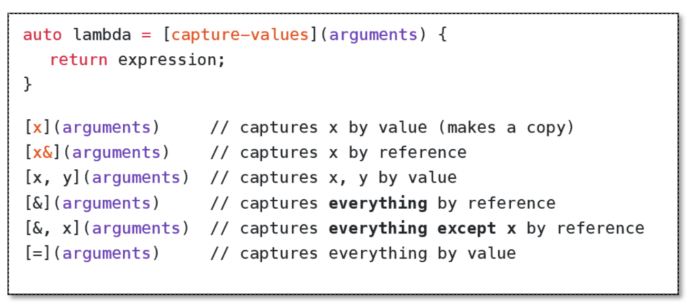
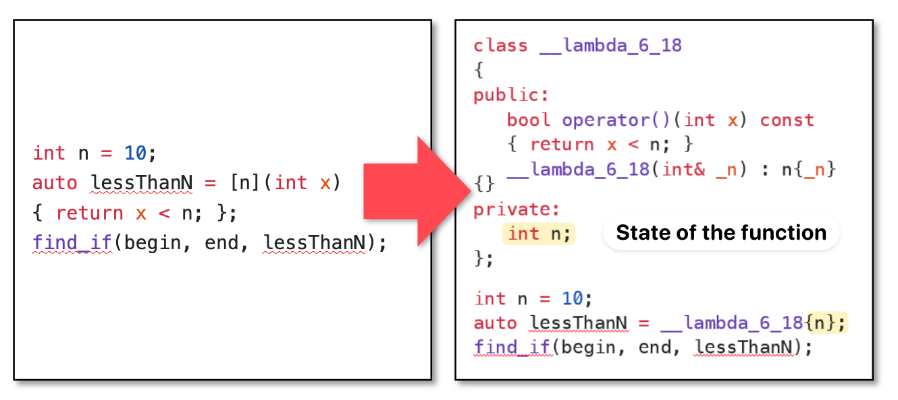

C++ Basics Series.
- [C++ Basics (1): Types, Structs and Objects](posts/c-basics-1-types-structs-and-objects/index.md)
- [C++ Basics (2): Streams](posts/c-basics-2-streams/index.md)
- [C++ Basics (3): STL Containers, Iterators and Pointers](posts/c-basics-3-stl-containers/index.md)
- [C++ Basics (4): Classes](posts/c-basics-4-classes/index.md)
- [C++ Basics (5): Template Classes and Template Functions](posts/c-basics-5-template-classes-and-template-functions/index.md)
- [C++ Basics (6): Functions and Lambdas](posts/c-basics-6-functions/index.md)

本文介绍了如何将函数作为可调用对象，并通过在创建可调用对象时捕获其上下文环境，更好地支持泛型编程。


Represent functions as variables.

## History: Predicates

**Predicate**: boolean-valued function

Example.
```c++
bool isVowel(char c) {  
    c = toupper(c);  
    return c == 'A' || c == 'E' || c == 'I' || c == 'O' || c == 'U';  
}  
```

Idea: Passing functions to _generalize_ an algorithm with _user-defined behavior_

```cpp
template <typename It, typename Pred>  
It find_pred(It first, It last, Pred pred) {  
    for (auto it = first; it != last; ++it) {  
        if (pred(*it)) return it;  
    }  
    return last;  
}

std::string corlys = "Lord of the Tides";
auto it = find_pred(corlys.begin(), corlys.end(), isVowel);  
```

In this example, `Pred` is a function pointer which is `bool (*)(char)`, and can be any callable object that takes an element and returns bool.

## Lambda functions

Problem: Functions pointers generalize poorly. For example, if we want to find a number less than $N$. Now we have to write `lessthan5()`, `lessthan6()`, ... for each number $N$.

The $N$ is referred to as the state of the function. We need to give our function extra state (not introducing new parameters)


Lambda syntax. The only difference is the capture clause and the auto-deduction of the type of the return value.

Example.

```cpp
std::vector<int> v = {1, 3, 5, 7, 9};  
double n = avgVal(v); // calculate the avg value of the container  
  
auto lessThanN = [n](int x) {  
    return x < n;  
};  
  
int cnt = std::count_if(v.begin(), v.end(), lessThanN);
```

### Captures



If we don't need capture value, then use `[]` in the capture clause.

## STL Functors

A **functor** is any object that defines an `operator()`. I.e., it is an _object_ that acts like a function.

Since a functor is an object, it can have state

```c++
struct my_functor {  
    bool operator()(int a) const {  
        return a * value;  
    }  
    int value;  
};  
  
my_functor f;  
f.value = 5;  
std::cout << f(2) << std::endl;  
```

### Functors and lambda

When you use a lambda, a functor type is generated. It is a syntactic sugar


