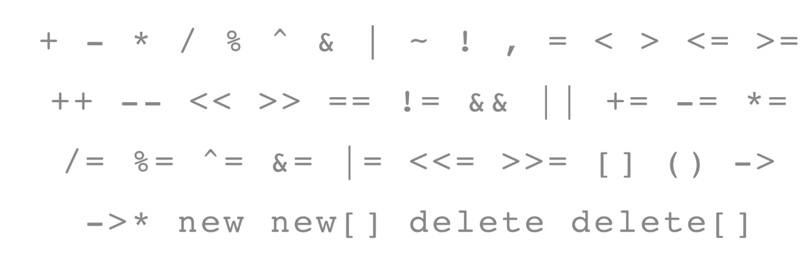

## Operator Overloading

How do operators work with classes?
- Just like we declare functions in a class, we can declare an operator’s functionality
- When we use that operator with our new object, it performs a custom function or operation
- Just like in function overloading, if we give it the same name, it will override the operator’s behavior!

Operator example.


Two ways to overload:
- Member overloading: within the scope of your class
- Non-member overloading (preferred)

```cpp
// member-overloading
bool StanfordID::operator< (const StanfordID& rhs) const { ... }

// non-member-overloading
bool operator< (const StanfordID& lhs, const StanfordID& rhs);
```

Problem. Non-member functions or classes cannot access private information in another class.

Solution. Declare the operator overload function as a `friend`

```cpp
class StanfordID {
// Inside the class
public:
	// constructor for our StudentID
	StanfordID(std::string name, std::string sunet, int idNumber);
	...
	friend bool operator < (const StanfordID& lhs, const StanfordID& rhs); // Declare the function as friend
}
```

Conclusion.
- Operator overloading unlocks a new layer of functionality and meaning within objects that we define
- Operators should make sense, the entire point is that convey some meaning that functions don’t about the type itself. (Otherwise, you should define a new function)
- Should overload when you need to
## Special Member Functions

**Special Member Functions (SMFs)** include
- Default constructor `T()`
- Destructor `~T()`
- Copy constructor `T(const T&)` （an object is constructed from another object)
- Copy assignment operator `T& operator=(const T&)` (both source and destination objects already exist)
- Move constructor `T(T&&)` (Constructs a new object by taking over the resources of a temporary or movable object.)
- Move assignment operator `T& operator=(T&&)` (Replaces the contents of an existing object by taking over the resources of another object)

### Copy constructor vs assignment operator

Usage.

```cpp
// Copy constructor
Widget widgetOne;
Widget widgetTwo(widgetOne); // widgetTwo is constructed here

// Copy assignment operator
Widget widgetOne;
Widget widgetTwo; // widgetTwo constructed here
widgetTwo = widgetOne; // assignment of copy
```

It’s quicker and more efficient to directly construct member variables with intended values.

Note. Variable is a non-assignable type. 
- `const` variables, 
- member-wise copy pointer will point to the same allocated data not a fresh copy. Thus changes made to one pointer affects the other

Example (Pointers).
```cpp
class Bad {
    int* p;
public:
    Bad(int v) : p(new int(v)) {}
    ~Bad() { delete p; } // Customized destructor
};

Bad a(1);
Bad b(a);

// Now b and a are pointing to the same memory
// When a is destructed, b.p is undefined behavior.

```

In these cases, you need to override the default SMFs.

### Delete SMF

_Core idea_. Allow functionality of special member functions

For example, you don't want you class to be copied.

```cpp
class PasswordManager {
public:
	PasswordManager(const PasswordManager& rhs) = delete;
	PasswordManager& operator=(const PasswordManager& rhs) = delete;
}

// Now copying isn't a possible operation
```

### Rule of Zero

If the default SMFs work, don’t define your own!
We should only define new ones when the default ones generated by the
compiler won't work. (E.g. pointers to things on the heap)

### Rule of Three


**Rule of three**: If you need and of these, you need them all:
- Destructor
- Copy Assignment
- Copy Constructor

Case. Managing external resources

If you need a custom destructor, then you also probably need to define a copy
constructor and a copy assignment operator for your class.

This is because, when you are manually dealing with dynamic memory allocation, the compiler won't be able to automatically generate the copy operators for you.

```cpp
class Bad {
    int* p;
public:
    Bad(int v) : p(new int(v)) {}
    ~Bad() { delete p; } // Custom destructor

	// Copy constructor
    Bad(const Bad& other) : p(new int(*other.p)) {}
    // Copy assignment operator
    Bad& operator=(const Bad& other) {
        if (this == &other) return *this;
        int* newp = new int(*other.p);
        delete p; // Destruct this->p original space
        p = newp;
        return *this;
    }
};
```

## Move semantics

### Lvalues and Rvalues

lvalues and rvalues generalize the idea of _temporariness_ in C++.

_Core difference_.
- lvalues have a definite address
- rvalues do not

```cpp
void foo(Photo pic) {
	Photo* p1 = &pic; // lvalue, can take its address
	Photo* p2 = &takePhoto(); // rvalue, doesn't work because we cannot take its address
}
```

An lvalue can appear on either side of an `=`, but rvalue can appear only right of an `=`.

An lvalue's lifetime is until the end of scope, an rvalues's lifetime is until the end of line.

Examples.
```cpp
int a = 4; // rvalue
int& b = a; // lvalue
vector<int> c = {1, 2, 3}; // rvalue
int d = c[1]; // lvalue. Has its position!
int* e = &c[2]; // rvalue
size_t f = c.size(); // rvalue
```


The return value of a function is _temporary_. It is destroyed before the next line. (Compiler is going to clean this object up before moving on to the next line)

### Pass by rvalue reference

Since pass by lvalue reference will result in unnecessary object coping:

```cpp
void upload(Photo& pic); // Pass by reference
 
int main() {
	Photo selfie = takePhoto(); // selfie is a lvalue
	upload(selfie);
	
	// incorrect way:
	upload(takePhoto());
}
```

We define the **pass by rvalue reference** method:

```cpp
void upload(Photo&& pic); // Pass by rvalue reference

upload(takePhoto()); // correct
```

Rvalue references:
- Syntax: `Type&&`
- Temporary, we can steal (move) its resources
- Object its temporary and might end up in an invalid state

### Move assignment operator

Compare the copy assignment operator and the move assignment operator.

```cpp
// copy assignment
Photo& operator=(const Photo& other);
// move assignment
Photo& operator=(Photo&& other) noexcept; // Note: No more "const" since we're going to deal with it

Photo& Photo::operator=(const Photo& other) {
	if (this==&other) return *this;
	delete[] data; // original
	width = other.width; height = other.height;
	data = new int[width * height];
	std::copy(other.data, other.data + width * height, data);
	return *this;
}

Photo& Photo::operator=(Photo&& other) noexcept {
	if (this==&other) return *this;
	delete[] data;
	width = other.width; height = other.height;
	data = other.data; // steal directly
	other.width = 0; other.height = 0;
	other.data = nullptr; // make it destructable, and when it destructs, doesn't effect *this object
	return *this;
}
```


### std::move

Forcing move semantics, for example

```c++
// std::vector<Photo> elems;

for (int i = size(); i > pos; i--) { 
	elems[i] = elems[i-1]; // Copy assignment
	elems[i] = std::move(elems[i-1]); // Move assignment
}
```

To enforce move operations, `std::move` type casts an `lvalue` to an `rvalue`.

This is error-prone, thus try to avoid explicitly using `std::move`.
### Return Value Optimization

```cpp
Photo takePhoto(); // is a function that returns a Photo object

Photo selfie = takePhoto();
```

The last line will not call copy-constructor + destructor. Instead of creating a temporary object, it will now directly construct an object at the caller side.

### Rule of Five

**Rule of five**: If you need and of these, you _probably_ want them all:
- Destructor
- Copy Assignment
- Copy Constructor
- Move Assignment (Optional)
- Move Constructor (Optional)


If we defined copy constructor/assignment and destructor, we should also define the *move constructor/assignment*.

This is not required, but our code will be slower as it involves unnecessary copying.