In this note, you will 
- understand how inter-related data (of the real world) is _modeled_ as relations (schemas and instances), and how relationships between data are _represented_ across relations in a database.
-  learn how to _query_ these relations using a formal query language.

Keywords.
- Entity-Relationship (ER) Model
- Entity, Attribute, Relationship
- Relation Model (RM)
- Relational instance, Relational schema, Tuples, Attributes, Values
- Key, Superkey, Candidate key, Primary key
- Relation Algebra (RA)
- Selection, Projection, Cartesian Product, Join, Union, Intersection, Difference, Division

Database series.
1. [Database (1): Relation Model and Relation Algebra](posts/database-1-er-model/index.md)
2. [Database (2): SQL](posts/database-2-sql/index.md)

## ER Model

**Entity-Relationship (ER) Model** models entities in the real world also the connections between them. The three main components of the ER model is:
- **Entities**, an object that is stored as data, e.g. _Student_, _Course_ or _Company_.
- **Relationships** (between entities), a connection, e.g. _Student enrolls in a Course_.
- **Attributes** (of entities and relationships), properties that describe an entity, e.g. _StudentID_, _CourseName_.

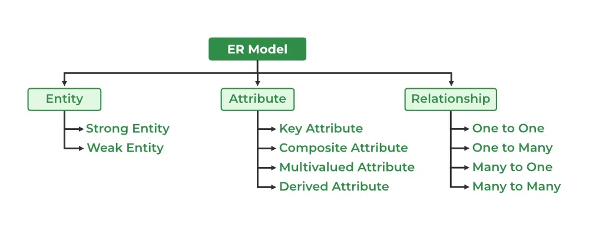
### Entity

An **entity** represents a real-world concept that has an independent existence and can be uniquely identified. 
It can be physical objects (e.g., a doctor, a client), and it can also be conceptual or event-based objects, like an medical visit, a demand.

### Relationships

A **Relationship** represents the association between entity types. For example, ‘Enrolled in’ is a relationship type that exists between entity type Student and Course. 

In ER diagram, the relationship type is _represented by a diamond_ and _connecting the entities with lines_.

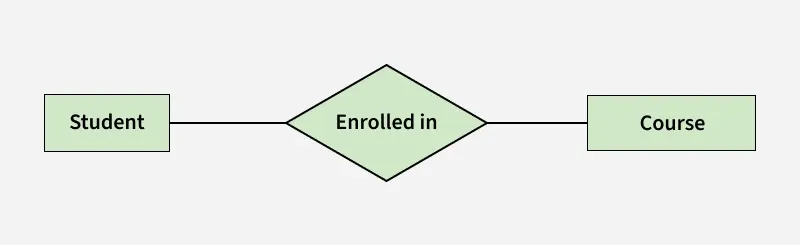
Relationship example
### Cardinality

**Cardinality** describes the maximum number of times an entity of an entity set participates in a relationship set.
- One-to-one (1,1). E.g. _One person can be issued only one passport, and one passport is issued to only one person_ 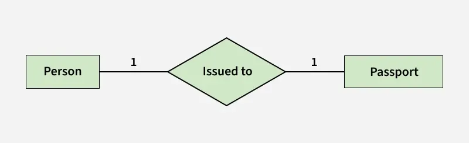
- One-to-many (1,m). E.g. _A single Surgeon Department can have many Doctors_. 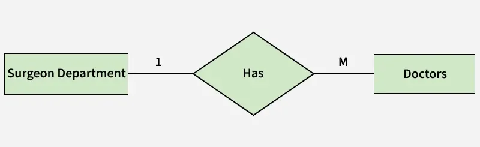
- Many-to-one (m:1).
- Many-to-many (m:n).

Cardinality have two directions.E.g., A product can only be delivered by only one delivery company, whereas a delivery company can deliver many products. This can be represented as:

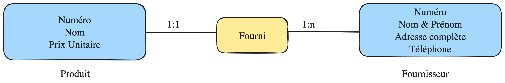

### Attributes

Attributes are the properties that define the entity type. For example, for a _Student_ entity _Roll_No, Name, DOB, Age, Address, and Mobile_No_ are the attributes that define entity type Student.

### Rules to build an Model

1. The MCD must reflect the _rules of the real world_ that the system is supposed to respect. (A professor can teach multiple courses)
2. Properties must be elementary, not calculated (redundant), not constant (redundant)
3. No repetitive properties. E.g. `Child [1-5]` is bad, create a new entity or an association instead
4. Every entity must have an identifier, thus being uniquely identifiable.
5. Entities are linked only via associations
6. No transitive dependencies. A property must not depend on another property that is _not_ the identifier. E.g. `Student(id, city, country)` is bad since country depends on city
7. Every property must depend on the entire identifier. E.g. `Teaches(Professor, Course, Group), <- Room?` the attribute Room **can be added** _if and only if_ its value is uniquely determined by the combination (Professor, Course, Group), not a subset of it.
8. No meaningless properties

### Exercise

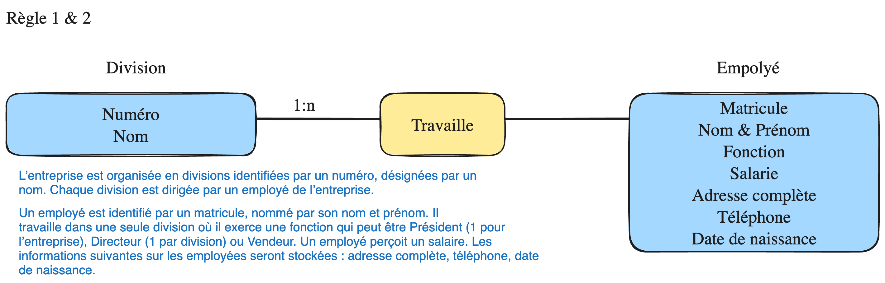

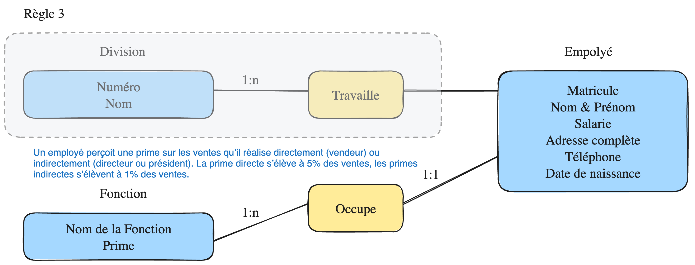

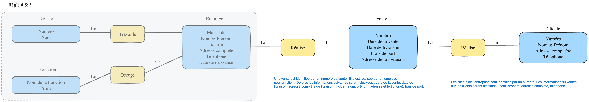

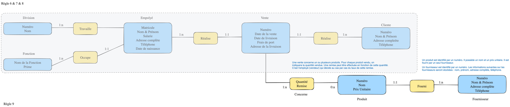
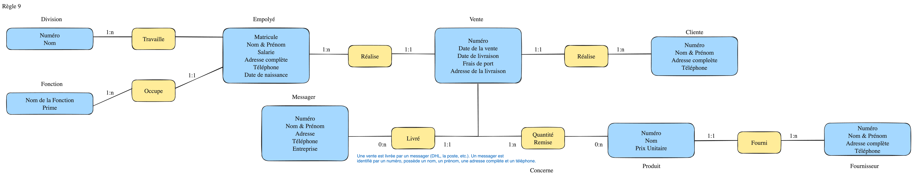
## Relation Model

**Database**: an organized collection of _inter-related_ data that models some aspect of the real world.

The **relational model** (**RM**) is 
- Proposed in 1970 by Edgar F. Codd.
- a mathematical abstraction for representing and manipulating data
- represents data as relations
- and defines operations on them independently of physical storage.

### Core concepts

Core concepts.
- A database is a collection of relations
- Relations.
	- **Relational schema**. $R(A_{1},\dots, A_{n})$, defines the _logical structure_
	- **Relational instance**: Concrete table content w.r.t. a given relational schema. Relational instance is an unordered set of **tuples**, or **records** (or rows)
- Each relational schema has a set of **attributes** ($A_{1}, \dots, A_{n}$), which are each column in the relational instance
- Each tuple has a **value** (which is atomic/scalar) for each attribute in the columns.

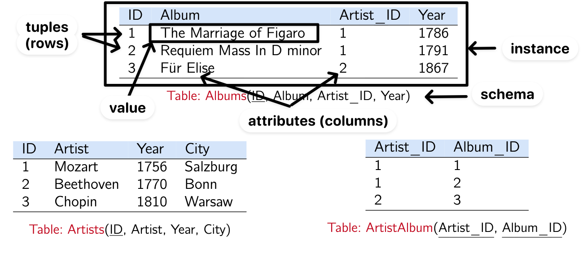Core concepts illustration

Comparaison.
- A schema rarely changes after being defined.
- Instances often changes rapidly.


### Key

#### Superkey, Candidate key, Primary key

_Core idea (Superkey)_. Each tuple in the relation instance should be uniquely identifiable. The concept of superkeys is used for this purpose.

$K \subseteq \{A_1, \ldots, A_n\}$ is a **superkey** of schema $R(A_1, \ldots, A_n)$ if values for $K$ are sufficient to identify a *unique* tuple for each *possible* relation instance of $R$.

A superkey $K$ is a **candidate key** if $K$ is minimal (i.e. we cannot delete any attribute from $K$ and still have a superkey). A schema can have multiple candidate keys,

A **primary key** is a *designated* candidate key of a relation.

#### Foreign key

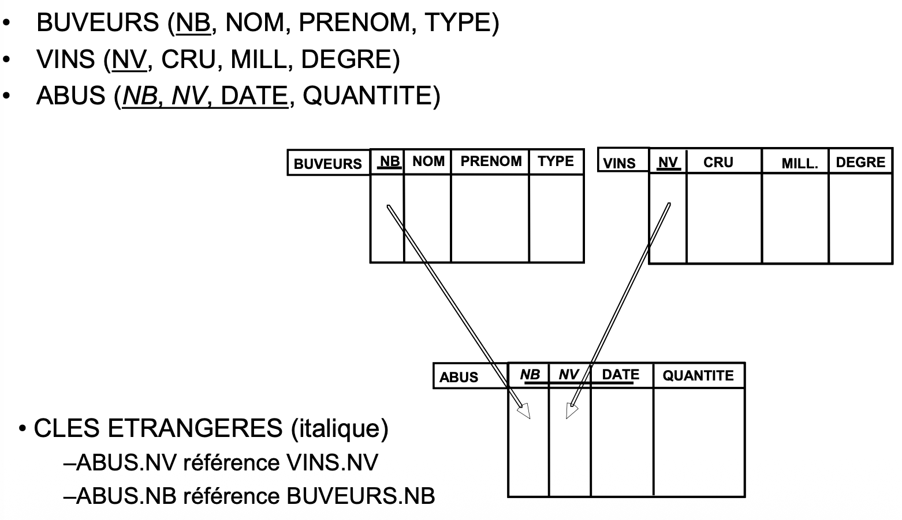
Example of foreign key

_Core idea_. Entity in one relation wants to reference an entity in another relation.
- This requires a link between relations
- The link is established by requiring that some attributes in one relation reference key values of another relation
- Using key values guarantees that the reference is well-defined and unambiguous

A **foreign key** is a constraint stating that every value appearing in the foreign key attributes of one relation **must also appear** as a key value in another relation (being referenced).

Example.
```sql
-- TABLE Artists
-- TABLE Albums

CREATE TABLE ArtistAlbum (
  Artist_ID  VARCHAR(8),
  Album_ID   VARCHAR(8),

  -- Primary key
  PRIMARY KEY (Artist_ID, Album_ID),

  -- Foreign keys
  FOREIGN KEY (Artist_ID) REFERENCES Artists, -- Artists relation must have attribute Artist_ID
  FOREIGN KEY (Album_ID)  REFERENCES Albums -- Albums relation must have attribute Album_ID
  
  -- (Recommended)
  -- FOREIGN KEY (Album_ID) REFERENCES Albums(Album_ID)
);
```

The referenced attributes must be **unique** (i.e., a key); otherwise the reference would be ambiguous.

Example. If there are two students with the same name, the reference to student is ambiguous

```sql
Student(sid, name)

Enrollment(student_name, course)
Enrollment.student_name -> Student.name -- Ambiguous

Enrollment(sid, course)
Enrollment.sid -> Student.sid -- Good, each enrollment refers to exactly one student
```

**Foreign key constraint**. The referencing attribute(s) must be the *primary key* (or any candidate key) of the referenced relation.


## Relational Algebra

Database management systems (DBMS) must have a query language so that the users can access the data stored in the database. **Relational algebra (RA)** is considered as a _procedural query language_ where the user tells the system to carry out a set of operations to obtain the desired results. i.e. The user tells what data should be retrieved from the database and how to retrieve it.

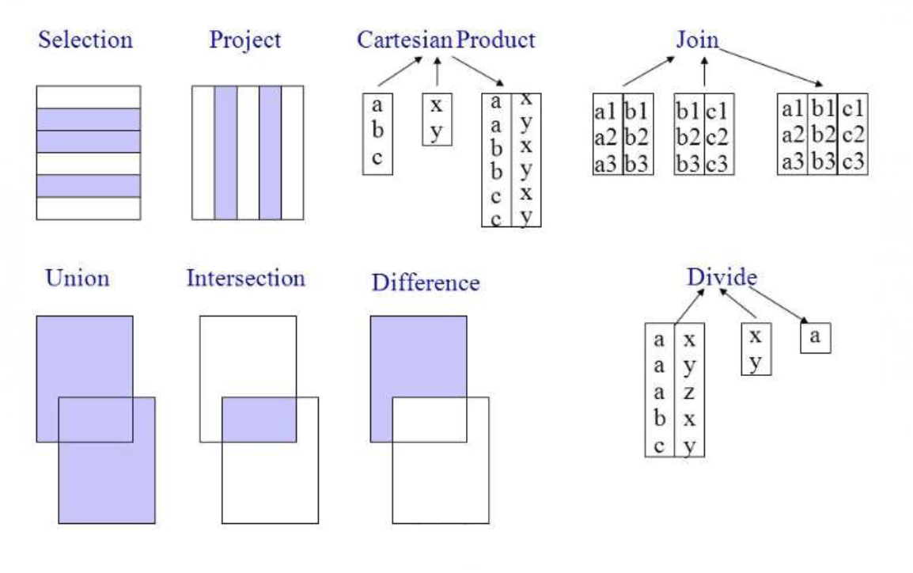

| **Operation** | **Notation**                  |
| ------------- | ----------------------------- |
| Selection     | $\sigma_p(R)$                 |
| Projection    | $\Pi_{A_1,\ldots,A_k}(R)$     |
| Product       | $R \times S$                  |
| Join          | $R \Join_\theta S$            |
| Union         | $R \cup S$                    |
| Difference    | $R - S$                       |
| Division      | $R \div S$                    |
| Renaming      | $\rho_{S(A_1,\ldots,A_k)}(R)$ |

### Selection

The **selection** operation selects tuples that satisfy a given predicate.

A predicate is a Boolean condition or expression that evaluates to true or false for each tuple (e.g. `age > 18`). Predicates can be combined using logical operators such as AND, OR, and NOT.

Notation: $\sigma_P(R)$


### Projection

The **projection** produces from an input relation $R$ a new relation $R'$ that has only some of $R$’s attributes.  

Notation: $\Pi_{A_1,\ldots,A_n}(R)$

### Cartesian Product

Pair every element of $R$ with every element of $S$ to construct a _combined view_ (all possible pairings).

This is mainly only useful for theoretical analysis, since the resulting relation can be extremely large.

Notation: $R \times S$
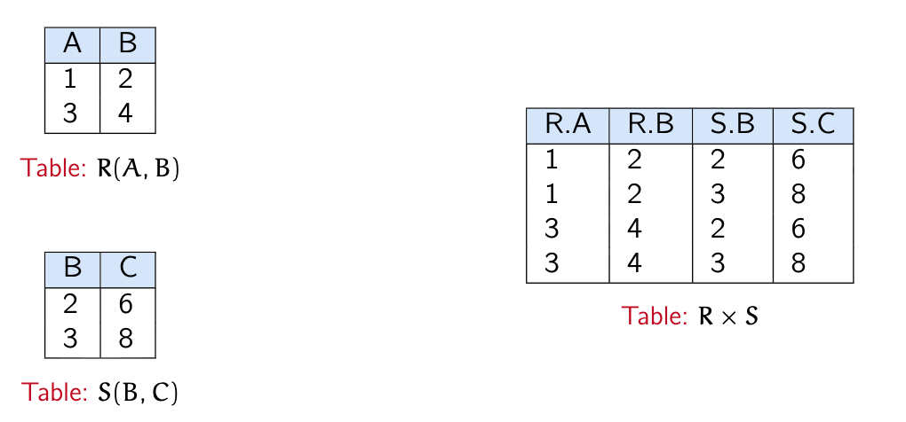
Example of cartesian product

  
### Join — Theta Join and Natural Join

We want a more intelligent combination of two relations—not all possible pairings, but only those satisfying specific conditions.

For example, we may require `employee.department = employer.department`, which is called a **join condition**.


The **join** operation combines a _selection_ and a _cartesian product_ into a single operation. Conceptually, it can be understood as:

```
joined_RS <- None

For each ele_R in R
	For each ele_S in S
		Create new relation (ele_R, ele_S)
		If (ele_R, ele_S) satisfies the predicate theta
			joined_RS += (ele_R, ele_S)
```  

Notation: $R \Join_\theta S = \sigma_\theta(R \times S)$

Join helps answer _exists_ queries by constructing concrete tuples that witness the existence of a relationship.


A **natural join** of $R$ and $S$ combines tuples based on their _common attributes_.
- Enforces equality between attributes that share the same name (only join the values that are equivalent)
- retains only one copy for each pair of identically named attributes

Example. If both $R$ and $S$ have attribute id, then $R \Join S = R \Join_{R.id = S.id} S$.

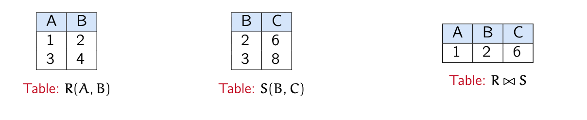
Example of natural join

_Lemma_. If $R$ and $S$ have no common attributes, then $R \Join S = R \times S$.


### Union, Intersection, Difference for compatible schemas

_Prerequisite_. The schemas of $R$ and $S$ must be _compatible_, meaning:
- they have the same number of attributes,
- corresponding attributes appear in the same order,
- corresponding attributes have matching domains (data types).


**Union**.

All tuples that appear in $R$ _or_ $S$.

**Intersection**.

All tuples that appear in $R$ _and_ $S$.


**Difference**.

All tuples that appear in $R$ _but not in_ $S$.

The difference operator is useful for expressing **“only”** conditions.
To say that an object satisfies an “only” constraint means: it **exists**, and there exists **no counterexample** that violates the constraint.

Therefore, “only” queries are typically expressed by:
1. selecting all objects that satisfy the basic condition, and
2. subtracting those for which a counterexample exists.


Notation:

$R \cup S,\quad R \cap S,\quad R - S$

Example (Difference). A file producer relation $P(\text{Producer}, \text{Title})$ and a spectator relation $S(\text{Spectator}, \text{Title})$. We now want to retrieve the producers who have watched and only watched the films that they themselves produced.
- *Only = Exist - Counterexample*.
	- Whole case：the producers who have watched at least one film produced by themselves.
	- Counterexample case：the producers who have watched at least one film that they did not produce themselves, 
	- This can be translated as $\{(p, t)\; | \; (p, t) \not\in P, \; (p, t) \in S\}$
- Whole case: $\Pi_{\text{Producer}}(P \Join_{\text{Producer}=\text{Spectator}} S)$
- Other case:
	- Since $(p, t) \in S$ but $(p, t) \not \in P$, therefore is $\Pi_{\text{Producer}}(S - P)$
- Conclusion: $\Pi_{\text{Producer}}(P \Join_{\text{Producer}=\text{Spectator}} S)- \Pi_{\text{Producer}}(S - P)$

### Division

_Core idea_.
- Selection and join are well suited for expressing _existential queries_.
- However, RA does not directly support _universal (for-all) queries_. For instance, retrieving the names of students who are enrolled in _all_ courses offered by the CS department cannot be naturally expressed using only $\sigma$, $\Pi$ and $\Join$.


Suppose $\text{schema}(R) = A \cup B$, $\text{schema}(S) = B$, where the attributes of $S$ are a subset of those of $R$.

The **division** operation finds all values of $A$ that are associated with _every_ tuples in $S$.

Notation: $$R \div S = \{ a \in \Pi_{A} (R) \;|\; \forall b \in S, (a, b) \in R\}$$


_Example_. Return to our example: Retrieving the names of students who are enrolled in _all_ courses offered by the CS department. Remind that $C(\text{CourseID}, \text{DepName}, \text{EnrolStuID})$ and $S(\text{StuID}, \text{StuName})$
- For all (students), (enrolled in course) that ...: 
	- We construct $R = R(\text{StuID}, \text{CourseID})$ the combined view of students and courses, and later the students name can be retrieved by joining $S$ and using projection.
	- $R$ can be built via $R = \Pi_{\text{EnrolStuID}, \text{CourseID}}(C)$
- $S$ is the ensemble of courses offered by the CS department. Therefore, $S = \Pi_{\text{CourseId}}(\sigma_{\text{DepName}=\text{CS}}(C))$
- We then retrieve the qualified student id, which is $R \div S$.
- The result can be expressed as: $$\Pi_{\text{StuName}}((\Pi_{\text{EnrolStuID}, \text{CourseID}}(C)\div \Pi_{\text{CourseID}}(\sigma_{\text{DepMame=CS}}(C)) )\Join_{\text{StuID}}S)$$
_Lemma_. If the schema of $R$ is $A \times B$ and the schema of $S$ is $B$, then:
$$
R \div S= \Pi_A(R) - \Pi_A\big((\Pi_A(R) \times S) - R\big)
$$
### Exercise


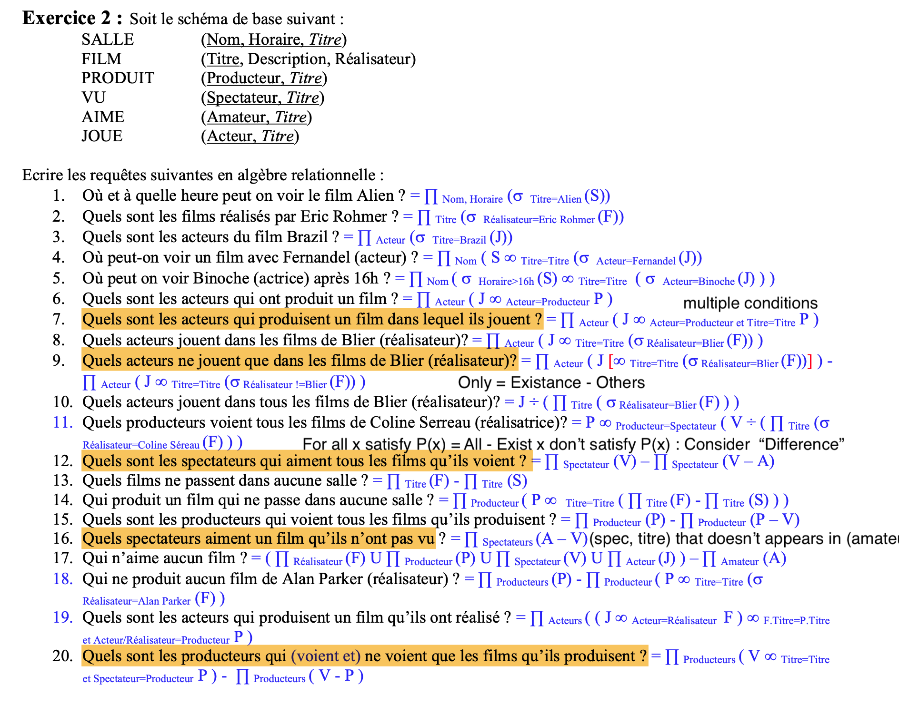


## References
- [Introduction of ER Model](https://www.geeksforgeeks.org/dbms/introduction-of-er-model/)
- [A Quick Guide to Relational Algebra Operators in DBMS](https://medium.com/data-science/a-quick-guide-to-relational-algebra-operators-in-dbms-1ff2ddecaad7)
- [Database Systems Concepts (AI3613/ICE3404P, Spring 2024)](https://basics.sjtu.edu.cn/~qyin/teaching/db2024/index.html)