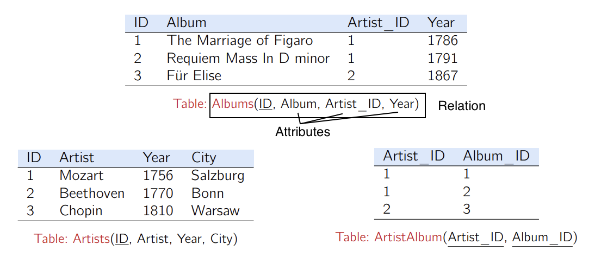

## Relation Model

Proposed in 1970 by Edgar F. Codd.

### Relation and attribute


RA example

Concepts.
- A **relation** is an unordered set of tuples (or rows).
- Each relation has a set of **attributes** (or columns).
- Each attribute has a name and a domain, and each tuple has a value for each attribute of the relation.

A database is a collection of relations.

We denote the *schema* (not a concrete instance) of a relation by  $R(A_1, \ldots, A_n)$.

### Key

#### Superkey, Candidate key, Primary key

_Core idea (Superkey)_. Each row in the database should be uniquely identifiable. The concept of **superkeys** is used for this purpose.

$K \subseteq \{A_1, \ldots, A_n\}$ is a superkey of schema $R(A_1, \ldots, A_n)$ if values for $K$ are sufficient to identify a *unique* tuple for each *possible* relation instance of $R$.

A superkey $K$ is a **candidate key** if $K$ is minimal (i.e. we cannot delete any attribute from $K$ and still have a superkey). A schema can have multiple superkeys.

A **primary key** is a *designated* candidate key of a relation.

#### Foreign key


Foreign key.

_Core idea_. Entity in one relation wants to reference an entity in another relation.
- This requires a link between relations
- The link is established by requiring that some attributes in one relation reference key values of another relation
- Using key values guarantees that the reference is well-defined and unambiguous

A **foreign key** is a constraint stating that every value appearing in the foreign key attributes of one relation **must also appear** as a key value in another relation.

The referenced attributes must be **unique** (i.e., a key); otherwise the reference would be ambiguous.

Example. If there are two students with the same name, the reference to student is ambiguous

```sql
Student(sid, name)

Enrollment(student_name, course)
Enrollment.student_name -> Student.name -- Ambiguous

Enrollment(sid, course)
Enrollment.sid -> Student.sid -- Good, each enrollment refers to exactly one student
```

**Foreign key constraint**. The referencing attribute(s) must be the *primary key* (or any candidate key) of the referenced relation.

**Example**.
```sql
-- TABLE Artists
-- TABLE Albums

CREATE TABLE ArtistAlbum (
  Artist_ID  VARCHAR(8),
  Album_ID   VARCHAR(8),

  -- Primary key
  PRIMARY KEY (Artist_ID, Album_ID),

  -- Foreign keys
  FOREIGN KEY (Artist_ID) REFERENCES Artists,
  FOREIGN KEY (Album_ID)  REFERENCES Albums
);
````

## Relational Algebra

| **Operation** | **Notation**                  |
| ------------- | ----------------------------- |
| Selection     | $\sigma_p(R)$                 |
| Projection    | $\Pi_{A_1,\ldots,A_k}(R)$     |
| Product       | $R \times S$                  |
| Join          | $R \Join_\theta S$            |
| Union         | $R \cup S$                    |
| Difference    | $R - S$                       |
| Division      | $R \div S$                    |
| Renaming      | $\rho_{S(A_1,\ldots,A_k)}(R)$ |

### Selection

The **selection** operation selects tuples that satisfy a given predicate.

A predicate is a Boolean condition or expression that evaluates to true or false for each tuple (e.g. `age > 18`). Predicates can be combined using logical operators such as AND, OR, and NOT.

Notation: $\sigma_P(R)$


### Projection

The **projection** produces from an input relation $R$ a new relation $R’$ that has only some of $R$’s attributes.  

Notation: $\Pi_{A_1,\ldots,A_n}(R)$

### Cartesian Product

Pair every element of $R$ with every element of $S$ to construct a _combined view_ (all possible pairings).

This is mainly only useful for theoretical analysis, since the resulting relation can be extremely large.

Notation: $R \times S$

  
### Join — Theta Join and Natural Join

We want a more intelligent combination of two relations—not all possible pairings, but only those satisfying specific conditions.

For example, we may require `employee.department = employer.department`, which is called a **join condition**.


The **join** operation combines a _selection_ and a _cartesian product_ into a single operation. Conceptually, it can be understood as:

```
joined_RS <- None

For each ele_R in R
	For each ele_S in S
		Create new relation (ele_R, ele_S)
		If (ele_R, ele_S) satisfies the predicate theta
			joined_RS += (ele_R, ele_S)
```  

Notation: $R \Join_\theta S = \sigma_\theta(R \times S)$


A **natural join** of $R$ and $S$ combines tuples based on their _common attributes_.

Example. If both $R$ and $S$ have attribute id, then $R \Join S = R \Join_{R.id = S.id} S$.


_Lemma_. If $R$ and $S$ have no common attributes, then $R \Join S = R \times S$.

  

### Union, Intersection, Difference for compatible schemas

_Prerequisite_. The schemas of $R$ and $S$ must be _compatible_, meaning:
- they have the same number of attributes,
- corresponding attributes appear in the same order,
- corresponding attributes have matching domains (data types).


**Union**.

All tuples that appear in $R$ _or_ $S$.

**Intersection**.

All tuples that appear in $R$ _and_ $S$.


**Difference**.

All tuples that appear in $R$ _but not in_ $S$.


Notation:

$R \cup S,\quad R \cap S,\quad R - S$

  

### Division

Example. A course relation $C(\text{CourseID}, \text{DepName}, \text{EnrolStuID})$, and a student relation $S(\text{StuID}, \text{StuName})$.

_Core idea_.

- Selection and join are well suited for expressing _existential queries_. For example, to retrieve the names of students enrolled in the CS106L course, we can write $\sigma_{\text{CourseID} =\text{CS106L}}(C \Join_{C.\text{EnrolStuID}=S.\text{StuID}}S)$
- However, RA does not directly support _universal (for-all) queries_. For instance, retrieving the names of students who are enrolled in _all_ courses offered by the CS department cannot be naturally expressed using only $\sigma$, $\Pi$ and $\Join$.


Suppose $\text{schema}(R) = A \cup B$, $\text{schema}(S) = B$, where the attributes of $S$ are a subset of those of $R$.

The **division** operation finds all values of $A$ that are associated with _every_ tuples in $S$.

Notation: $$R \div S = \{ a \in \Pi_{A} (R) \;|\; \forall b \in S, (a, b) \in R\}$$


_Example_. Return to our example: Retrieving the names of students who are enrolled in _all_ courses offered by the CS department. Remind that $C(\text{CourseID}, \text{DepName}, \text{EnrolStuID})$ and $S(\text{StuID}, \text{StuName})$
- For all (students), (enrolled in course) that ...: 
	- We construct $R = R(\text{StuID}, \text{CourseID})$ the combined view of students and courses, and later the students name can be retrieved by joining $S$ and using projection.
	- $R$ can be built via $R = \Pi_{\text{EnrolStuID}, \text{CourseID}}(C)$
- $S$ is the ensemble of courses offered by the CS department. Therefore, $S = \Pi_{\text{CourseId}}(\sigma_{\text{DepName}=\text{CS}}(C))$
- We then retrieve the qualified student id, which is $R \div S$.
- The result can be expressed as: $$\Pi_{\text{StuName}}((\Pi_{\text{EnrolStuID}, \text{CourseID}}(C)\div \Pi_{\text{CourseID}}(\sigma_{\text{DepMame=CS}}(C)) )\Join_{\text{StuID}}S)$$
  

_Lemma_. If the schema of $R$ is $A \times B$ and the schema of $S$ is $B$, then:
$$
R \div S= \Pi_A(R) - \Pi_A\big((\Pi_A(R) \times S) - R\big)
$$