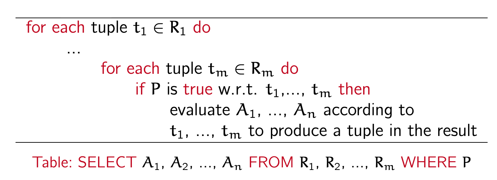
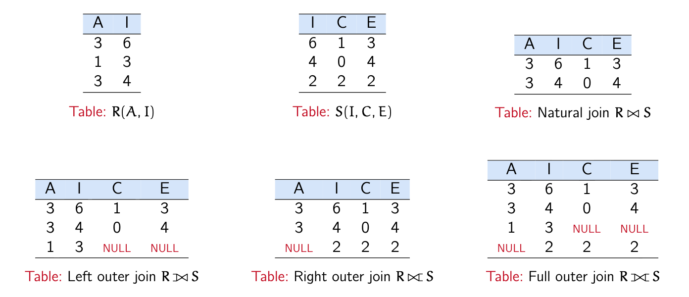
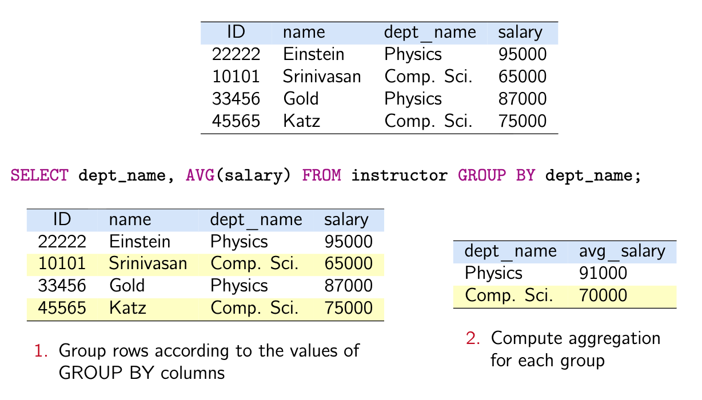
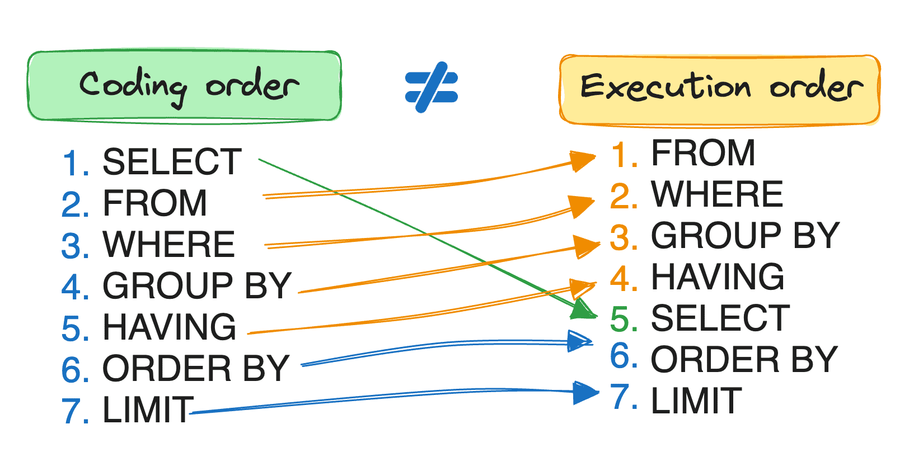
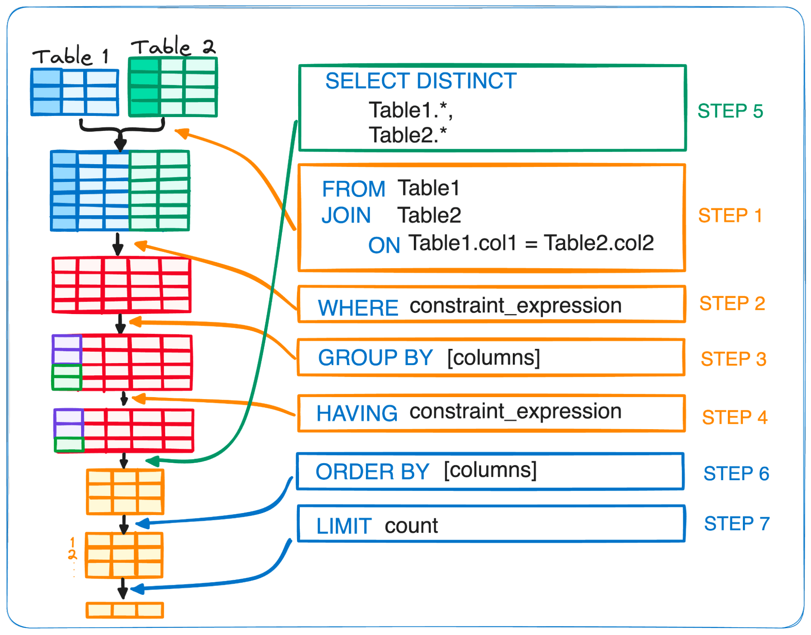

Database series.
1. [Database (1): Relation Model and Relation Algebra](posts/database-1-er-model/index.md)
2. [Database (2): SQL](posts/database-2-sql/index.md)
3. [Database (3): Transaction Processing](posts/database-4-transactions/index.md)


*Overview*.
- Data definition language: CRUD to the schema of a database
- Data manipulation language: How to query and manipulate data stored under a given schema
	- SFW semantics
	- Joins and subqueries
	- Aggregation and grouping
	- Set and bagging
	- Execution order

## DDL

**Data definition language (DDL)**: define the database schema.


### Create table

```sql
CREATE TABLE R(
    ...,
    attribute_name attribute_type,
    ...,
    [integrity_constraints],
); -- pay attention the semicolon

DROP TABLE R;
```

Built-in data types (correspond to `attribute_type`):

| Type                       | Description                                                               |
| -------------------------- | ------------------------------------------------------------------------- |
| `char(n)`                  | Fixed-length string with length = n                                       |
| `varchar(n)`               | Variable-length string with max length = n                                |
| `int`, `smallint`          | Integer, small integer                                                    |
| `numeric(p, d)`            | Fixed-point number with precision `p` and scale `d`                       |
|                            | ↳ `p` includes **both** the digits before **and** after the decimal point |
| `real`, `double precision` | Floating-point and double-precision floating-point numbers                |
| `float(n)`                 | Floating-point number with precision at least `n` digits                  |

_Example_.  `numeric(5, 2)`: 
- Valid: 123.45, 99.99, 0.12.
- Invalid: 1000.00, 7.394

_Example_. Customer table

```sql
CREATE TABLE customer (
  ID varchar(6) PRIMARY KEY,
  first_name varchar(20),
  second_name varchar(20)
);
```

### Integrity constraints


> [!note] Integrity constraints
> Conditions that must always be satisfied by the database, regardless of how it is updated.


A constraint may have a user-defined name, but naming is optional.
If no name is provided, the system generates one automatically.

A constraint can be defined either at the column level—immediately following an attribute declaration—or at the table level, where it is listed after the column definitions.

The keyword `CONSTRAINT` is optional but commonly used when specifying table-level constraints.

Example.

```sql
CREATE TABLE Student (
  student_id   VARCHAR(10) PRIMARY KEY,      -- Key constraint + Entity integrity (PK not NULL)
  full_name    VARCHAR(100) NOT NULL,         -- NOT NULL constraint
  age          INT NOT NULL CHECK (age >= 0), -- Domain constraint (via CHECK)
  email        VARCHAR(200) UNIQUE            -- Key-like constraint (UNIQUE)

);

CREATE TABLE instructor (
    ID varchar(5),
    name varchar(20) NOT NULL,
    dept_name varchar(20),
    salary numeric(8,2),
    CONSTRAINT PK_ID PRIMARY KEY (ID), -- the name pk_id is optional. It is also valid to write PRIMARY KEY (ID).
    CONSTRAINT FK_DN FOREIGN KEY (dept_name) REFERENCES department -- the name fk_dn and the CONSTRAINT keyword is optional
);
```

### Table Modification

Use `alter table`.
- Add a column to the table. `ADD`
- Add a constraint to an existed attribute in the table `ADD CONSTRAINT`
- Change the definition of an existing column (e.g., data type, default value, or nullability) `MODIFY` (In PostgreSQL, `ALTER COLUMN`)
- Drop a column in the table `DROP COLUMN`
- Drop a constraint of an existed attribute in the table `DROP CONSTRAINT`

```sql
ALTER TABLE <table_name> ADD <def_colonne>;
ALTER TABLE <table_name> ADD CONSTRAINT <def_constraint>;
ALTER TABLE <table_name> MODIFY <column>;
ALTER TABLE <table_name> DROP COLUMN <column_name>;
ALTER TABLE <table_name> DROP CONSTRAINT <constraint_name>;
```

`ADD CONSTRAINT` introduces a table-level constraint. Therefore, the constraint must be written in table-level form, such as `PRIMARY KEY (k1)`.


Examples.

```sql
ALTER TABLE Cli ADD test char(50);
ALTER TABLE Cli ADD CONSTRAINT u_t UNIQUE (test);
ALTER TABLE Cli MODIFY test int CONSTRAINT n_n CHECK (test>0);
ALTER TABLE Cli DROP CONSTRAINT n_n;
ALTER TABLE Cli DROP COLUMN test;
```

### Delete Table

Use `drop table`. It removes both schema and data and is not reversible.

```sql
DROP TABLE <table_name>;
```


## DML

**Data manipulation language (DML)**: query language and CRUD operations.

### Insert, delete and update

_Insert_. Insert a tuple (a line of data) into table $R(A_1, ..., A_n)$. The relation after `INSERT INTO` must be an _updatable relation_. Attention to attributes that are `not null` :

```sql
INSERT INTO R VALUES (v_1, ...., v_n);
INSERT INTO R(A_1, ..., A_p) VALUES (v_1, ..., v_p);
``` 

Counterexample (Updatable relation). A Select-from-where query result.

_Delete_. Delete tuples satisfying a given condition $\theta$.

```sql
DELETE FROM R WHERE theta;
``` 

Example.

```sql
DELETE FROM Doc where NumDoc NOT IN (SELECT NumDoc FROM ORD)
```

_Update_.

```sql
UPDATE <relation_name>
SET <attribute> = value_expression [, ...]
[WHERE <search condition>];
```

Example. Modify all doctors who have never issued a prescription.

```sql
UPDATE DOC
SET NomDoc = UPPER(NomDoc)
WHERE NomDoc NOT IN (SELECT NomDoc FROM ORD);
```

### Select

Key operations:
- `SELECT`: Define the output (projection / computed values)
- `FROM`: Define the input data space (relations after joins)
- `WHERE`: Filter rows in the input data space
- `GROUP BY`: Partition rows into groups
- `HAVING`: Filter groups after aggregation

General form:
```sql
SELECT [DISTINCT|ALL] {*|<value_exp.>[,<value_exp.>]...}
FROM relation [alias], relation [alias] …
[WHERE <search condition>]
[GROUP BY <attribute> [,<attribute>]...]
[HAVING <search condition>]
[ORDER BY <attribute> [{ASC | DESC}] [,<attribute>[{ASC | DESC}]]...];
```

#### Basic SFW Semantics: SELECT-FROM-WHERE

_Basic SQL queries_. *SELECT-FROM-WHERE (SFW) Semantics*.

```sql
SELECT A1, A2, ..., An 
FROM R1, R2, ..., Rm
WHERE P;
```

- $A_1, ..., A_n$ are desired _attributes_,
- $R_1, ..., R_m$ are inquired _tables_,
- $P$ is a filtering _predicate_.

This is equivalent to:
1. Form the cartesian product of $R_1, \dots, R_{m}$: Form $R = R_{1} \times \dots \times R_{m}$
2. Apply the selection $\sigma$ with predicate $P$: Generate $\sigma_{P}(R)$
3. Apply the projection on the selected attributes $A_{1},\dots, A_{n}$

$$
\Pi_{A_{1},\dots, A_{n}}(\sigma_{P}(R_{1} \times \dots \times R_{m}))
$$

Equivalence to SELECT-FROM-WHERE query.

Notes:
- `SELECT` can contain expressions, which are evaluated for each row and returned as result columns. E.g. `SELECT score > 30` will return rows of `TRUE` or `FALSE`
- Use a relation name prefix to _distinguish_ attributes with the same name. E.g. `SELECT student.name, instructor.name`

### Logical connectives: AND, OR, NOT

`AND`, `OR` and `NOT` can be included in the `WHERE` clause.

```sql
SELECT ID, name FROM student
WHERE tot_cred > 30
AND (dept_name = 'Physics' OR dept_name = 'MUSIC');
```
#### String operations: LIKE

_String operations: `LIKE`_. `LIKE` matches a string against a pattern.
- The percent (%) character matches any string of zero or more characters.
- The underscore (`_`) character matches any single character.
- Use keyword `escape` to specify an escape character.

```sql
SELECT name FROM instructor WHERE name LIKE '%and%';
SELECT ID FROM instructor WHERE name LIKE '___';
SELECT ID FROM instructor WHERE name LIKE 'ab\%cd' ESCAPE '\';
```

#### Bag semantics, DISTINCT

**Bag semantics**. By default, SQL allows _duplicates_ in query result. Query results may contain duplicate tuples.

Use keyword `DISTINCT` to eliminate duplicates explicitly.

Example.
```sql
SELECT DISTINCT item, amount > 300
FROM Orders;
```

#### Rename: AS

_AS_:
- Use `AS` in select to rename attributes
- Use `AS` in from to rename relations
  
  
```sql
SELECT ID, salary/12 as monthly_salary
FROM instructor AS S, advisor AS T
WHERE S.name=T.name
```

#### Join

_Core idea_. In the FROM clause,
- Make explicit the logical relationship between tables
- Efficient joining instead of materialize a cartesian product + selection

##### Basic operations: JOIN ON and NATURAL JOIN

```sql 
R JOIN S ON join_condition; -- Theta join
R NATURAL JOIN S; -- Natural join
```

Notes:
- The `join_condition` should be a predicate 
- Natural join retains only one copy of each common column 

##### Better natural join: USING

`USING (attribute)` merges columns with the same name (e.g. `R.id = S.id`) and explicitly specifies which attributes are used for the join, thereby preventing unintended matches—especially when multiple natural joins are involved.

Meanwhile, `NATURAL JOIN` is discouraged.

Example.
```sql
SELECT * FROM student JOIN takes ON student.id = takes.id;
SELECT * FROM student JOIN takes USING (id);

SELECT name, title
FROM student NATURAL JOIN takes NATURAL JOIN course; 

SELECT name, title 
FROM (student NATURAL JOIN takes)
    JOIN course USING (course_id);
```

##### Left outer join, Right outer join and Full outer join 

_Revision: Join operation $R \Join_\theta S$_. Now we focus on the table $R$. For each row in $R$, we want to retrieve the corresponding values from table $S$. However, an inner join would discard any row in $R$ that has no matching row in $S$, which is not what we want.

Instead, when no match exists, we want the attributes from the right table to be filled with NULL values.

*Left outer join of $R$ and $S$*. In this sense, a left outer join 
- Can be thought of as extending each row of the left table with attributes from the right table. 
- The number of rows in the result is therefore the same as in the left table. 
- A left outer join between $R$ and $S$ includes both 
	- rows in $R \Join S$
	- _dangling_ $R$ rows padded with NULL's 

*Right outer join of $R$ and $S$* is similar but this time includes dangling $S$ rows padded with NULL's.

*Full outer join* combines all three.



Illustration of left outer join, right outer join and full outer join

```sql
SELECT *
FROM course
NATURAL LEFT OUTER JOIN prereq; -- left outer join
```

#### Aggregation: COUNT, SUM, AVG ...

**Aggregates** map a set of tuples to a single value. Aggregate functions can only be used in the `SELECT` output list. The most commons are: `COUNT`, `SUM` and `AVG`, which support keyword `DISTINCT`. Others include `MIN` and `MAX`.

Example.
```sql
SELECT AVG(salary)
SELECT COUNT(*), MAX(tot_cred)
SELECT COUNT(DISTINCT ID)
```

These functions return a _scalar_ result.

_ATTENTION_. 
- Most aggregate functions ignore NULL values, except for `COUNT(*)`, which counts all rows (including rows where attributes are NULL).
- BUT! The `*` is essential: `COUNT(*)` counts rows, whereas `COUNT(column)` counts non-NULL values in that column.

#### Aggregation by groups: GROUP BY and HAVING

_Core idea_. When we want to compute aggregate values for different categories in the table—such as the average salary of each department in the whole university—we first need to partition the table into groups according to the grouping attribute.

_Grouping_. The GROUP BY clause performs exactly this partitioning, and the aggregate function is then applied independently to each group.

_Example_. In this case,
```sql
SELECT dept_name, AVG(salary)
FROM instructor
GROUP BY dept_name;
```


Illustration of the SQL GROUP BY query.

_Filtering after grouping_. After we obtain the aggregate values for different categories, we want to filter the results once more. For example, we only need the apartment where the average salary is above 80000 dollars.

```sql
SELECT dept_name, AVG(salary) 
FROM instructor 
GROUP BY dept 
HAVING AVG(salary) > 80000;
```

_Difference between WHERE and HAVING_. 
- WHERE decides which raw data participates in aggregation, while HAVING decides which aggregated groups are kept. 
- Granularity of data:
	- WHERE works on rows
	- HAVING works on groups
- Stage at which they apply:
	- WHERE filters rows before any grouping or aggregation takes place. It only sees the raw tuples from the relations in the FROM clause.
	- HAVING filters groups after the GROUP BY and aggregate computations. Therefore, it can use aggregate functions such as AVG, SUM, COUNT, etc.

In this example, we cannot use WHERE because `AVG(salary)` does not exist at the row level.
WHERE is evaluated before aggregation, while `AVG(salary)` is computed after grouping.


#### Nested Subqueries

A *subquery* is a SFW expression that is nested in another query.

```sql
SELECT A1, A2, ..., An 
FROM R1, R2, ..., Rm
WHERE P;
```
- Each $A_i$ can includes a subquery that generates a single value (for example, aggregate operations)
- Each $R_j$ can be replaced by a subquery
- $P$ can includes _predicates_ involving subqueries.

#### IN and EXISTS

_IN_: $x$ IN (subquery) indicates that whether $x$ is in the subquery result.

Example. List the course_id's of all courses that is offered in Fall 2017 but not in Spring 2018.

```sql
SELECT DISTINCT course_id
FROM section
WHERE semester = 'Fall' AND year = 2017 AND
      course_id NOT IN (SELECT course_id
                        FROM section
                        WHERE semester = 'Spring' 
                        AND year = 2018)
```

_EXISTS_: EXISTS (subquery) indicates the subquery result is empty or not. We don't care the actual return values, so we usually write `SELECT 1` or `SELECT *`.

Example. List the course_id's of all courses that _is_ offered in Fall 2017 but _is_ not in Spring 2018.

```sql
SELECT DISTINCT course_id
FROM section as S1
WHERE semester = 'Fall' AND year = 2017 AND NOT EXISTS (
    SELECT 1
    FROM section as S2
    WHERE S1.course_id = S2.course_id
      AND S2.semester = 'Spring'
      AND S2.year = 2018
)
```
Note. Although section appears twice in the query, this does not incur any additional overhead. The aliases simply distinguish the two logical roles of the same table within the query.

#### Scalar subquery

Aggregate operations produce a single attribute, therefore it can be used in conditions and predicates. 

*Scalar subquery*. A subquery that returns a _single_ tuple containing a _single_ attribute is a scalar subquery. 

A scalar subquery can be used _as a value_ in `WHERE`, `SELECT` and `HAVING` clauses.

```sql 
-- List the name of each instructor with the highest salary
SELECT name 
FROM instructor
WHERE salary = (SELECT MAX(salary) FROM instructor);

-- List the name and the number of instructors of each dept
SELECT dept_name,
       (SELECT COUNT(*) 
        FROM instructor
        WHERE department.dept_name = instructor.dept_name)
FROM department;
```

#### Set operations and combing SFW results: Union, Intersect and Difference

These operations are identical to $\cap$, $\cup$ and $-$ in RA.

```sql
R UNION S;
R INTERSECT S;
R EXCEPT S;
```

Example.
```sql
SELECT course_id FROM section
WHERE semester = 'Fall' AND year = 2017
UNION
SELECT course_id FROM section
WHERE semester = 'Spring' AND year = 2018;
```

_ATTENTION_: By default, they all _eliminate duplicates_. To retain all duplicates, explicitly use `ALL`. That is

```sql
R UNION ALL S;
R INTERSECT ALL S;
R EXCEPT ALL S;
```

#### Ordering: ORDER BY

Append a `ORDER BY` clause at the end of a SFW query to sort the query result.
- `DESC` = descending, `ASC` = ascending.
- `ASC` is the default option.

```sql
SELECT * FROM instructor
ORDER BY salary DESC, name; -- by default, name (ascending)
```


#### Execution order


#### Conclusion



## Exercise

