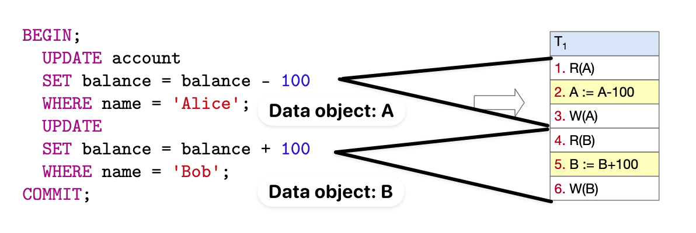
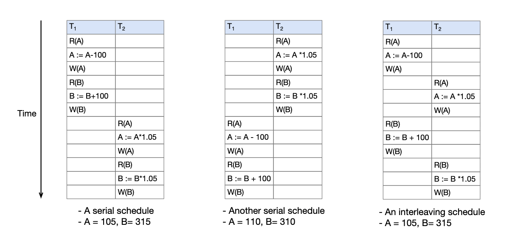
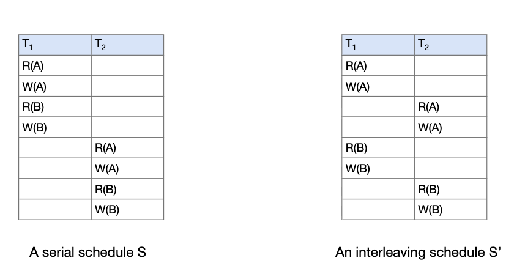
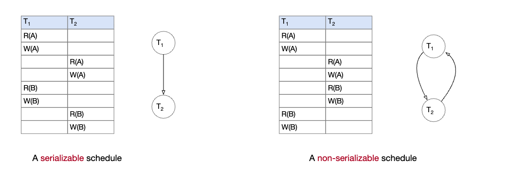
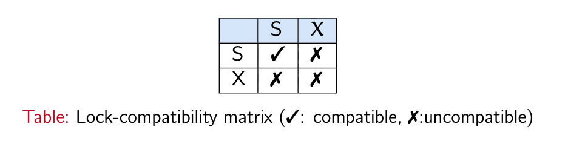
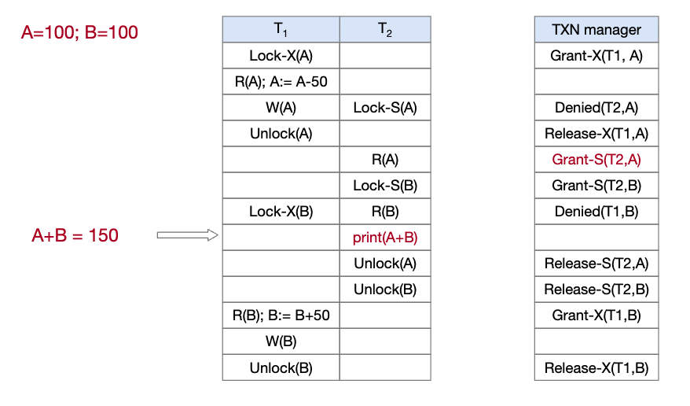
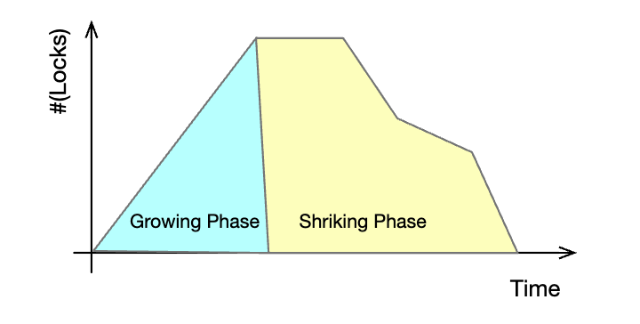
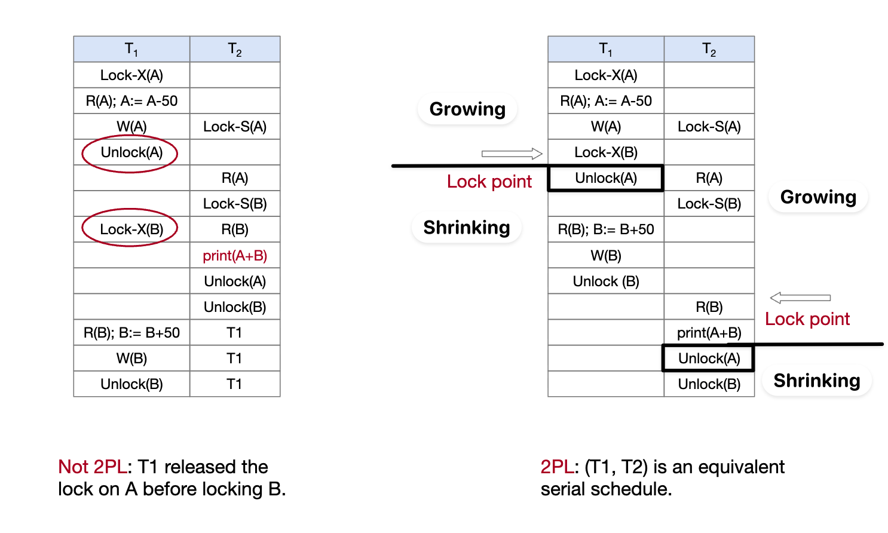

Database series.
1. [Database (1): Relation Model and Relation Algebra](posts/database-1-er-model/index.md)
2. [Database (2): SQL](posts/database-2-sql/index.md)
3. [Database (3): Transaction Processing](posts/database-4-transactions/index.md)

## Transaction

> [!note] Transaction
> A **transaction (“TXN”)** is a collection of database operations that servers as a single, indivisible logical unit of work.

- A TXN starts with the `BEGIN [TRANSACTION]` command.
- Followed by SQL operations that access/update the database.
- It stops with either ”COMMIT” (make all changes permanent) or ”ABORT/ROLLBACK” (revert all changes).

Example. A transaction that transfers 100 from account Alice to account Bob.



## Transaction Properties: ACID

**ACID**: Atomicity, Consistency, Isolation and Durability

**Atomicity** = All-or-nothing. Partial TXN is not allowed.
**Consistency** = Database is in a consistent state.
**Isolation**: Each TXN is executed as if it were executed in isolation. This is essential for concurrency control, allowing operations of different TXNs can be interleaved, and making it equivalent to some serial execution
**Durability**: Persistent and recoverable to unpredictable failures

### Isolation levels


Example.
```
-- Example of Dirty read and Non-repeatable read
T1-READ(A)                  <---- v1
			T2-WRITE(A)     <---- A:= v2
T1-READ(A)                  <---- v1? v2?
			T2-Commit
T1-READ(A)                  <---- v2

-- Example of Phantom read
-- "Orders" has two entries: (1, 120) and (2, 200)
T1: SELECT * FROM Orders WHERE amount > 100;
    -- returns 2 rows (id = 1, 2)
            T2: INSERT INTO Orders VALUES (3, 150);
                COMMIT;
T1: SELECT * FROM Orders WHERE amount > 100;
    -- returns 3 rows (id = 1, 2, 3)   <-- phantom row
```

Phenomenas of how transactions interact.
- **Dirty read**. A transaction reads data written by another transaction that has not yet been committed. 
	- In this example, if the second T1-READ(A) reads v2 before T2 commits, then a dirty read occurs.
	- If dirty reads are prevented, it should still read v1.
- **Non-repeatable read**. A transaction reads the same data item multiple times and obtains different values, due to another committed transaction modifying the data in between.
	- In this example, the first and the last T1-READ(A) return different values (v1 and v2), which is a non-repeatable read.
- **Phantom Read**. Phantom reads involve changes in the *set of rows returned by a query predicate*, not changes to the value of an existing row.

Isolation level is divided into 4 categories:
- **Read uncommitted**
- **Read committed**
- **Repeatable Read**
- **Serializable**


Isolation level table

## Concurrency Control Reasoning

A **schedule** specifies the chronological execution order for instructions of concurrent TXNs.

A **serial schedule** executes transactions in order, with _no interleaving_ of operations.


Serial schedule example. TXN T1 transfer 100 from account A to account B. TXN T2 credits both A and B with 5% interest ($\times 1.05$)

### Serializable schedules

_Core idea_. Design a good schedule scheme to interleave the TXNs.
- The effect should be equivalent to a serial one

> [!note] Serializable
> A schedule is serializable if it is equivalent to some serial schedule.
> Serializability makes consistency reasoning easy, and thus allowing more concurrency.

### Conflicting operations

What are the operations that avoid serializability?

> [!note] Conflicting operations
> Two operations from different TXNs are in a schedule conflict if they
> - access the same data item
> - AND at least one operation is write

The correctness of schedules can be guaranteed if the conflicting operations are dealt with in the same way.

> [!note] Conflict equivalent
> Two schedules $S$ and $S'$ are conflict equivalent if
> - $S$ and $S'$ are schedules of the same set of TXNs
> - Every pair of _conflicting operations_ is ordered in the same way

Example.


### Precedence graph

A useful way to determine the serializability of two TXNs $T_1$ and $T_2$ is via a precedence graph. Such graph of scheduler $S$ is a direct graph $G=(V, E)$ where
- Nodes: Each nodes represents a TXN of S
- Edges: Each edge represents a conflict (Same access and at least one write) between two TXNs.
- $(T_{i}, T_{j})$ indicates a pair of conflicting operation $O_{i} \in T_{i}$ and $O_{j} \in T_{j}$ such that $O_{i}$ appears _before_ $O_{j}$ in $S$

> [!note] Serializability test
> A schedule is conflict serializable if and only if its precedence graph has no cycle.


Example. The right graph shows conflicting operations exist in both direction thus non-serializable.

## Concurrency Control Approaches

### 2PL

Lock approach: _Pessimistic_, must acquire a lock before every shared data access (both R/W).

As R/W operations result in inconsistency, we impose a control to how can access the data.

> [!note] Basic locking
> A TXN $T$ is allowed to access a data item $A$ if and only if $T$ holds a lock on $A$
> - Read but not write mode: If $T$ holds a shared lock (S) on data $A$, then $T$ can read but not write $A$
> - Both read and write mode: If $T$ holds an exclusive lock (X) on $A$, then $T$ can both read and write $A$
> 
> The lock-compatibility matrix: 
> - At most one TXN can hold an exclusive lock (X) on $A$, while multiple TXNs can hold the same shared lock (S)
> - If a transaction already holds an exclusive lock (X) on A, a shared lock (S) on A cannot be granted to another transaction until the exclusive lock is released.
> - If one transaction already holds a shared lock (S) on A, another transaction cannot obtain an exclusive lock (X) on A until that shared lock is released.

APIs.
- `LOCK(T, A, S/X)`
- `UNLOCK(T, A)`

However, basic locking is not enough. Below is an example of inconsistent state when scheduling using basic locking.


Example (Basic locking). $T_{1}$: $R(A);A:=A-50; W(A);R(B);B:=B+50;W(B)$, $T_{2}:R(A);R(B);\text{Print}(A+B)$. If $T_{1}$ and $T_{2}$ are serializable, $A+B$ should equals to 200 at any timestamp. However, this is not the case.

> [!note] Two-Phase Locking (2PL)
> In a transaction $T$, all locks requests _MUST precede_ all unlock requests.
> Growing Phase: $T$ may OBTAIN locks but it may not release locks
> Shrinking Phase: $T$ may RELEASE locks but it may not obtain locks
> 
> Once a transaction releases a lock, it can never acquire any new locks.
> Therefore, for each transaction, all lock actions must occur in the growing phase, i.e., before the first unlock.

2PL guarantees conflict serializability.


Example (2PL).

Using locks for access control introduces the possibility of **deadlock**. Imagine a scheduling of two transactions $T_{1}$ and $T_{2}$:
```
Lock(T1, A, X)
Lock(T2, B, X)
Lock(T1, B, X) <-- Blocked, T2 has the lock
Lock(T2, A, X) <-- Blocked, T1 has the lock
```

2PL does not prevent Deadlock.

## References
- [Transaction Processing](https://basics.sjtu.edu.cn/~qyin/teaching/db2024/index.html)
- [Two Phase Locking Protocol](https://www.geeksforgeeks.org/dbms/two-phase-locking-protocol/)
