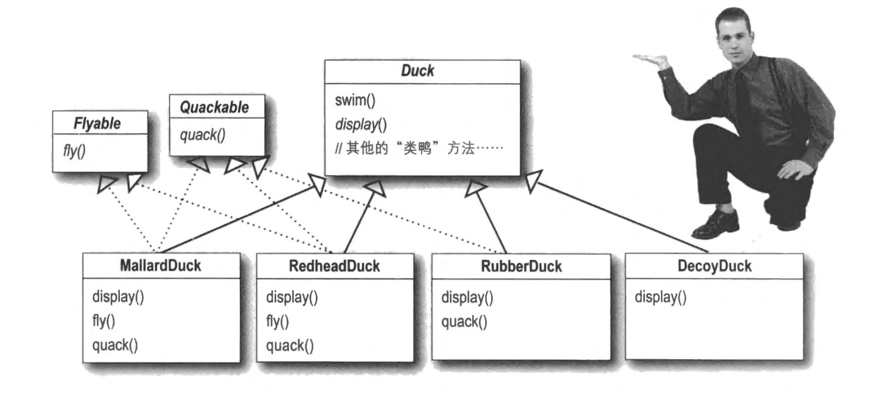
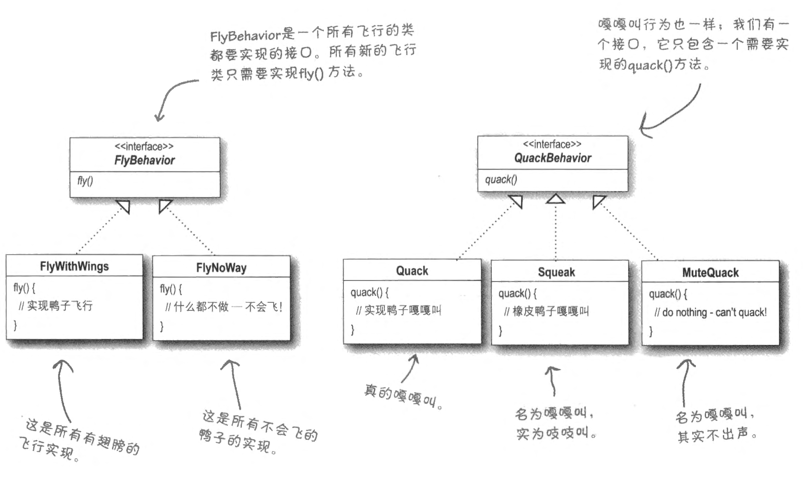

**Design patterns series**.
- [Design Patterns (1): Strategy Pattern](posts/design-pattern-1-strategy-pattern/index.md)
- [Design Patterns (2): Observer Pattern](posts/design-pattern-2-observer-attern/index.md)
- [Design Patterns (3): Decorator Pattern](posts/design-patterns-3-decorator-pattern/index.md)

## 识别变化的部分，将其分开

设想要实现 Duck 类，然而不是所有的 Duck 都具有相同的行为。与此同时我们知道在不久的将来，可能会有更多类型的鸭子，各自具有各自的 fly() 和 quack() 特性：
- 普通的鸭子同时能够 fly() 和 quack()
- RubberDuck 不能 fly() 但是能够 quack()
- DecoyDuck 两者都不能
- 未来还有更多类型的鸭子……



通过继承 Duck 类实现的方式

这不是一个很好的实现形式。尽管现在每个类别的鸭子都被区分出来，但如果不同类型的鸭子具有相同的飞行/嘎嘎叫模式，则需要复制粘贴代码。这意味着，将来会发生变化的部分：`fly()` 和 `quack()` 被冗杂在了 `Duck` 中

> [!note] 设计原则
> 识别应用中变化的方面，把它们和不变的方面分开。

在本例中，应该单独设置两个类，分别来控制 fly 行为和 quack 行为，所有可能的 fly 模式和 quack 模式都定义在各自类中。

下一章将介绍怎么定义这两个类。

## 针对接口编程

我们知道将来会对 fly 行为和 quack 行为进行修改（例如修改某些飞行模式的具体实现、增加或删除新的飞行模式等）。

为了使得我们的 Duck 实例不直接绑定到某一种模式的具体实现，我们定义对应的 interface，每个 interface 都使用相同的接口，这样可以使得：
- Duck 类（我们所设想的不动的部分）可以统一调用相同的 fly() 或者 quack() API，所有实例一致
- Duck 类不关心 fly() 和 quack() 具体的实现，只知道自己能够执行这样的行为即可
- 具体行为委托给 quackBehavior 和 flyBehavior 实例去操作。
- 每个子模式只用实现对应的相同的接口即可。

简单理解为
1. 定义一个抽象接口类
2. 然后各种具体实现通过**继承**来完成抽象接口函数的定义。




> [!note] 设计原则
> 针对接口编程，而不是针对实现编程。

针对实现编程和面对接口（超类型）编程区别：
```cpp
// class Dog : Animal { ... }
// 针对实现编程
Dog d; d.bark();

// 面向接口编程
// 初始化为 Dog 类，但是使用 Animal* 指针
// 在运行时，将 Animal->bark() 帮定为 Dog->bark() 方式
std::unique_ptr<Animal> a = std::make_unique<Dog>();
a->bark(); 
```

实现上：
```cpp
// 抽象接口
struct QuackBehavior {
    virtual ~QuackBehavior() = default;
    virtual void quack() = 0;
};

// 具体实现
struct Quack : QuackBehavior {
    void quack() override { /* quack */ }
};

struct MuteQuack : QuackBehavior {
    void quack() override { /* silence */ }
};
```

## 优先使用组合

在本例中，鸭子 **has-a**（而不是 **is-a**）fly 和 quack 行为。使用组合创建系统给了你更大的弹性。

> [!note] 设计原则
> 优先使用组合而不是继承


实现：
```cpp
#include <memory>
#include <utility>
#include <iostream>

// ---- Behavior interfaces ----
struct FlyBehavior {
    virtual ~FlyBehavior() = default;
    virtual void fly() = 0;
};

struct QuackBehavior {
    virtual ~QuackBehavior() = default;
    virtual void quack() = 0;
};

// ---- Concrete behaviors ----
struct FlyWithWings : FlyBehavior {
    void fly() override { std::cout << "Flying with wings\n"; }
};

struct FlyNoWay : FlyBehavior {
    void fly() override { std::cout << "(can't fly)\n"; }
};

struct Quack : QuackBehavior {
    void quack() override { std::cout << "Quack!\n"; }
};

struct MuteQuack : QuackBehavior {
    void quack() override { std::cout << "(silence)\n"; }
};

// ---- Duck base class (stable part) ----
class Duck {
public:
    Duck(std::unique_ptr<FlyBehavior> fb, std::unique_ptr<QuackBehavior> qb)
        : flyBehavior(std::move(fb)), quackBehavior(std::move(qb)) {}

    virtual ~Duck() = default; // important for polymorphic deletion

    void performFly()   { flyBehavior->fly(); }
    void performQuack() { quackBehavior->quack(); }

    void setFlyBehavior(std::unique_ptr<FlyBehavior> fb) {
        flyBehavior = std::move(fb);
    }
    void setQuackBehavior(std::unique_ptr<QuackBehavior> qb) {
        quackBehavior = std::move(qb);
    }

    virtual void display() = 0;

protected:
    std::unique_ptr<FlyBehavior> flyBehavior;
    std::unique_ptr<QuackBehavior> quackBehavior;
};

// ---- Concrete ducks (configure behaviors) ----
class MallardDuck : public Duck {
public:
    MallardDuck()
        : Duck(std::make_unique<FlyWithWings>(), std::make_unique<Quack>()) {}

    void display() override { std::cout << "I'm a MallardDuck\n"; }
};

class RubberDuck : public Duck {
public:
    RubberDuck()
        : Duck(std::make_unique<FlyNoWay>(), std::make_unique<Quack>()) {}

    void display() override { std::cout << "I'm a RubberDuck\n"; }
};

class DecoyDuck : public Duck {
public:
    DecoyDuck()
        : Duck(std::make_unique<FlyNoWay>(), std::make_unique<MuteQuack>()) {}

    void display() override { std::cout << "I'm a DecoyDuck\n"; }
};

// ---- Example usage ----
int main() {
    std::unique_ptr<Duck> d = std::make_unique<DecoyDuck>();
    d->display();
    d->performFly();
    d->performQuack();

    // runtime change behavior
    d->setQuackBehavior(std::make_unique<Quack>());
    d->performQuack();
}
```

## 总结：策略模式

**策略模式**
- 定义了一个算法族（语义上解决同一类问题的一组实现）
- 分别封装起来，是的它们之间可以互相变换
- 实现同一个策略接口，不变的部分依赖此接口
- 算法变化独立于它的客户