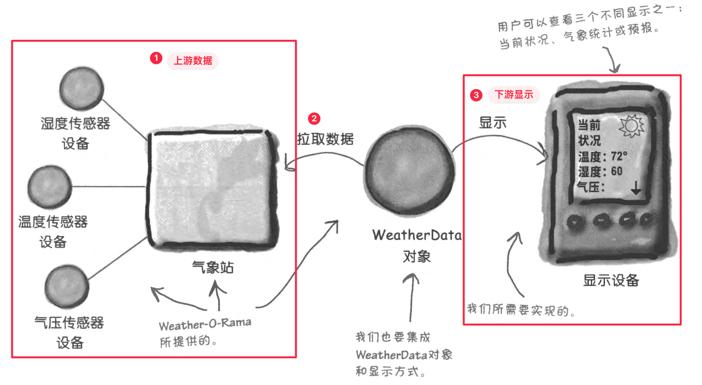
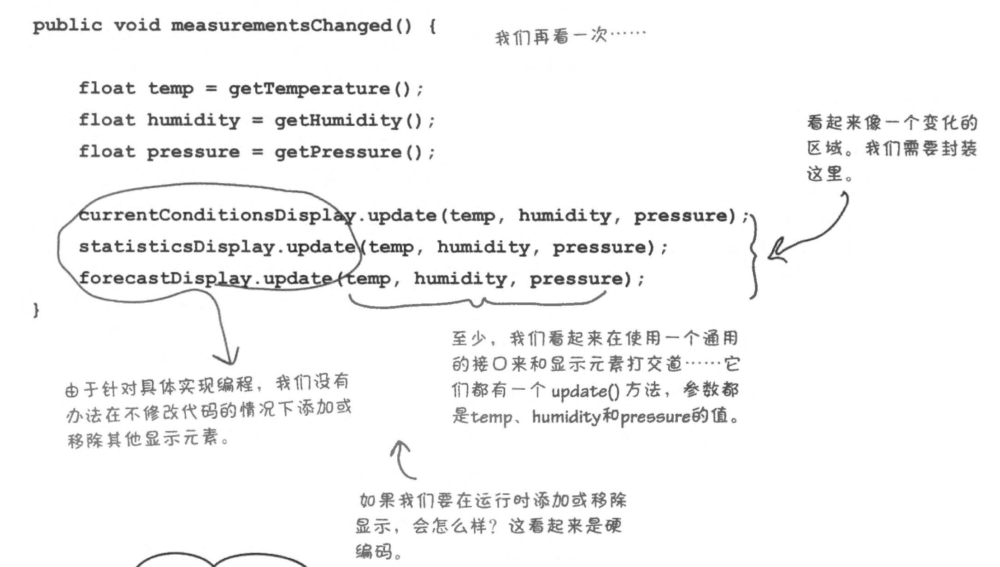
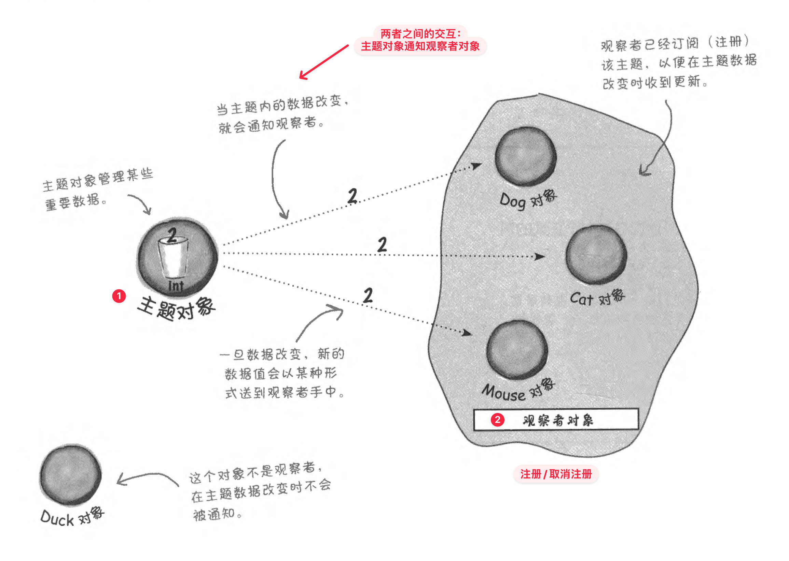
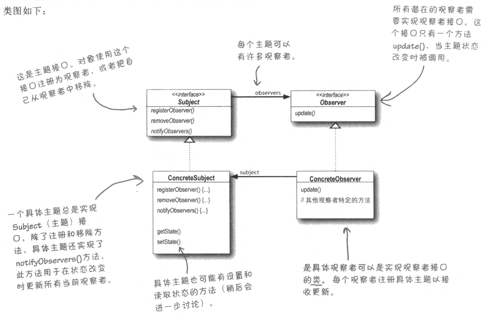
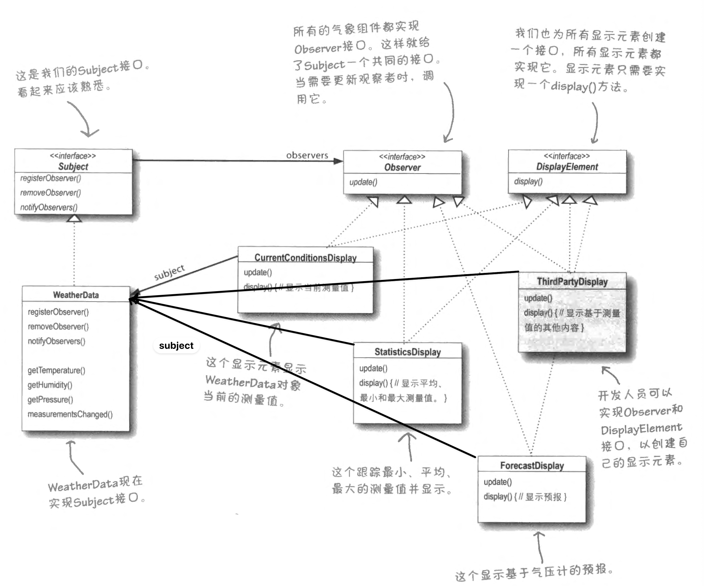

Design Pattern Series.
- [Design Pattern (1): Strategy Pattern](posts/design-pattern-1-strategy-pattern/index.md)
- [Design Pattern (2): Observer Pattern](posts/design-pattern-2-observer-attern/index.md)

在许多系统中，数据会持续从上游产生（如传感器、行情源、日志流），而下游存在多个依赖这些数据的组件（如显示、告警、统计分析、预测模块）。

我们希望在**不让上游依赖具体下游实现**的前提下，实现一种机制：
- 当上游状态发生变化时，能够**自动通知**所有感兴趣的下游组件；
- 同时允许下游组件在运行时**动态订阅/取消订阅**，以支持未来新增更多处理或展示方式。



在我们的例子中：
- 我们知道，一旦上游数据有更新，他们都会调用一个叫 `measurementsChanged()` 的方法，我们需要实现这个方法。
- 每个显示设备都有个 `update()` 方法。

最暴力的方式是直接在函数内录罗列每个对象，调用他们的 `update()` 方法。这样做有很多问题：
- 针对具体实现编程。一旦有新的、或者需要删除显示设备，都必须修改这个函数；应该针对 update 设计 interface
- 这一部分是变化的，应当将其封装




## 观察者模式

观察者模式可以类比为订阅报纸的过程。
- 主要活动参与者：出版者 + 订阅者。
- 需要实现：**订阅者注册/取消订阅、出版者提供服务**。

在观察者模式中，出版者称之为**主题** (Subject)，订阅者称之为**观察者** (Observer).


观察者模式定义一对多依赖

> [!note] 观察者模式
> 观察者模式定义对象间的一对多依赖。当一个对象（**主题**）改变状态时，它的所有依赖者（**观察者**）都会得到通知并更新

观察者对象：
1. 通过主题提供的接口注册自己（而不是主题将其加入！）
2. 被主题通知有新的数据值
3. 通过主题接口注销自己


## 具体实现

主题和观察者有各自的接口，
- 其中主题的接口有 `registerObserver()`, `removeObserver()` 和 `notifyObserver()`，用于让观察者注册/取消注册，和主题知道如何通知观察者
- 以及观察者的接口 `update()` 用于让观察者具体实现当被通知的时候，自己该做什么。主题调用这个接口。

这样实现了松耦合设计：
- 主题不知道观察者的具体类，只知道它实现了 `update()` 接口
- 添加/删除观察者，不需要修改主题
- 改变其中一方，在满足两者之间接口协议的前提下，不会影响另一方

> [!note] 设计原则
> 尽量做到交互对象之间的松耦合



## 例子



首先是接口：
```cpp
// ==Interfaces==  
struct Observer {  
    virtual ~Observer() = default;  
    virtual void update(float temp, float humidity, float pressure) = 0;  
};  
  
struct Subject {  
    virtual ~Subject() = default;  
    virtual void registerObserver(Observer* o) = 0;  
    virtual void removeObserver(Observer* o) = 0;  
    virtual void notifyObserver() = 0;  
};  
  
struct DisplayElements {  
    virtual ~DisplayElements() = default;  
    virtual void display() = 0;  
};
```

对主题的定义。
- 除了实现 API 之外，还需要
- 定义和上游的接口
- 定义什么时候通知观察者，一般来说定义一个“当数据发生变化时……”的函数（`measurementsChanged()`），这个函数在和上游的接口函数中被调用

```cpp
// ==Concrete==  
class WeatherData : public Subject {  
private:  
    std::vector<Observer*> observer_list;  
    float temp_{0.f};  
    float humidity_{0.f};  
    float pressure_{0.f};  
  
public:  
    void registerObserver(Observer *o) override {  
        observer_list.push_back(o);  
    }  
    void removeObserver(Observer *o) override {  
        // Find the pos of o  
        auto it = std::find(observer_list.begin(),  
            observer_list.end(), o);  
        // If not "not found", erase it  
        if (it != observer_list.end()) observer_list.erase(it);  
    }  
    void notifyObserver() override {  
        for (auto o: observer_list) {  
            o->update(temp_, humidity_, pressure_);  
        }  
    }  
    // API of measurements changed  
    void measurementsChanged() {  
        notifyObserver(); // when measurements changed, notify all observers  
    }  
  
    // Upper stream function  
    void setMeasurements(float temp, float humidity, float pressure) {  
        temp_ = temp; humidity_ = humidity; pressure_ = pressure;  
        measurementsChanged(); // Call API  
    }  
};
```

对观察者的定义

```cpp
class ConditionDisplay: public Observer, public DisplayElements {  
private:  
    Subject& weatherData_;  
    float temp_;  
public:  
    explicit ConditionDisplay(Subject& weatherData)  
        : weatherData_(weatherData) {  
        weatherData.registerObserver(this);  
    }  
  
    void update(float temp, float /*humidity*/, float /*pressure*/) {  
        temp_ = temp;  
        display();  
    }  
  
    void display() {  
        std::cout << "Temperature is " << temp_ << "oC" << std::endl;  
    }  
};
```

最后时一种调用方式。观察者会自动被调用 `display()` 功能

```cpp
WeatherData weather_data;  
ConditionDisplay condition_display(weather_data);  
weather_data.setMeasurements(23.0, 88.0, 1024);
```