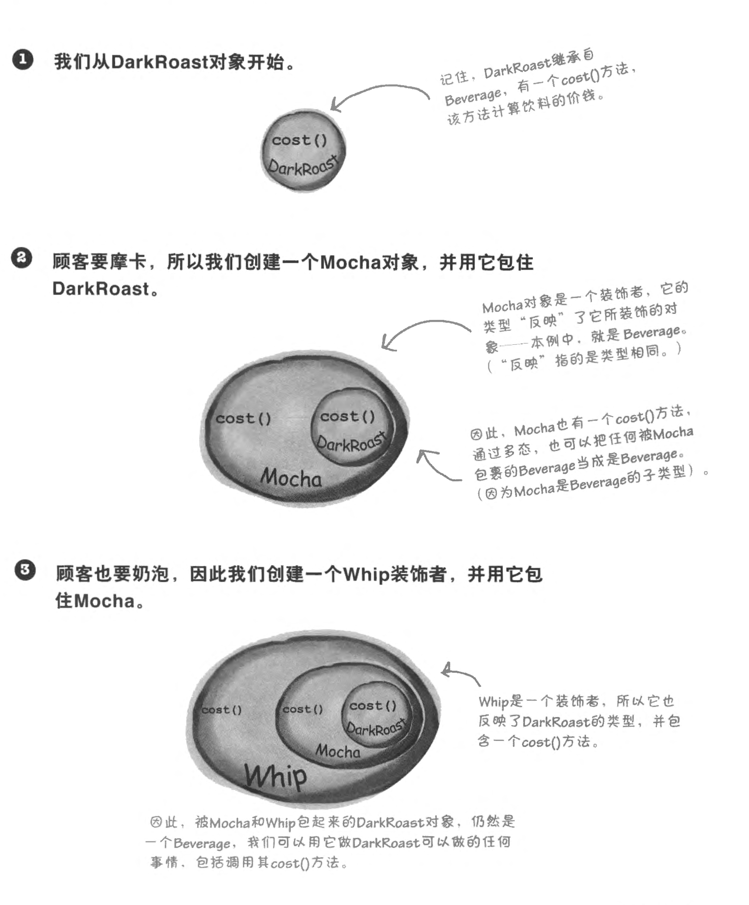
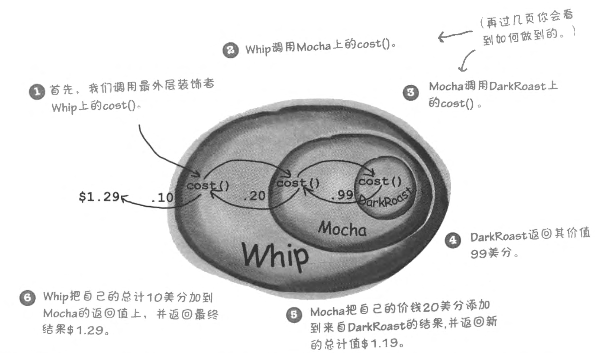
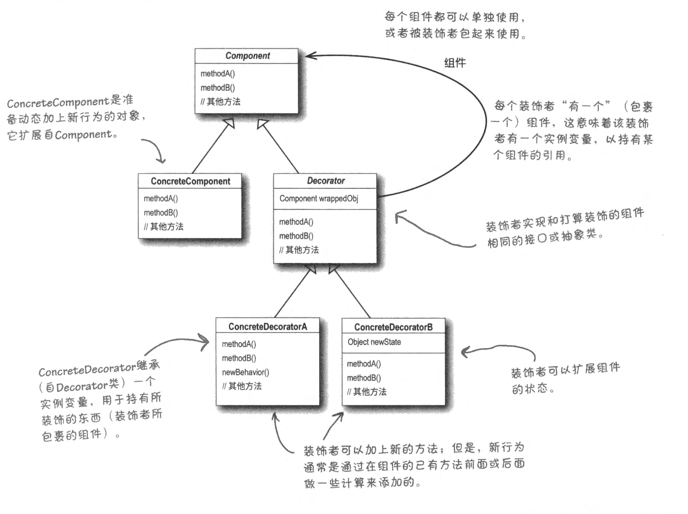
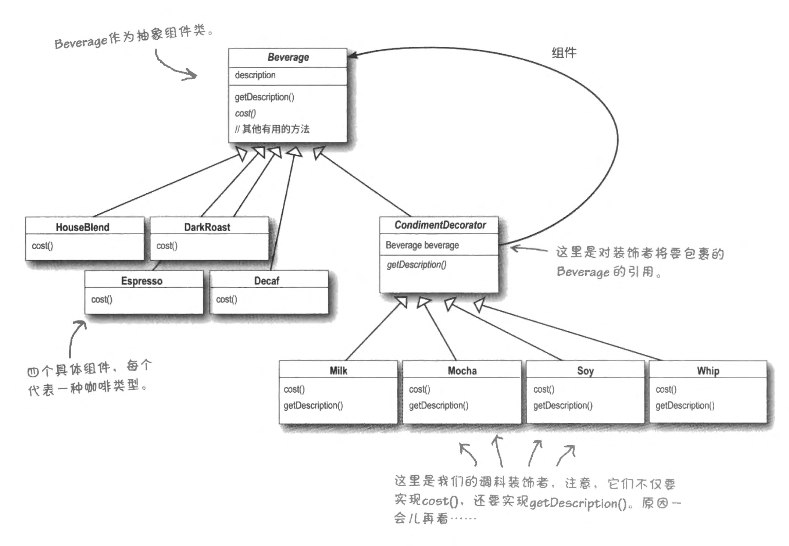

**Design patterns series**.
- [Design Pattern (1): Strategy Pattern](posts/design-pattern-1-strategy-pattern/index.md)
- [Design Pattern (2): Observer Pattern](posts/design-pattern-2-observer-attern/index.md)
- [Design Patterns (3): Decorator Pattern](posts/design-patterns-3-decorator-pattern/index.md)

我们已经看到 has-a 是一个比继承强大的功能，而我们之前所介绍的 has-a 都是组合类型的，而我们将看到这不适用于所有的场景。

在如下设计中，Beverage 必须提前声明所有可能的配料，并通过布尔标志控制其存在性。这隐含了“所有变化在编译期已知”的假设。

```cpp
class Beverage {
private:
	Milk milk;
	Soy soy;
	Mocha mocha;
	
	bool hasMilk;
	bool hasSoy;
	bool hasMocha;	
}
```

当需求包括：
1. 需要在运行期（比如需要定义一个无糖带抹茶不加奶的饮料）进行属性组合
2. 属性有很多种组合方式（顺序、层数、是否存在），都会影响其具体行为

以上情况就不适合用组合 has-a。与此同时，如果我们希望加入新的配方，需要对于 Beverage 反复修改，变化无法被隔离。

## 开放-关闭原则

> [!note] 设计原则
> 类应该对修改关闭，但对扩展开放


这有两层含义：
- 对老代码的修改可能意味着有很多连锁反应。既然既有代码已经能顺利运行，不应该对它进行修改
- 对类进行扩展总是欢迎的，如果有新需求写新的扩展即可。

## 装饰者模式：装饰+委托

当组合行为数量组合爆炸、或者是希望运行时能够进行动态组合的时候，我们用**装饰**的思想来设计。与此同时，我们通过**委托**实现一定的功能。（意味着叠加行为，例如在原来价格上加上装饰部分的价格）

例如，“带摩卡和奶泡的深度烘培”是：
- 首先，基类是深度烘培对象（继承抽象饮料类）
- 用摩卡 Mocha 对象装饰它
- 用奶泡 Whip 对象装饰它



在计算价格的时候，层层委托直到基类。每一个装饰者在委托给所装饰对象之前（或之后）添加自己的行为。在这里就是添加每个小料各自的价格。



> [!note] 装饰者模式
> 装饰者模式动态将额外责任附加到对象上。
> 对于扩展功能，装置者提供子类化之外的弹性替代方案

在代码层面，如何才能进行层层装饰和委托呢？我们需要实现这样的功能：

```cpp
// 运行期结构
std::make_unique<Mocha>(
	std::make_unique<Soy>(
		std::make_unique<DarkRoast>();
	)
)
```

- 装饰：这需要每个装饰者和被装饰对象具有相同的超类型，这样才能嵌套叠加。
- 委托：与此同时，装饰者能够调用被装饰对象的方式（声明为 const，不修改被装饰对象），在此基础上叠加行为（而不是将其篡改）

```cpp
class Beverage : { /* ... */ };
class DarkRoast : public Beverage { /* ... */ }; // is a beverage

// 装饰器抽象
class Decorator : public Beverage { // is a beverage
private:
	std::unique_ptr<Beverage> beverage_;
public:
	Decorator(std::unique_ptr<Beverage> b)
		: beverage_(std::move(b)) {} // use a beverage to initialize it
		
protected:
	const Beverage& wrapped() const { return *beverage_; }
	
public:
	float cost() { return wrapped().cost() + 1.0; }
};
```


## 例子



首先实现最基本的基类：

```cpp
// ==Basic==  
class Beverage {  
public:  
    virtual ~Beverage() = default;  
    virtual std::string getDescription() const = 0;  
    virtual double cost() const = 0;  
};
```

左下角，定义一个 Beverage 的基础实例：

```cpp
// ==Concrete items==  
class Mocha : public Beverage {  
public:  
    std::string getDescription() const override { return "Mocha"; }  
    double cost() const override { return 1.99; }  
};
```

现在是右边中间部份，定义所有装饰品的抽象类：
- 注意：在抽象类中，保存其“被装饰对象”的指针，这样可以调用它们的行为（从而在它们的基础上进行扩展、委托执行）
- 被装饰对象不应该对外暴露，但应该对子类可见，因此是 protected
- 当使用 unique_ptr 时要使用 move

```cpp
// ==Abstract Decorator==  
class CondimentDecorator : public Beverage {  
protected:  
    std::unique_ptr<Beverage> beverage_;  
public:  
    explicit CondimentDecorator(std::unique_ptr<Beverage> b)  
        : beverage_(std::move(b)) {}  
};
```

定义一个具体的装饰品：
- Using 表示使用抽象类的构造函数
- 这里可以看到，通过保存的被装饰对象指针进行调用其行为

```cpp
// ==Concrete Decorator==  
class Milk : public CondimentDecorator {  
public:  
    using CondimentDecorator::CondimentDecorator;  
  
    std::string getDescription() const override {  
        return beverage_->getDescription() + ", Milk";  
    }  
    double cost() const { return beverage_->cost() + 0.20; }  
};
```

具体调用方式则是一层嵌套：

```cpp
std::unique_ptr<Beverage> drink =  
    std::make_unique<Milk>(  
        std::make_unique<Mocha>());  
  
std::cout << drink->getDescription() << std::endl;  
std::cout << drink->cost() << std::endl;
```