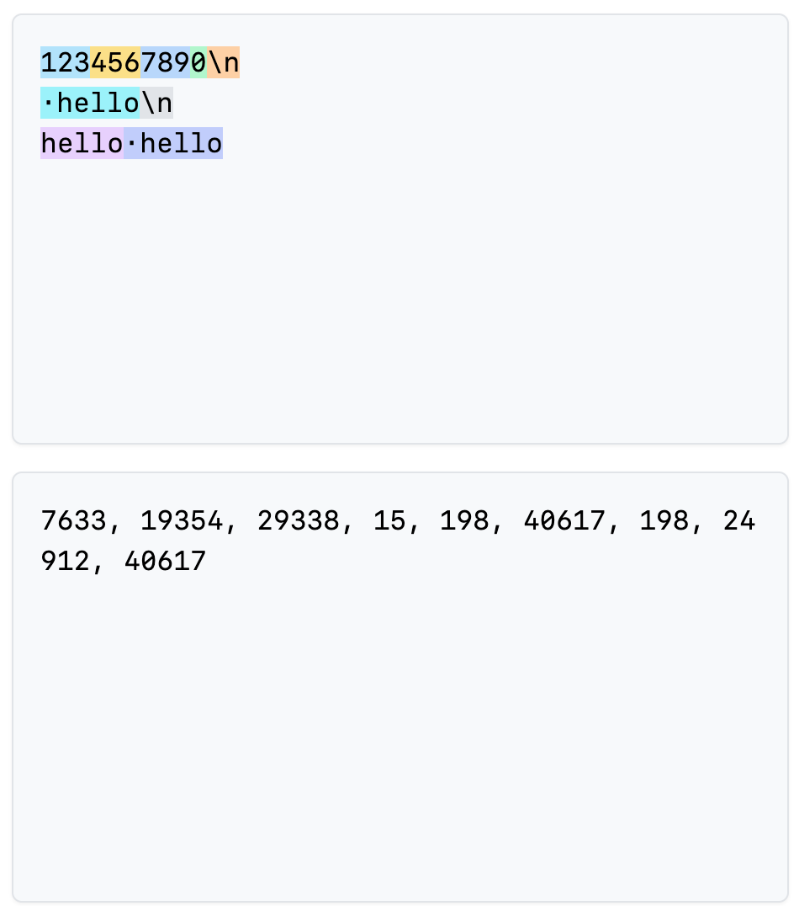
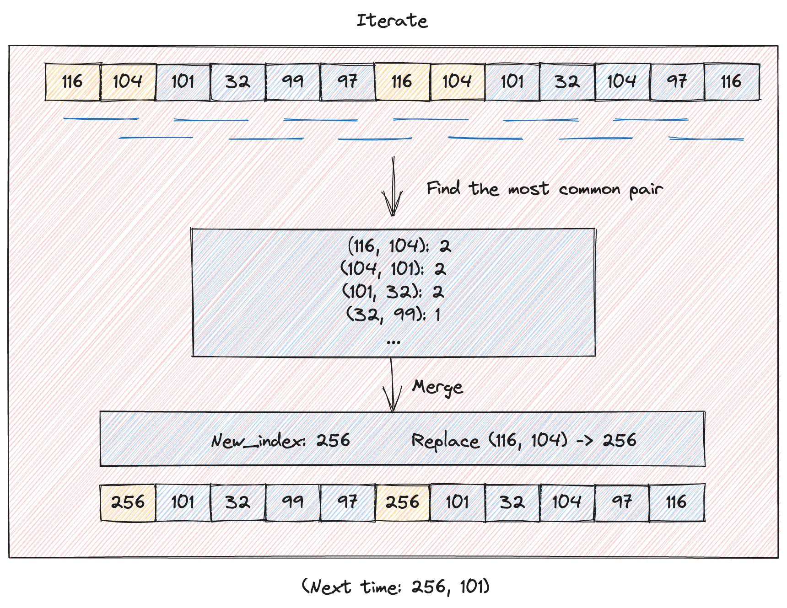

本文介绍了 Tokenizer 部件，从 Character-based, byte-based, word-based 方式引入到 BPE Tokenizer，分别介绍它们的优缺点以及提供了对应的实现。

*Keywords*.
- Tokenizer
- Encode <-> Decode
- Unicode Character
- Character-based tokenizer, byte-based tokenizer, word-based tokenizer
- BPE Tokenizer

## Introduction


Process of encode and decode: transformation between strings and tokens (list of integers)

Raw text is generally represented as Unicode strings.
```
string = "Hello, 🌍! 你好!"
``` 

A language model places a probability distribution over sequences of tokens (usually represented by integer indices).

```
indices = [15496, 11, 995, 0]
```

So we need a procedure that *encodes* strings into tokens.

We also need a procedure that *decodes* tokens back into strings.

A *Tokenizer* is a class that implements the encode and decode methods.

The *vocabulary size* is number of possible tokens (integers).

Example cite: [Tiktokenizer](https://tiktokenizer.vercel.app/?encoder=gpt2)




Observations.
- A word and its preceding space are part of the same token (e.g., " world").
- A word at the beginning and in the middle are represented differently (e.g., "hello hello").
- Numbers are tokenized into every few digits.

## Goals to design a tokenizer

+ High compression rate
+ Low dictionary size

## Unicode Character-based tokenization

_Core idea_. Unicode is a text encoding standard that maps characters to integer code points. Therefore it is natural to have the idea of directly use this mapping for our Tokenizer.

A Unicode string is a sequence of Unicode characters. Each character can be converted into a code point (integer).

```python
assert ord("a") == 97
assert ord("🌍") == 127757
```

Converts back an integer Unicode code point into a string with the corresponding character.

```python
assert chr(97) == "a"
assert chr(127757) == "🌍"
```

Implementation.

```python
class CharacterTokenizer(Tokenizer):
    """
    Represent a string as a sequence of Unicode code points.
    """
    
    def encode(self, text : str) -> list[int]:
        return list(map(ord, text))
    
    def decode(self, token_ids: list[int]) -> str:
        return "".join(map(chr, token_ids))
```

Problem.
- There are approximately 150K Unicode characters. This is a very large vocabulary.
- Many characters are quite rare (e.g., 🌍), which is inefficient use of the vocabulary.


## Byte-based tokenization

Unicode code points (between 0 to 154997) can be further encoded into bytes (between 0 and 255). An Unicode code point needs 1-4 bytes to represent it. The most common Unicode encoding is  UTF-8.

```python 
assert bytes("🌍", encoding="utf-8") == b"\xf0\x9f\x8c\x8d"
```

Implementation.

```python 
class ByteTokenizer(Tokenizer):
    def encode(self, string : str) -> list[int]:
        string_bytes = bytes(string, encoding="utf-8")
        return list(map(int, string_bytes))
    
    def decode(self, token_ids : list[int]) -> str:
        string_bytes = bytes(token_ids)
        return string_bytes.decode("utf-8")
```

The vocabulary is nice and small: a byte can represent 256 values.

Problem. 
- The compression ratio is 1, which is terrible, which means the sequences will be too long.

## Word-based tokenization 

Another approach (closer to what was done classically in NLP) is to split strings into words.

```python
string = "I'll say supercalifragilisticexpialidocious!"
segments = regex.findall(r"\w+|.", string)
```

This regular expression keeps all alphanumeric characters together (words).

Here is a fancier version:

```python
GPT2_TOKENIZER_REGEX = r"""'(?:[sdmt]|ll|ve|re)| ?\p{L}+| ?\p{N}+| ?[^\s\p{L}\p{N}]+|\s+(?!\S)|\s+"""

pattern = GPT2_TOKENIZER_REGEX
segments = regex.findall(pattern, string)
```
To turn this into a Tokenizer, we need to map these segments into integers.
Then, we can build a mapping from each segment into an integer.

Problems.
- The number of words is huge (like for Unicode characters).
- Many words are rare and the model won't learn much about them.
- This doesn't obviously provide a fixed vocabulary size.
- New words we haven't seen during training get a special UNK token, which is ugly and can mess up perplexity calculations.


## Byte-Pair Encoding (BPE)

_Basic idea_: train the tokenizer on raw text to automatically determine the vocabulary.

Intuition: common sequences of characters should be represented by a single token, rare sequences should be represented by many tokens.

Sketch: start with each byte as a token, and successively merge the most common pair of adjacent tokens.




Advantages.
- Limited vocabulary size (fixed in advance)
- Compression ratio is high
- No need for UNK token

## Summary
    
Tokenizer: strings <=> tokens (indices)
    
Character-based, byte-based, word-based tokenization highly suboptimal
    
BPE is an effective heuristic that looks at corpus statistics
    
Tokenization is a necessary evil, maybe one day we'll just do it from bytes...