**LLM Series**.
- [LLM Basics (1): Tokenizer](posts/llm-basics-1-tokenizer/index.md)
- [LLM Basics (2): Attention](posts/llm-basics-2-attention/index.md)

## History: RNN and Sentence Encoding

### Notations

**Neural Modeling Approach.** Let $w_{1:n}$ be a sequence where each $w_i \in \mathcal{V}$, a finite vocabulary.

We assume an **embedding** matrix  
$$
E \in \mathbb{R}^{d \times |\mathcal{V}|},
$$
which maps from the vocabulary space to the *hidden dimensionality* $d$.  
For a token $w$, its embedding is written as $Ew \in \mathbb{R}^d.$

Since we will always be working with embeddings (the **non-contextual representations**), we let
$$
x = Ew,
$$
and
$$
x_{1:n} = w_{1:n} E^\top \in \mathbb{R}^{n \times d}.
$$

> [!notes] Core idea
> A goal of the methods in this note is to develop a representation $h_i$ that is
> - **non-contextual**: representing $w_i$;
> - **contextual**: but also a function of the entire sequence $x_{1:n}$ (or more frequently $x_{1:i}$).

### RNN

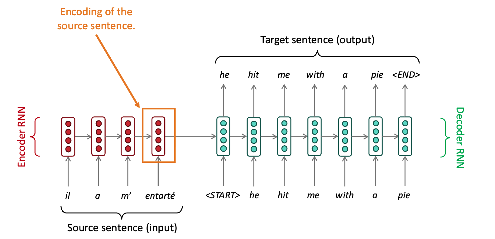
Illustration of a traditional classic RNN.

A simple form of a *Recurrent Neural Network (RNN)* is given by
$$
h_t = \sigma \bigl( W h_{t-1} + U x_t \bigr),
$$
where
- $h_t \in \mathbb{R}^d$ is the hidden state at time step $t$,
- $W \in \mathbb{R}^{d \times d}$ is the recurrent (state-to-state) weight matrix,
- $U \in \mathbb{R}^{d \times d}$ is the input-to-state weight matrix,
- $\sigma(\cdot)$ is a non-linear activation function.

Key problems of RNN.
1. Lack of parallelism. Forward and backward passes have $O(\text{sequenceLength})$ _unparallel-izable_ operations.
2. Long-range dependencies are too distant because gradient problems.

*Core idea*: On each step of the decode, use _direct connection to the encoder_ to _focus on a particular part_ of the source sequence.

Starting point: **Sentence Encoding**: _mean-pooling_ for RNNs.
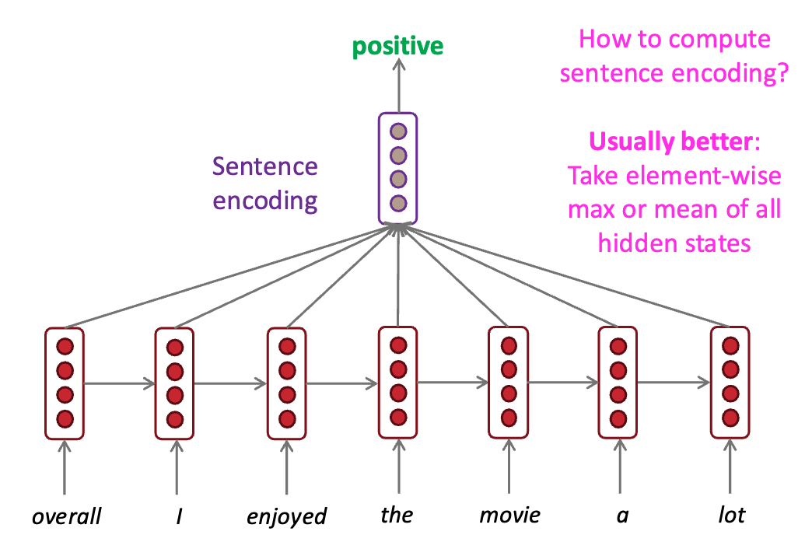

## Key-Query-Value self-attention mechanism

### Lookup table and Attention: Illustration

> [!note] 传统 RNN Sentencing Encoding 和 Attention 之间的联系
> 注解：在 RNN 的时候，就有一个流行的做法——将一句话中的词向量做平均，接一个分类器，最终得到正/反二分结果。这种做法每个词向量的权重都是一样的，不考虑词序也不考虑语义重要性。
> 注解：在 RNN 的时候，就有一个流行的做法——将一句话中的词向量做平均，接一个分类器，最终得到正/反二分结果。这种做法每个词向量的权重都是一样的，不考虑词序也不考虑语义重要性。
> K-V Attention 的思想与之非常相似，
> - 权重不应该是固定的，应该对每个词向量对应的 values 做加权平均，怎么得到权重呢？
> - 对应的权重则由每个词向量对应的 keys 与 query 得到。用人话美言称之为“从整句话里取我关心的部分”

Attention is just a _weighted_ average - this is very powerful if the weights are learned!

In a **lookup table**, we have a table of keys that map to values. The query matches one of the keys, returning its value.

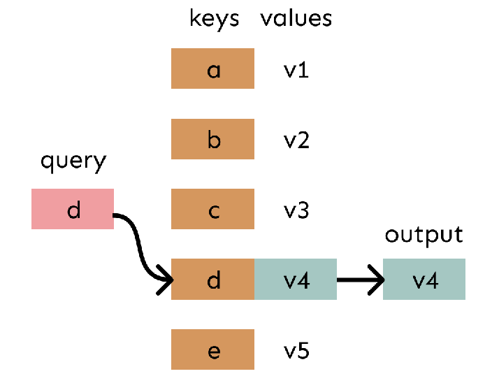
A lookup table, storing keys-values pairs. The query $d$ searches for a certain key in the lookup table (usually their values should identical, e.g. matches the $d$ key in the dictionary), then produces the corresponding output.

In *attention*, 
- the *query* matches all *keys* softly to a weight between 0 and 1
- The key's *values* are multiplied by _the_ weights and summed.

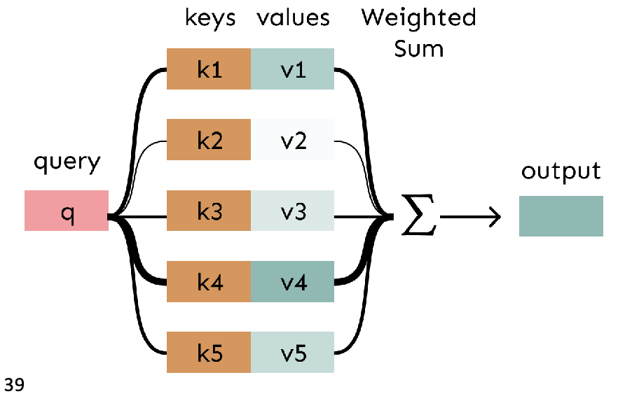
Attention illustration. (1) The output is a weighted sum of "value" values (2) The weights is obtained via softmax + dot-product of queries and keys.

The whole process.

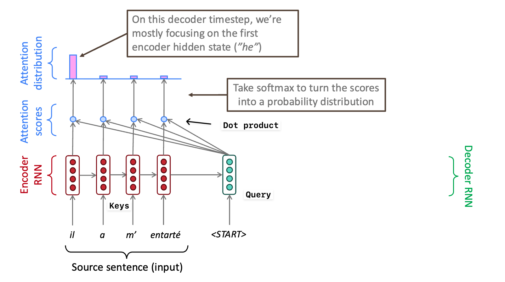
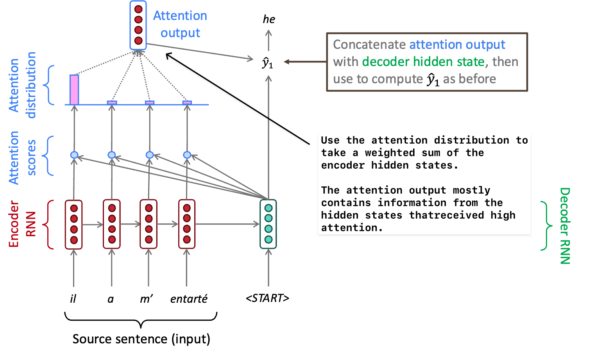

### Attention: in equations

Consider a token $x_i$ in the sequence $x_{1:n}$.  
We define a **query**
$$
q_i = Q x_i,
$$
where $Q \in \mathbb{R}^{d \times d}$.

Then, for each token in the sequence $x_j \in \{x_1, \ldots, x_n\}$, we define both a **key** and a **value**:
$$
k_j = K x_j, \qquad v_j = V x_j,
$$
with $K \in \mathbb{R}^{d \times d}$ and $V \in \mathbb{R}^{d \times d}$.

The **contextual representation** $h_i$ of $x_i$—which is also the attention output—is a linear combination of the values in the sequence:
$$
h_i = \sum_{j=1}^n \alpha_{ij} \, v_j,
$$
where the coefficients $\alpha_{ij}$ control the *strength of contribution* of each value $v_j$.

The attention weights are defined as follows:
1. Compute the **affinity** between the query $q_i$ and each key $k_j$ using the dot product $q_i^\top k_j$.
2. Apply a **softmax** over the sequence to normalize the affinities.

Formally,
$$
\alpha_{ij}
= \frac{\exp\!\left(q_i^\top k_j\right)}
{\sum_{j=1}^n \exp\!\left(q_i^\top k_j\right)}.
$$

### Interpretability

Attention provides some interpretability
- By inspecting attention distribution, we see what the decoder was focusing on
- We get (soft) alignment for free!
- The network just learned alignment by itself

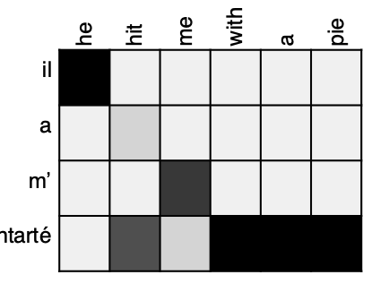
Example of attention distribution.
### Attention and self-attention

There is no constraint on where $Q$ and $(K, V)$ come from in the equation
$$
\mathrm{Attention}(Q, K, V) = \mathrm{softmax}\!\left(QK^\top\right)V.
$$
They may originate from different sources.

**Self-attention** is a special case of attention in which the queries, keys, and values are all derived from the same input sequence.

Given an input sequence representation $X$, we define
$$
Q = X W_Q, \qquad
K = X W_K, \qquad
V = X W_V,
$$
where $W_Q, W_K, W_V \in \mathbb{R}^{d \times d}$ are learned projection matrices.

## Sequence order problem - Position Embedding

### Position Embedding

Since self-attention does not inherently encode order information, we need to *encode* the order of the sentence into the keys, queries, and values, and then project them with the matrices $W_Q$ and $W_K$ (this is not strictly necessary for $W_V$, recalling that $W_V x_i$ is non-contextual).

Consider representing each *sequence index* as a vector. For all
$$
i \in \{1, \ldots, n\}, \qquad p_i \in \mathbb{R}^d.
$$

Recall that $x_i$ is the embedding of token $w_i$.  
The *position-aware embedding* is usually defined as  
(although concatenation is also possible, in practice addition is more common):
$$
\mathrm{Embed}(x, i) = x_i + p_i \in \mathbb{R}^d.
$$

### Sinusoidal position representations

*Sinusoidal position representations* are a common way to encode position information: concatenate sinusoidal functions of varying periods.
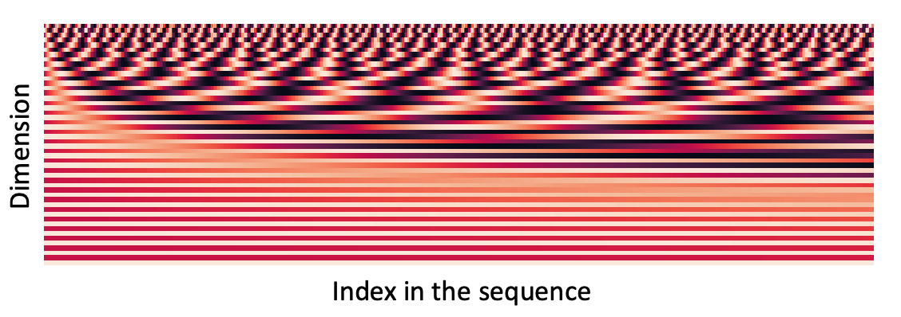

The positional embedding $p_i$ is defined using sinusoidal functions as
$$
p_i =
\begin{pmatrix}
\sin\!\left( \dfrac{i}{10000^{2j/d}} \right) \\
\cos\!\left( \dfrac{i}{10000^{2j/d}} \right) \\
\vdots \\
\sin\!\left( \dfrac{i}{10000^{2(d/2)/d}} \right) \\
\cos\!\left( \dfrac{i}{10000^{2(d/2)/d}} \right)
\end{pmatrix}
\in \mathbb{R}^d.
$$

Pros
- Periodicity indicates that the _absolute position_ isn't important
- Possibility of extrapolataion to longer sequences

Cons
- Not learnable
- Extrapolation sadly doesn't work ;(

### Position representation vectors learned from scratch 

**Core idea.**  
Let
$$
\forall i \in \{1, \ldots, n\}, \quad p_i
$$
be learnable parameters. Equivalently, we learn a *positional embedding matrix*
$$
P \in \mathbb{R}^{d \times n},
$$
and each positional vector $p_i \in \mathbb{R}^d$ corresponds to the $i$-th column of this matrix:
$$
P = \bigl[\, p_1 \; p_2 \; \cdots \; p_n \,\bigr].
$$
Pros:
- _Flexibility_. Each position gets to be learned to fit the data

Cons:
- _Non-extrapolatable_. Definitely can't extrapolate to indices outside $\{1, ..., n\}$.

### Modern position embeddings - RoPE

Suppose that embedding process of $x_i$ (at position $i$) is $f(x, i)$.

**Core idea.**

- We want our embeddings to be *invariant* to absolute position.
- The attention function should depend only on the **relative position** $i - j$.  
  That is to say, (Here $g$ denotes a different function than $f$.)
  $$
  \langle f(x, i), f(y, j) \rangle = g(x, y, i - j).
  $$

However, the traditional formulation
$$
f : (x, i) \mapsto x_i + p_i
$$
causes the dot product in the attention operation to include terms such as
$$
\langle p_i, y \rangle, \quad
\langle x, p_j \rangle, \quad
\langle p_i, p_j \rangle,
$$
all of which encode information about **absolute positions**.

Therefore, we seek a formulation in which the position index acts as a
*transformation* on the token embedding. Concretely, we define
$$
f(x, i) = R_i x_i,
$$
where $R_i$ is a position-dependent transformation applied to the token embedding.
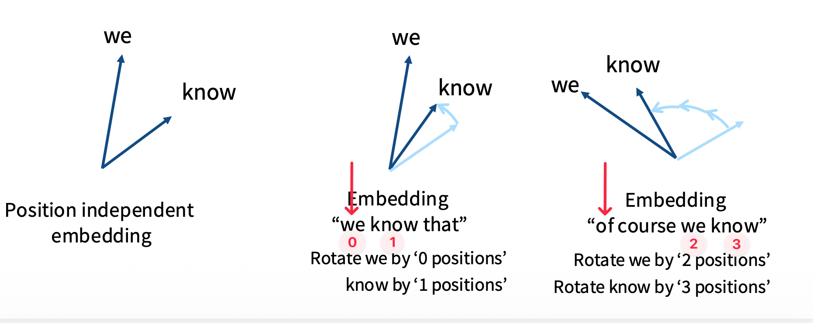

If $R_i$ is an **orthogonal transformation** (e.g. a rotation) satisfying
$$
R_i^\top = R_{-i},
$$
then we obtain
$$
\langle R_i x,\; R_j y \rangle
= \langle x,\; R_i^\top R_j y \rangle
= \langle x,\; R_{j-i} y \rangle.
$$
Hence, the inner product depends only on the **relative position** $j - i$.

**Example (2D rotation).**  
Consider a 2D rotation matrix
$$
R_i = R(\theta_i)
= \begin{pmatrix}
\cos \theta_i & -\sin \theta_i \\
\sin \theta_i & \cos \theta_i
\end{pmatrix},
\qquad \text{where } \theta_i = i\,\omega.
$$

However, such a rotation-based encoding is **not injective**. In particular,
$$
R_i = R_j
\;\Longleftrightarrow\;
(i - j)\,\omega = 2\pi k,
\qquad k \in \mathbb{Z}.
$$
That is, different positions may correspond to the same transformation, leading to ambiguity in positional encoding.
Long sequences inevitably lead to collisions.

**Rotary Position Embeddings (RoPE)**. RoPE applies multiple rotations with different frequencies, each acting on a different 2D subspace. 

Position $i$ is thus represented as a high-dimensional phase vector, where collisions in one frequency are exceedingly unlikely to occur simultaneously across all frequencies. 

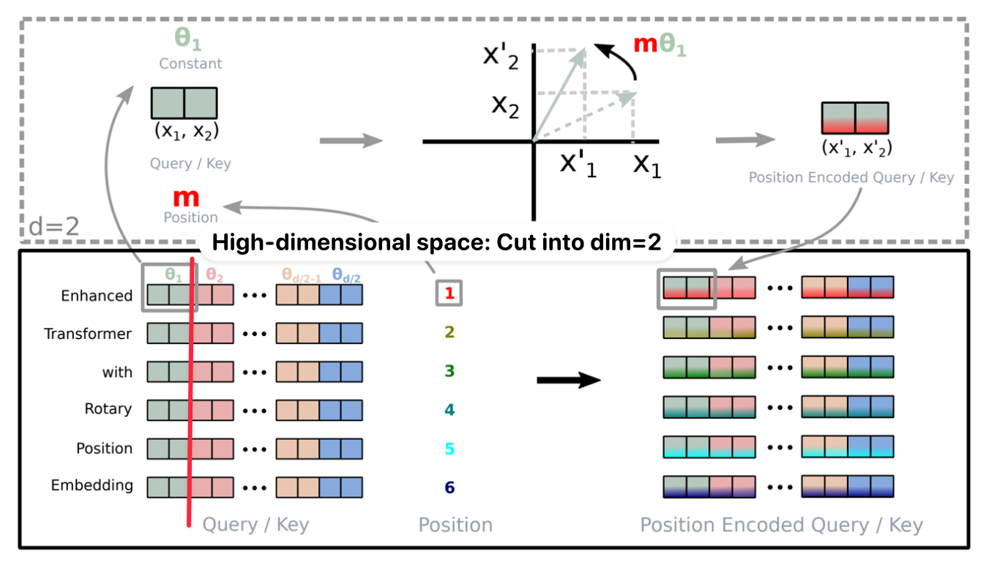

Mathematically (Here we use $m$ to represent the position to avoid confusion with $i$ where $i^2=-1$),

We define the query/key positional transformation as
$$
f_{q,k}(x_m, m)
= R_{\Theta, m}^{(d)} \, W_{q,k} x_m,
$$
where the rotation matrix $R_{\Theta, m}^{(d)} \in \mathbb{R}^{d \times d}$ is block-diagonal:
$$
R_{\Theta, m}^{(d)}
=
\begin{pmatrix}
\cos(m\theta_1) & -\sin(m\theta_1) & 0 & 0 & \cdots & 0 & 0 \\
\sin(m\theta_1) & \phantom{-}\cos(m\theta_1) & 0 & 0 & \cdots & 0 & 0 \\
0 & 0 & \cos(m\theta_2) & -\sin(m\theta_2) & \cdots & 0 & 0 \\
0 & 0 & \sin(m\theta_2) & \phantom{-}\cos(m\theta_2) & \cdots & 0 & 0 \\
\vdots & \vdots & \vdots & \vdots & \ddots & \vdots & \vdots \\
0 & 0 & 0 & 0 & \cdots & \cos(m\theta_{d/2}) & -\sin(m\theta_{d/2}) \\
0 & 0 & 0 & 0 & \cdots & \sin(m\theta_{d/2}) & \phantom{-}\cos(m\theta_{d/2})
\end{pmatrix}.
$$

The rotation frequencies are defined as
$$
\theta_k = 10000^{-2k/d},
\qquad k = 1, \ldots, \frac{d}{2}.
$$

In the code.

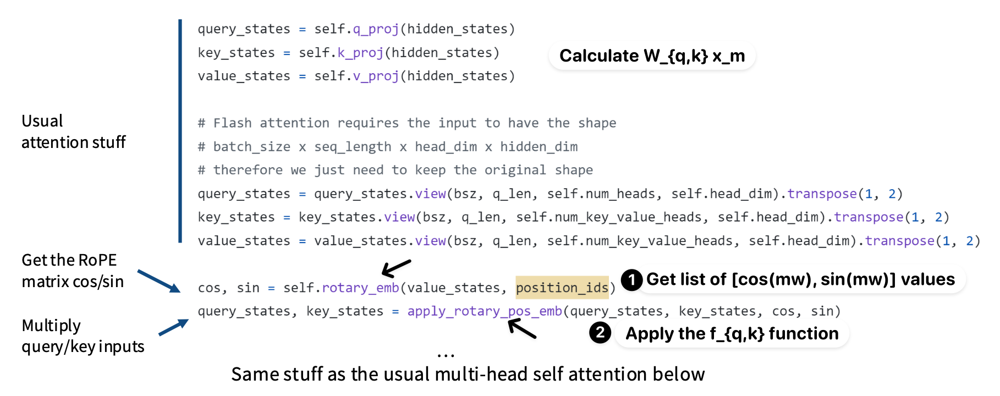

Now nearly everyone use RoPE embedings.

## Elementwise nonlinearity

if we stack two self-attention layers, we get something that looks a lot
like a single self-attention layer:

$$
\begin{aligned}
o_i
&= \sum_{j=1}^n \alpha_{ij} \, V^{(2)}
    \left( \sum_{k=1}^n \alpha_{jk} \, V^{(1)} x_k \right) \\
&= \sum_{k=1}^n
    \left( \sum_{j=1}^n \alpha_{ij} \, \alpha_{jk} \right)
    \left( V^{(2)} V^{(1)} \right) x_k .
\end{aligned}
$$

In practice, after a layer of self-attention, it is common to apply a
*feed-forward network* independently to each word representation:
$$
\begin{aligned}
m_i
&= \mathrm{MLP}(\mathrm{output}_i) \\
&= W_2 \bigl( \mathrm{ReLU}(W_1 \, \mathrm{output}_i + b_1) \bigr) + b_2 .
\end{aligned}
$$

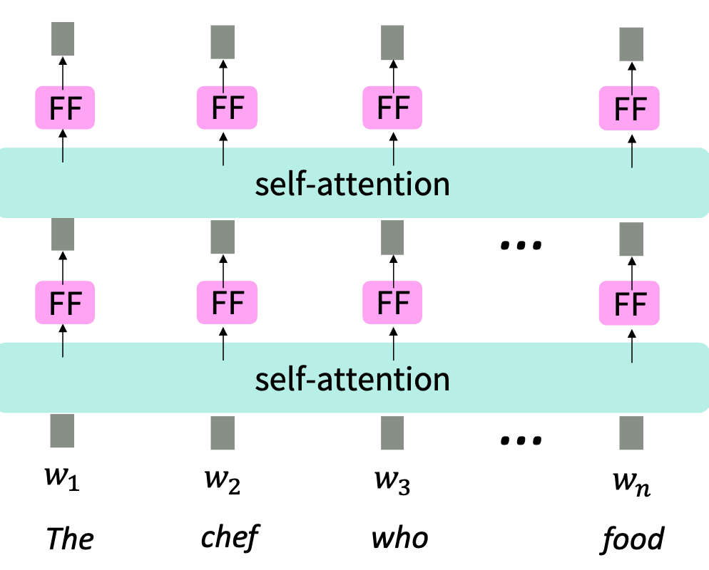

## Masking the future

When performing **language modeling** (often called *autoregressive modeling*), we predict a word given all
previous words:
$$
w_t \sim \mathrm{softmax}\!\bigl(f(w_{1:t-1})\bigr).
$$

One crucial aspect of this process is that we **cannot look at the future**
when making a prediction.

In a Transformer, there is nothing explicit in the self-attention weights
$\alpha$ that prevents attending to indices $j > i$ when computing the
representation of token $i$.

In practice, we enforce this constraint by **masking**: we add a large
negative constant to the inputs of the softmax so that future positions
receive zero probability. Concretely,
$$
\alpha_{ij}^{(\text{masked})}
=
\begin{cases}
\alpha_{ij}, & \text{if } j \le i, \\
-\infty, & \text{otherwise}.
\end{cases}
$$

After applying the softmax, all attention mass is restricted to
positions $j \le i$, ensuring causality.

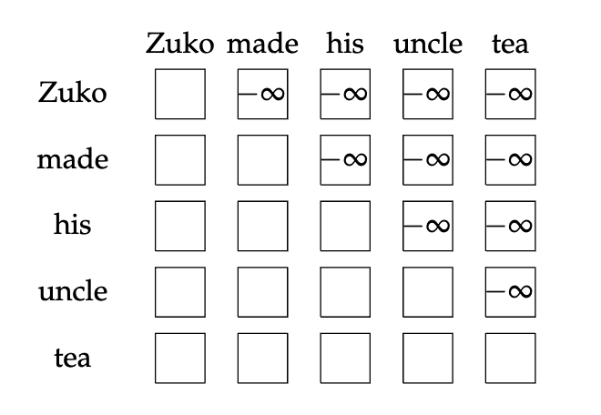
## Summary

Our minimal self-attention architecture has 
+ the self-attention operation, 
+ position representations,
+ elementwise nonlinearities,
+ future masking (in the context of language modeling.)