Motivation


Limits to GPU-based scaling.
- _Compute side_. A single GPU is not enough for training a big LLM model.
- _Memory side_. Models are getting really big with more parameters.

Solution. Multi-GPU, multi-machine parallelism.

  

## Collective communication

### Definitions

  
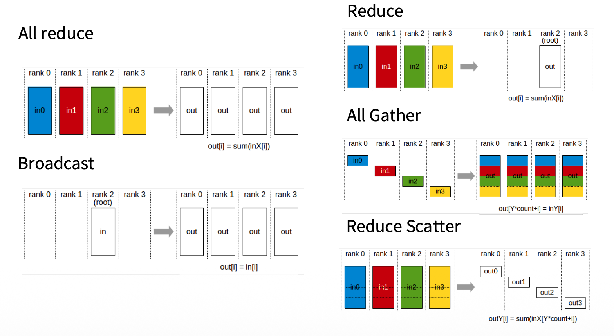
Collective communication operations.


**All Reduce**.
- Each rank have its data
- Perform a reduce operation
- Result copied to each rank


**Broadcast**.
- Data from one rank copied to other machines


**Reduce**.
- Similar to all reduce
- But result is only put on one rank

  

**All Gather**.
- Each rank holds a disjoint shard of the data
- Each rank copies what they have to everyone else
- After the operation, every rank holds the _complete_ concatenated data.

  

**Reduce Scatter**.
- Each rank starts with a _complete_ input.
- All ranks collective reduce it (a reduce operation)
- The result is then partitioned and scattered
- Each rank receives a portion of the data (disjoint).

  

Way to remember:
- Reduce: performs some associative/commutative operations onto one single device
- Broadcast/scatter is inverse of gather
- All: means destination is all devices.

  
### All-Reduce vs Reduce-Scatter-Gather


Reduce can be implemented as reduce-scatter + all-gather.
  

Each rank first deals with different parts of the data then we gather the subparts to all other devices.

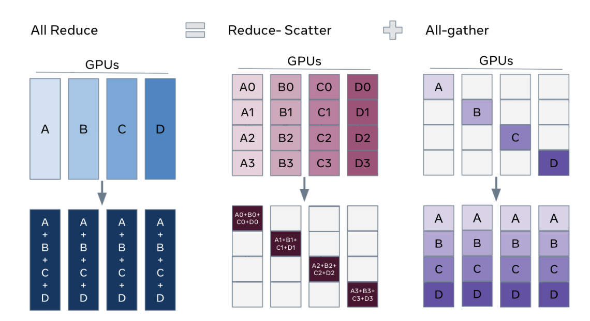

  
  
  

## Data parallelism

  

Copy the model parameter to different machines, split the batch of the input up, and different machiens will get different slices of the batch.

  
  

A naive SGD can be expressed as

$$
\theta_{t+1} = \theta_{t} - \eta \sum_{i=1}^B \nabla f (x_{i})
$$

where $B$ is the batch size of the data.

  

_Memory situation_. We need 5 copies of weights and 16 bytes per param because of mixed-precision training.
- 2 bytes for FP/BF 16 model parameters
- 2 bytes for FP/BF 16 gradients
- 12 (or 8) bytes of _Optimizer state_.
	- 4 bytes for FP32 master weights
	- 4 (or 2) bytes for FP32/BF16 Adam first moment estimates  (Historical gradients)
	- 4 (or 2) bytes for FP32/BF16 Adam second moment estimates (Historical gradients)


	


### Naive data parallelism


The naive approach is to split the elements of $B$ sized batch across $M$ machines. We need to exchange the gradients to synchronize.
  
- Compute scaling: Each GPU gets $B/M$ examples
- Communication overhead: Transmits $2 \times $ # params every batch due to All-Reduce
- Memory scaling: not impacted. Each GPU needs # parameters. (which needs to optimized)

  

### ZeRO


[**Zero Redundancy Optimizer (ZeRO)**](https://arxiv.org/abs/1910.02054).

_Core idea_. Split up the expensive parts (state) and replace the all-reduce by reduce-scatter.


ZeRO can be divided in three parts: ZeRO-1, ZeRO-2 and ZeRO-3. Their optimization can be summarized as:


  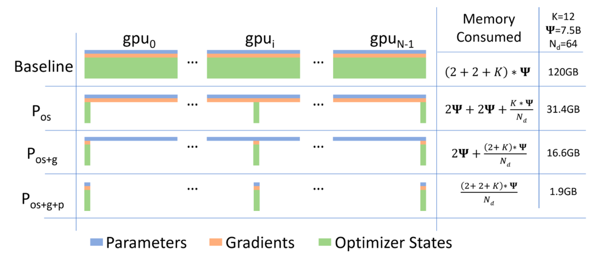
  

#### ZeRO-1

  

ZeRO-1 illustration
  

_Core idea_. Since the optimizer states take up the majority of the memory spaces, do we really need to store all the optimizer states?
- Instead of every rank storing all of the optimizer states,
- Each rank only calculates their _subset of the batch_
- Then, in the aggregation phase, is only responsable for a _subset of the parameters_

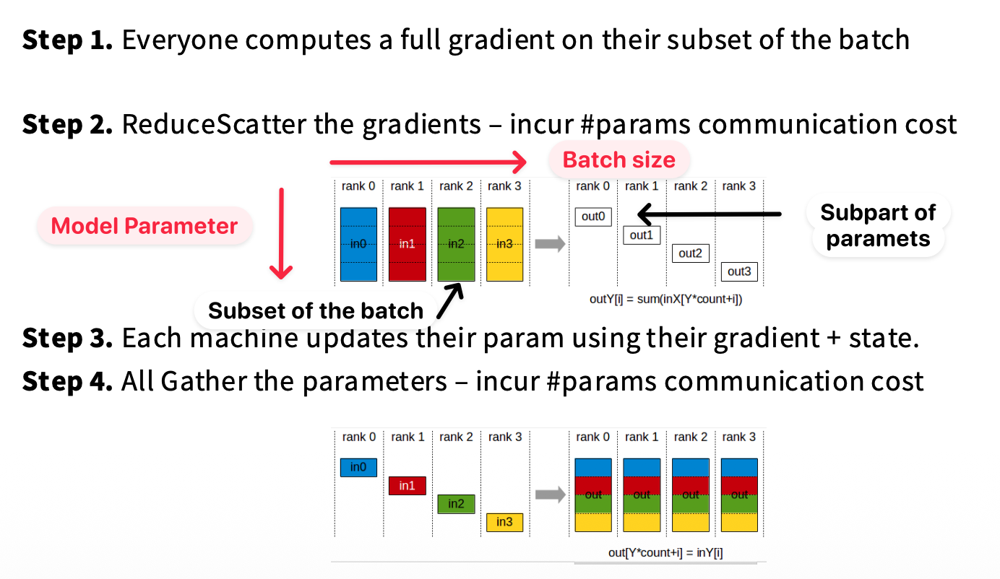
Steps. (Forward and Backward unchanged)

  

Summary.
- _Communication primitive_. One All-Reduce -> One Reduce Scatter (Send gradients) + All Gather (Collect params)
- _Communcation costs_. Unchanged.
- _Memory_. $(4+K) \times$ # params -> $(4+ K/M) \times$ # params.

  

Free improvement.

  

#### ZeRO-2


_Core idea_. Although ZeRO-1 may use reduce-scatter in implementation, gradients are still logically full-replicated.

Can we make gradients truly sharded, so that each device keeps only the gradients it owns?
- When processing each _subset of the batch_,
- For each _subset of the parameter_, send (reduce) the gradients immediately to the device for which it is responsable.
- No full gradients space is needed for each rank.

  
  
ZeRO-2 illustration
  


  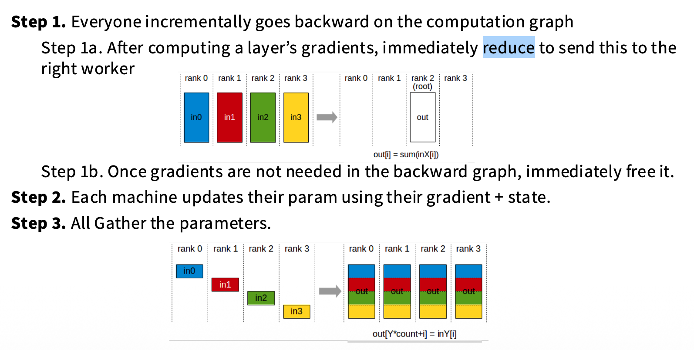
Steps. (Forward unchanged)

  

Almost free. Little overhead in freeing memories.

  

#### ZeRO-3 (FSDP)

  

**ZeRO-3** is also known as **Fully-Sharded Data Parallel (FSDP)**.

  

_Core idea_. We want to shard also the model weights.
- Each rank _persistently_ stores only its own shard of the model parameters.
- Parameters/gradients are requested/sent and then immediately freed
- However, forward/backward passes surely aren't possible when their model weights aren't ready.
- Parameters must be prefetched ahead of their computation, and their communication is overlapped with computation whenever possible.


Steps to forward:

```
for layer_group in model:
	all_gather(params) <- Only load the needed group of params
	forward(layer_group)
	free(params)
```

  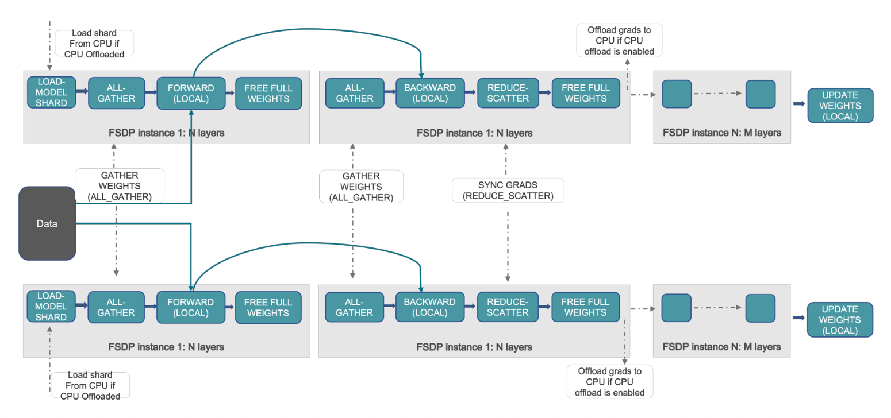
ZeRO-3 illustration


  


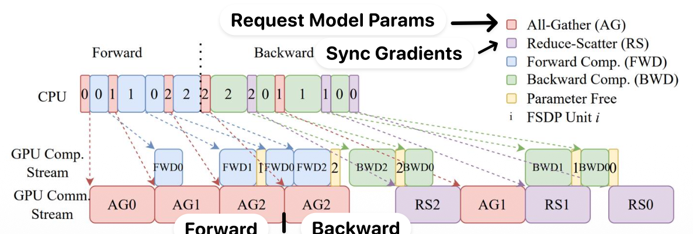
Overlapping communication and computation. Example $(W_1 W_0 + W_2 W_0)x = y$

  

_Communication cost_.

- $2 \times$ # params in all-gather (both forward and backward pass)
- $1 \times$ # params in reduce-scatter (synchronize gradients)

  

Total $3 \times$ # params.
  
This is not free (1.5x communication cost), but isn't that bad.

  
#### Conclusion

  

_Benefits_.

- ZeRO-1 is free, and might as well always do it.
- ZeRO-2 is (almost) free except for little overhead of freeing memories.
- ZeRO-3 needs 1.5x communication cost, and have latency problems. But overall, it reduces memory consumption.

  

_Easy to implement_. Write a FSDP block wrapper.

  

_Problems_.

- With data parallel, # machines < batch size. (Near this limit, the communication overhead is high) which introduce training problems (e.g. noise)
- Activation memories aren't optimized (e.g. Attention KV Cache)
- Zero-3 can be slow.

  

## Model parallelism

  

Instead of having GPUs to have the whole part of the model, *model parallelism* cut up the model in different ways, and each GPU handles different part of the model

####  Naive method: Layer-wise parallel

  
_Naive method_. *Layer-wise parallel* cut up layers, assigns some subset to GPUs.

  
  Layer-wise parallel

  

Activations and partial gradients are passed back and forth.

  
_Problem_. GPU utilization is terrible. With $n$ GPUs, each GPU is active $1/n$ of the time.

  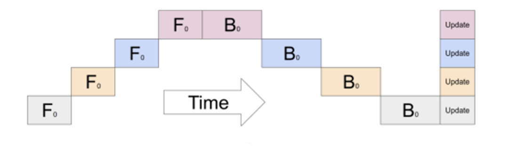
Illustration of bubbles in layer-wise parallel


### Pipeline parallel

  


  

#### Pipeline parallel

  

_Solution_. Each sequence has a series to be processed by each GPU.
- The input is being processed via 'micro-batches'.
- For each GPU, when the first microbatch is finished, send it off and then starst computing the second.
- While the previous GPU is now processing the second minibatch, the next GPU can now process the first minibatch that it received.

  


  

_Ratio of bubble time to useful compute_. 
$$ 
\min \frac{n_{\text{stages}} - 1}{n_{\text{micro\_batch}}}
$$

  
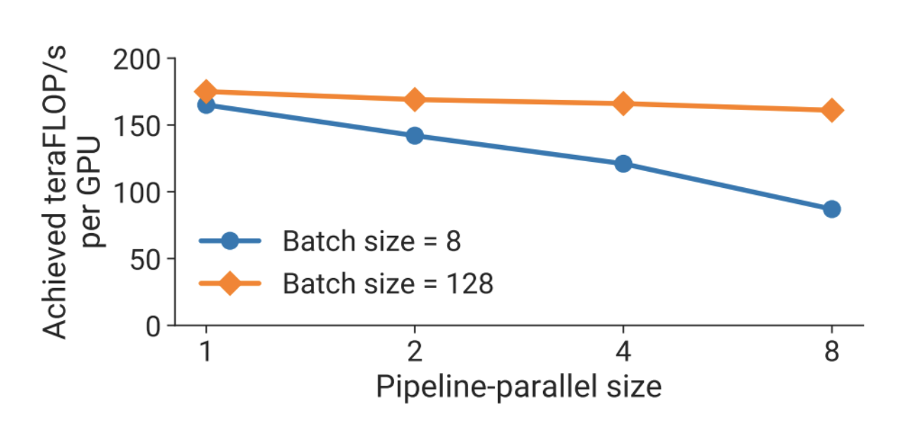
Pipeline-parallel's performance and the mini-batch size

  

Pipeline performance is highly dependent on batch size. We need big minibatch sizes.

  

The reasons why we do pipeline parallel.
- Pipelines save memory. This time, it shards also the activation memory.
- Pipelines have good communication properties. It is _point to point_ (Only stage $n$ to stage $n+1$) and only depends on activations.

  

#### Zero-bubble pipelining


_Goal_. Improve pipeline patterns to improve utilization and remove bubbles.

The backwards can be divided into:
+ Back-propagating activation $(z, x)$
+ Compute weight gradients $(W)$

  

Specifically,

- Forward: $$ y = \sigma(z) \quad \text{where} \quad z = W x $$
- Backward:
	+ First compute the gradient of the loss $$ \nabla_x L = W^\top \nabla_z L, \quad \text{where} \quad \nabla_z L = \frac{d \sigma(z)}{d z} \, \nabla_y L . $$
	+ Then compute the gradient of each parameters: $$ \nabla_W L = \nabla_z L \, x^{\top} $$

  

Compute graph

  

Core idea. The first step of the backward has to be done layer-by-layer (data dependency). The second step can be done whenever. This can be better handcrafted.

  


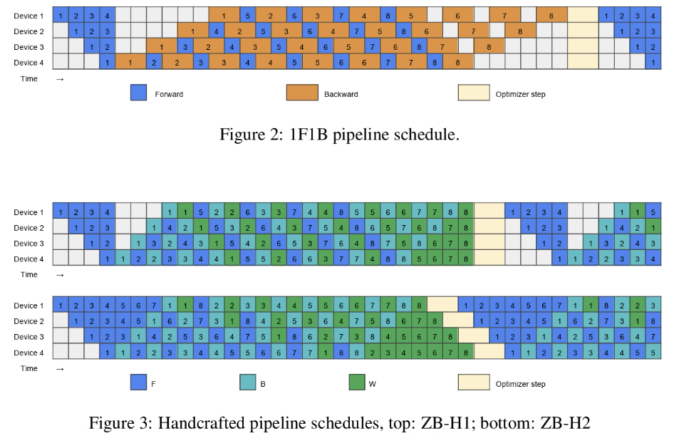
Examples.
  

_Problem_. Infrastructurly complicated.

  

## Tensor parallel (+ Sequence parallel)

  
### Tensor parallel

  

_Core idea_. Change the big matrix multiply operations into a set of submatrices that can be multiplied.

  

Tensor parallel

  

Assign columns $\begin{bmatrix} A_{1}, A_{2}\end{bmatrix}$ and rows $\begin{bmatrix} B_{1}\\ B_{2}\end{bmatrix}$ to separate GPUs. Each GPU receives the full input $X$.

- In the forward pass, $f$ is the identity, and $g$ is an all-reduce of $Z_1$ and $Z_2$

- In the backward pass, $g$ is the identity, and $f$ is an all-reduce of $\nabla_X^{(1)} L$ and $\nabla _X^{(2)}L$

  

Tensor parallel
- needs synchronization per layer
- requires very high spped interconnects

  
TP performance degrades severely when $>8$.


TP performance and TP level
  
  
  

*Pros*.
- No bubble. (network speed)
- Low complexity. each to "wrap"
- Doesn't need large batch sizes.

  

*Cons*.

- Much larger communication than pipeline parallel. Per layer $$8 b s h \frac{n_\text{devices} - 1}{n_\text{devices}}$$ communication($8 = 2 \times 4$, where 4 includes QKV, ATTN, MLP1 in FFN and MLP2 in FFN.

  

### Activation parallelism

  

Manage memory footprints of (intermediate) activations.
  
Activation memories are dynamique.


  
  Activation memory are dynamique

_Core idea_. Some element-wise operation can't be optimized via tensor parallel.

  
Examples. Dropout and LayerNorm.


**Sequence parallelism (SP)** observes that

- the remaining operations are all independent computations along the sequence dimension;
- therefore, the input tensor can be partitioned along the sequence dimension and distributed across different GPUs for processing.

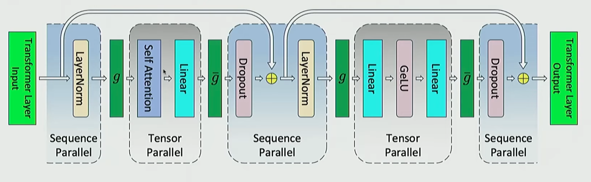  
Sequence parallel

  

In the forward pass, $g$ is all-gather and $\overline{g}$ is reduce-scatter. In the backward pass, the two are reversed.

  
  
## Activation Memory Optimization Per Transformer Layer (TP+SP)

  

This section illustrates the activation memory per transformer layer under different parallelism techniques @korthikanti2022reducingactivationrecomputationlarge.

  

Transformer Architecture

  

Each Transformer layer is composed of two residual streams, the first residual stream consists of a LayerNorm, an Attention and an Add operation, while the second residual stream consists of a LayerNorm a MLP and an Add operation.

  

Here we denote
- Activation. Batch size is $b$, length is $s$ and the hidden dimension is $h$.
- Attention heads. Number of attention heads is $a$.
- Parallel size. Tensor parallel size is $t$.

  

Note.

Unless otherwise stated, the factor 2 comes from storing both the forward activations and the corresponding backward buffers required for gradient computation.


Attention block

Memory required to store activations in different blocks.
- _Attention block_. (Total: $11 b s h + 5 b a s^ 2$) 
	- $X. W_{Q, K, V}$ matrices multiplies. Shared input needs to be stored which is $2 b s h$.
	- $Q.K^T$ matrix multiply ($\{Q, K, V \}= X.W_{\{Q, K, V\}}$). Requires both $Q$ and $K$ thus $4 b s h$
	- Softmax to the matrix multiply. The matrices dimension is $(b, a, s, s)$ thus $2b a s^2$
	- Softmax dropout. A mask with $b a s^2$
	- Attention over values ($V$). Requires both the dropout output and the generated $V$ thus $2 b a s^2 + 2 b s h$
	- Linear Projection. Input of $2b s h$
	- Attention dropout. A mask with $b s h$
- _MLP block_. (Total: $19 b s h$)
	- Two linear layers storing their input, respectively $2 b s h$ and $2 b s (4h) = 8 b s h$
	- GeLU's input: the same with the second linear layer $8 b s h$
	- Dropout's input: its mask $b s h$
- _LayerNorm_. (Total: $4 b s h$)
	- Input size: $(b, s, h)$ thus $2 b s h$

  

Total.

$$
\text{Activation per layer}= b s h \left( 34 + 5 \frac{a s }{ h} \right)
$$

  

Appling TP to all matmul operations. For each operation, the memory requirement is divided by the TP value $t$. Layers that are not impacted:
- Input to the Attention ($2 b s h$)
- Input to the MLP ($2 b s h$)
- Attention Dropout ($2 b s h$)
- LayerNorm ($4 b s h$)

  

Total.

$$
\text{Activation per layer}= b s h \left( 10+ \frac{24}{t} + 5 \frac{a s }{ h} \right)
$$

  

Apply TP to LayerNorm, Dropout and intersection between layers.

Total.

$$
\text{Activation per layer}= b s h \left( \frac{34}{t} + 5 \frac{a s }{ h} \right)
$$

  

## Comparaison between DP, PP and TP/SP


  

## 3D parallelism

  

Rule of thumb.
+ Until your models fits in the memory.
+ Tensor parallel up to GPUs/machines
+ Pipeline parallel across machines (Or use ZeRO-3)
+ Then until you run out of GPUs
+ Scale the rest of the way with data parallel