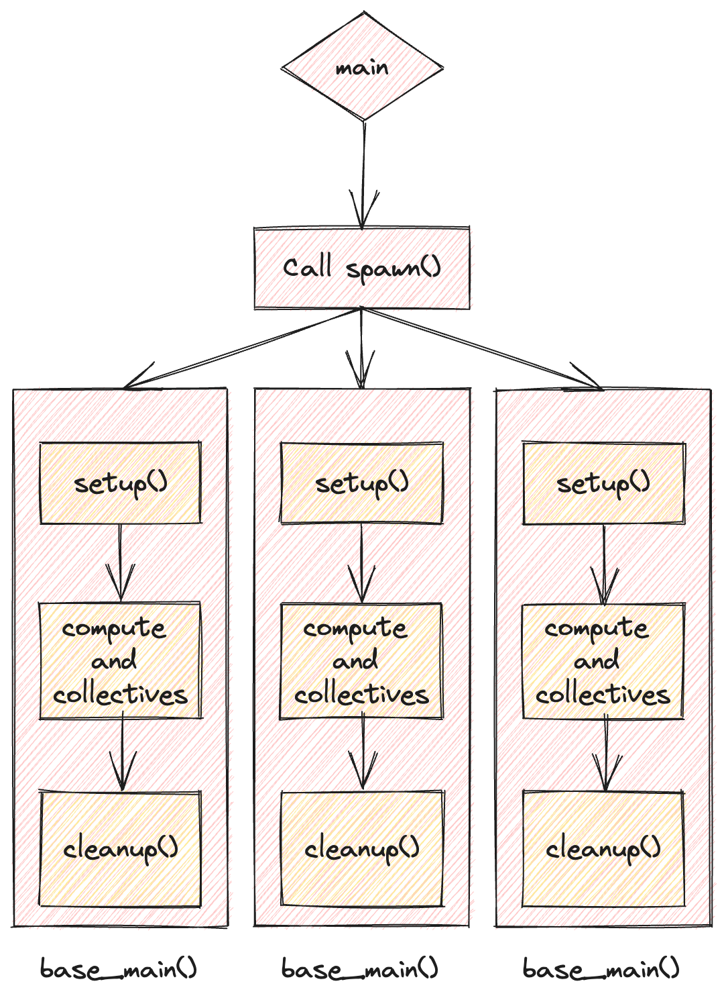

## NVIDIA Collective Communication Library (NCCL)

NCCL translates collective operations into low-level packets that are sent between GPUs.  
- Detects topology of hardware (e.g., number of nodes, switches, NVLink/PCIe)
- Optimizes the path between GPUs
- Launches CUDA kernels to send/receive data

## PyTorch distributed library (torch.distributed)

**torch.distributed** is a distributed abstraction layer, not a communication library itself.  

Its responsibility is to provide a **uniform distributed programming model**, independent of the underlying communication backend.

Specifically, it:
- Defines the **distributed execution model**
    - rank, world_size, process groups
- Exposes **high-level collective APIs**
    - all_reduce, broadcast, all_gather, reduce_scatter, …
- Maps these operations to concrete backends:
    - GPU communication → NCCL
    - CPU communication → Gloo

## Single-node, Multi-GPU Framework (PyTorch + NCCL)

To write a distributed code, follow the steps:
- `main()` function. The per-rank entrypoint: each spawned process runs the same main(rank, ...), which calls setup(), runs compute + collectives, then calls cleanup().
- `spawn()` To spawn `world_size` number of subprocesses
- `setup()` To setup each subprocess
	- Put on the correct device via `torch.cuda.set_device()`
	- Connect to the process group via `dist.init_process_group()`
- `cleanup()` At the end, cleanup the resources.

Since the `main()` function encapsulates the core computation logic, we modify it to meet our requirements.


### Main function

1. Setup for each subprocesses
2. Compute (+ collectives)
3. Cleanup resource

```python
def base_main(rank, world_size, cfg: dict = None):
	setup(rank, world_size) # To be defined
    print(f"[Rank {rank}/{world_size}] Hello world!")
    cleanup() # To be defined


if __name__ == '__main__':
	assert torch.cuda.is_available()
    spawn(base_main, world_size=4)
```

### Spawn subprocesses

```python
from typing import Callable
import torch.multiprocessing as mp

# Spawn main func
def spawn(func: Callable, world_size: int, cfg: dict = None):
    # For each rank in {0, ..., world_size-1}
    # Spawn a process that is executing
    # func(rank, world_size, cfg)
    mp.spawn(
        func, 
        args=(world_size, cfg), # Merge config
        nprocs=world_size, 
        join=True
    )
```

### Setup

```python
import os
import torch
import torch.distributed as dist

# Setup for each subprocess
def setup(rank: int, world_size: int):
    # Register the subprocess in the Distrubuted Process Group
    # For each subprocess, find the master node (rank 0)
    os.environ["MASTER_ADDR"] = "localhost"
    os.environ["MASTER_PORT"] = "15623"
    
    torch.cuda.set_device(rank)

    dist.init_process_group(
        backend="nccl", 
        rank=rank, 
        world_size=world_size
    )
```

### Cleanup

```python
import torch

def cleanup():
    torch.distributed.destroy_process_group()
```

## Data Parallel

Data parallel splits the global batch across ranks. 
Each rank computes forward/backward on its local batch, then gradients are synchronized (typically via all-reduce) before the optimizer step, so all ranks apply the same update and keep parameters identical.

```python
def dp_main(rank: int, 
            world_size: int,
            data: torch.Tensor,
            num_layers: int,
            num_steps: int,
            cfg: dict = None):
    setup(rank, world_size)
    # Get the sub-batch for this rank (Each rank should only load its own data)
    batch_size = data.shape[0]
    num_dim = data.shape[1]
    assert batch_size % world_size == 0
    local_batch_size = batch_size // world_size
    start_index = rank * local_batch_size
    end_index = start_index + local_batch_size
    data = data[start_index:end_index].to(get_device(rank))
    
    # Define network, params and optimizer
    params = [get_init_params(num_dim, num_dim, rank) for i in range(num_layers)]
    optimizer = torch.optim.AdamW(params, lr=3e-4)
    
    for step in range(num_steps):
		optimizer.zero_grad(set_to_none=True)
        # Forward
        x = data
        for param in params:
            x = x @ param
            x = F.gelu(x)
            
        loss = x.square().mean()
        
        # Backward
        loss.backward()
        
        # Update params and sync gradients across ranks
        for param in params:
            dist.all_reduce(tensor=param.grad, op=dist.ReduceOp.AVG, async_op=False)
            
        # Optimizer step
        optimizer.step()
        
        print(f"[DP] Rank {rank}: step = {step}, local loss = {loss.item()}", flush=True)
    
    cleanup()
```

Note. Since the function signature has changed, the `spawn()` function needs to be updated accordingly.

## Tensor Parallel

Tensor Parallel divides the model parameters into subparts. In this implementation we use column-parallel linear layers (split output features), so we need an all-gather of activations between layers to reconstruct the full hidden state.

Note. Recommend to use `torch.distributed.nn.functional.all_gather` to keep the computation graphs when all-gathering.


```python
from torch.distributed.nn.functional import all_gather

def tp_main(rank: int, 
            world_size: int,
            data: torch.Tensor,
            num_layers: int,
            num_steps: int,
            cfg: dict = None):
    setup(rank, world_size)
    # Get the sub-batch for this rank (Each rank should only load its own data)
    batch_size = data.shape[0]
    num_dim = data.shape[1]
    assert num_dim % world_size == 0
    local_num_dim = num_dim // world_size
    data = data.to(get_device(rank))
    
    # Define network, params and optimizer
    # Params stores (# layers) of local sub-parameters
    params = [get_init_params(num_dim, local_num_dim, rank) for i in range(num_layers)]
    optimizer = torch.optim.AdamW(params, lr=3e-4)
    
    for step in range(num_steps):
        optimizer.zero_grad(set_to_none=True)
        # Forward
        x = data
        for i in range(num_layers):
            x = x @ params[i]
            x = F.gelu(x)
            
            # Sync activations.
            # Specify each sub-block of activation
            # (# world-size) of (b, local_d) blocks
            """
            activations = [
                torch.empty(batch_size, local_num_dim, device=get_device(rank))
                for _ in range(world_size)
            ]
            
            # (b, local_d) -> (b, d) for all ranks
            dist.all_gather(tensor_list=activations, tensor=x, async_op=False)
            
            x = torch.cat(activations, dim=1) # (b, d)
            """
            
            # Use torch.distributed.nn.functional to keep the autograd graph
            x_parts = all_gather(x)
            x = torch.cat(x_parts, dim=1)

        loss = x.square().mean()
        loss.backward()
        
            
        # Optimizer step
        optimizer.step()
        
        print(f"[TP] Rank {rank}: step = {step}, local loss = {loss.item()}", flush=True)
    
    cleanup()
```


## Pipeline Parallel

Pipeline Parallel (PP) partitions the model layers into sequential stages, where each rank holds a contiguous block of layers. The input batch is further split into micro-batches so that different stages can process different micro-batches concurrently. Activations are transferred between adjacent stages using point-to-point communication (send/recv).

```python
def pp_main(rank: int, 
            world_size: int,
            data: torch.Tensor,
            num_layers: int,
            num_steps: int,
            num_micro_batches: int,
            cfg: dict = None):
    setup(rank, world_size)
    data = data.to(get_device(rank))
    batch_size = data.size(0)
    num_dim = data.size(1)
    
    # Split layers
    assert num_layers % world_size == 0 
    local_num_layers = num_layers // world_size
    local_params = [
        get_init_params(num_dim, num_dim, rank) for i in range(local_num_layers)
    ]

    # Forward pass
    # Rank 0 is responsable for chunking the input: b -> mini_b
    assert batch_size % num_micro_batches == 0
    micro_batch_size = batch_size // num_micro_batches
    if rank == 0:
        micro_batches = data.chunk(chunks=num_micro_batches, dim=0)
    else:
        # Allocate memory
        micro_batches = [torch.empty(micro_batch_size, num_dim, device=get_device(rank)) for _ in range(num_micro_batches)]
    
    for x in micro_batches:
        if rank - 1 >= 0: # if not rank 0
            dist.recv(tensor=x, src=rank - 1) # p2p primitive
            
        for param in local_params:
            x = x @ param
            x = F.gelu(x)
            
        if rank + 1 < world_size: # if not last rank
            dist.send(tensor=x, dst=rank + 1)
    
    print(f"Rank {rank}, {x}")      
      
    # Not handled the overlapping communication
    
    
    dist.barrier()
    cleanup()
```
## References

[Stanford CS336: Language Modeling from Scratch](https://stanford-cs336.github.io/spring2025-lectures/?trace=var/traces/lecture_08.json)
