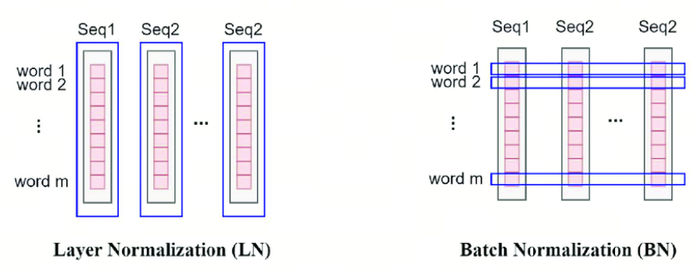
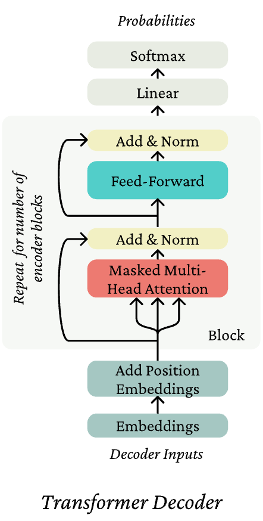
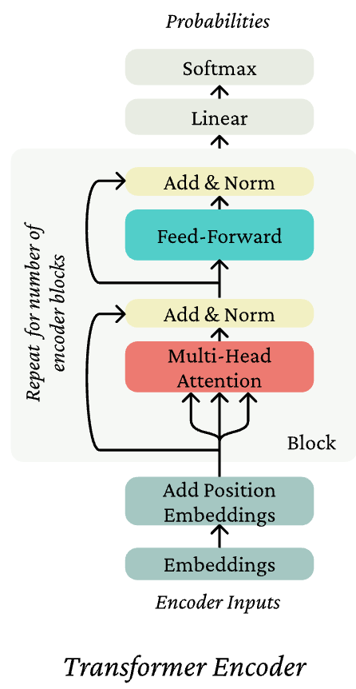
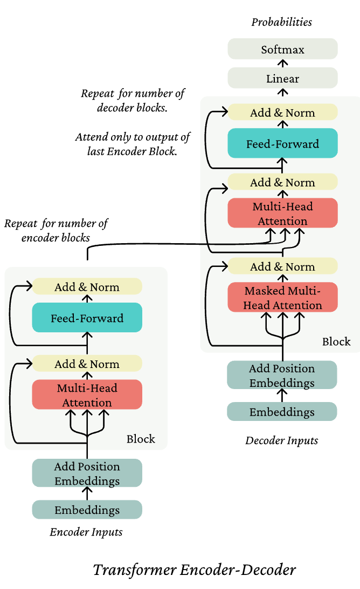

**LLM Series**.
- [LLM Basics (1): Tokenizer](posts/llm-basics-1-tokenizer/index.md)
- [LLM Basics (2): Attention](posts/llm-basics-2-attention/index.md)
- [LLM Basics (3): Transformer](posts/llm-series-3-transformer/index.md)

## Multi-headed attention

**Core idea.**  
Multi-head attention allows the model to attend to different positions *for different reasons* (via multiple parallel paths, or *heads*) at the same time.

Let
$$
X = [x_1; \ldots; x_n]
= \begin{pmatrix}
- x_1 - \\
\vdots \\
- x_n -
\end{pmatrix}
\in \mathbb{R}^{n \times d},
$$
be the concatenation of the input vectors  ($X$ is also commonly written as $x_{1:n}$.)

Let
$$
Q \in \mathbb{R}^{d \times d}, \qquad
K \in \mathbb{R}^{d \times d}, \qquad
V \in \mathbb{R}^{d \times d}.
$$
The output of (single-head) self-attention can be written as
$$
\begin{aligned}
\mathrm{output}
&= \mathrm{softmax}\!\bigl(XQ (XK)^\top\bigr) \, XV \\
&= \mathrm{softmax}\!\bigl(X Q K^\top X^\top\bigr) \, XV
\;\in\; \mathbb{R}^{n \times d}.
\end{aligned}
$$

### Multiple attention heads

We define *multiple attention heads* by using multiple projection matrices
$Q$, $K$, and $V$.
Let $h$ be the number of heads, and define
$$
Q = \bigl( Q^{(1)} \mid \cdots \mid Q^{(h)} \bigr),
\qquad
\forall\, l \in \{1, \ldots, h\}, \;
Q^{(l)} \in \mathbb{R}^{d \times (d/h)}.
$$
The same construction applies to $K$ and $V$.

### Multi-headed attention

- First, we compute $XQ$, $XK$, and $XV$, and reshape each into a tensor of shape
  $$
  \mathbb{R}^{n \times h \times (d/h)},
  $$
  splitting the model dimensionality into a *head* dimension and a *per-head*
  feature dimension.

- We then transpose the tensors to
  $$
  \mathbb{R}^{h \times n \times (d/h)},
  $$
  which can be viewed as $h$ independent sequences, each of length $n$ and
  dimensionality $d/h$.

- Each attention head performs attention independently:
  $$
  \forall\, l \in \{1, \ldots, h\}, \qquad
  \mathrm{output}^{(l)}
  = \mathrm{softmax}\!\bigl(X Q^{(l)} (X K^{(l)})^\top\bigr)\, X V^{(l)}
  \in \mathbb{R}^{n \times (d/h)}.
  $$

- Finally, we concatenate the outputs of all heads and combine them with a
  linear projection $Y \in \mathbb{R}^{d \times d}$:
  $$
  \begin{aligned}
  \mathrm{output}
  &= \mathrm{concat}\!\bigl(
      \mathrm{output}^{(1)}, \ldots, \mathrm{output}^{(h)}
     \bigr)\, Y \\
  &= \bigl(
      \mathrm{output}^{(1)} \mid \cdots \mid \mathrm{output}^{(h)}
     \bigr)\, Y
  \in \mathbb{R}^{n \times d}.
  \end{aligned}
  $$

## Scaled-dot product

When the dimensionality $d$ becomes large, dot products between vectors tend to grow in magnitude. In particular, the dot product $q_i^\top k_j$, with $Q$ and $K$ normally initialized, grows roughly on the order of $\sqrt{d}$.

As a consequence, the inputs to the softmax function can become large, which
leads to very small gradients and makes optimization difficult.

To mitigate this effect, we **scale** the dot products by $\sqrt{d}$:
$$
\alpha
= \mathrm{softmax}\!\left(
\frac{x_{1:n} Q K^\top x_{1:n}^\top}{\sqrt{d}}
\right).
$$

**Note.**  
Be careful with matrix dimensions in the softmax operation.  
In the case of *multi-head attention*, the scaling factor $\sqrt{d}$ is replaced
by

$$
\sqrt{\frac{d}{h}},
$$
since each attention head operates on vectors of dimensionality $d/h$.

## Residual connections

**Residual connections** simply add the input of a layer to the output of that
layer. Formally,
$$
f_{\text{residual}}\!\bigl(h_{1:n}\bigr)
= h_{1:n} + f\!\bigl(h_{1:n}\bigr).
$$

The intuition being that 
+ the gradient flow of the identity function is great (the local gradient is 1 everywhere!) so the connection allows for learning much deeper networks,
+ it is easier to learn the difference of a function from the identity function than it is to learn the function from scratch.

## LayerNorm

**Layer Normalization (LayerNorm)** normalizes activations *within a single
sample*, rather than across a batch.

**Core idea.**  
Reduce uninformative variation in hidden vector values by normalizing to unit
mean and standard deviation *within each layer*.

Concretely, for an input vector $x_i \in \mathbb{R}^d$ at a given layer, LayerNorm
computes the mean and variance across the feature dimension:
$$
\mu_i
= \frac{1}{d} \sum_{j=1}^d x_{ij},
\qquad
\sigma_i^2
= \frac{1}{d} \sum_{j=1}^d \bigl(x_{ij} - \mu_i\bigr)^2 .
$$

It then produces the normalized output
$$
\mathrm{output}
= \gamma \cdot
\frac{x_i - \mu_i}{\sqrt{\sigma_i^2 + \epsilon}}
+ \beta
$$
where $\gamma$ and $\beta$ are learnable scale and bias parameters.

_Discussion_. LayerNorm vs BatchNorm [(Visit the GitHub post here)](https://github.com/luhengshiwo/LLMForEverybody/blob/main/01-%E7%AC%AC%E4%B8%80%E7%AB%A0-%E9%A2%84%E8%AE%AD%E7%BB%83/10%E5%88%86%E9%92%9F%E6%90%9E%E6%B8%85%E6%A5%9A%E4%B8%BA%E4%BB%80%E4%B9%88Transformer%E4%B8%AD%E4%BD%BF%E7%94%A8LayerNorm%E8%80%8C%E4%B8%8D%E6%98%AFBatchNorm.md"). BatchNorm assumes that the same feature dimension is comparable across samples, so it normalizes across the batch.
LayerNorm does not rely on cross-sample comparability, and instead normalizes each sample’s internal feature distribution.

## Transformer Decoder

The *Transformer Decoder* is a stack of Transformer Decoder Blocks.

Each decoder block consists of:
+ Self-attention
+ Add & Norm
+ Feed-forward
+ Add & Norm

## Transformer Encoder

- The Transformer Decoder constrains to unidirectional context, as for language models.
- What if we want bidirectional context, like in a bidirectional RNN?
- This is the Transformer Encoder. The only difference is that we remove the masking in the self-attention.

## Transformer Encoder-Decoder and Cross-Attention

Recall that in machine translation, we processed the source sentence with a bidirectional model and generated the target with a unidirectional model.

For this kind of seq2seq format, we often use a Transformer Encoder-Decoder.

The first sequence $x_{1:n}$ is passed through a **Transformer Encoder** to build
contextual representations.

The second sequence $y_{1:m}$ is passed through a **Transformer Decoder**
architecture, in which *cross-attention* is applied from the (partially)
decoded representation of $y_{1:m}$ to the output of the Encoder.

### Cross-attention

Let
$$
h_{1:n}^{(x)} = \mathrm{Encoder}\!\left(x_{1:n}\right).
$$
To generate the next token $y_{m+1}$, we condition on both the previously
generated tokens $y_{1:m}$ and the encoded source representation
$h_{1:n}^{(x)}$. Let $h^{(y)}$ denote the intermediate (decoder) representation
of $y_{1:m}$.

In cross-attention, **queries** come from the decoder, while **keys** and
**values** come from the encoder:
$$
q_i = Q\, h_i^{(y)}, \qquad i \in \{1, \ldots, m\},
$$
$$
k_j = K\, h_j^{(x)}, \qquad j \in \{1, \ldots, n\},
$$
$$
v_j = V\, h_j^{(x)}, \qquad j \in \{1, \ldots, n\}.
$$

The resulting attention output allows each decoder position $i$ to selectively
attend to the entire encoded source sequence.

and compute the attention on q, k, v as we defined for self-attention.